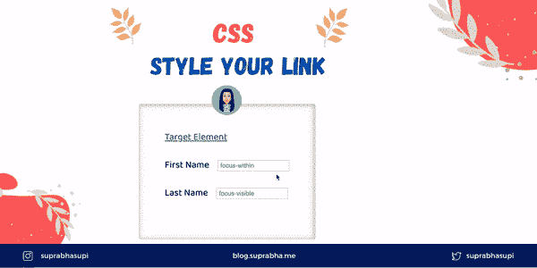

# CSS 链接样式🎨

> 原文：<https://medium.com/geekculture/css-link-style-53adb595b4d?source=collection_archive---------23----------------------->



style-your-link

使用 CSS，链接可以有多种不同的样式。

我们可以将 CSS 链接的样式更改为:

1.  [:悬停](https://dev.to/suprabhasupi/css-link-style-2nh2#hover)
2.  [:活动](https://dev.to/suprabhasupi/css-link-style-2nh2#active)
3.  [:拜访过](https://dev.to/suprabhasupi/css-link-style-2nh2#visited)
4.  [:焦点](https://dev.to/suprabhasupi/css-link-style-2nh2#focus)
5.  [:焦点-在](https://dev.to/suprabhasupi/css-link-style-2nh2#focus-within)内
6.  [:焦点可见](https://dev.to/suprabhasupi/css-link-style-2nh2#focus-visible)

# 1.:悬停

当用户将光标悬停在元素上时触发的`:hover` CSS 伪类。

```
a:hover {
    color: red
}
```

如果您正在使用:link，:visited，:active。记得在链接和访问后加悬停按 LVHA 顺序:**:链接—:访问—:悬停—:活动**。

# 2.:活动

当用户按下鼠标主按钮时,`:active` CSS 伪类启动。

```
a:active {
    color: blue;
}
```

`:active`伪类通常用在`<a>`和`<button>`元素上。

# 3.:已访问

visited CSS 伪类表示用户已经访问过的链接。

```
a:visited {
    color: yellow;
}
```

# 4.:聚焦

focus CSS 伪类表示获得焦点的元素(比如表单输入)。它通常在用户点击或点击一个元素或者用键盘的 Tab 键选择它时被触发。

```
input:focus {
    background-color: green;
}
```

**注**📝永远不要移除焦点轮廓

检查你玩的代码笔，了解`hover`、`active`、`visited`和`focus`是如何工作的。

# 5.:焦点在内

:focus-within CSS 伪类表示一个元素，该元素本身由:focus 伪类匹配，或者具有一个由:focus 匹配的后代。

```
div:focus-within {
    background: cyan;
}
```

# 6.:焦点可见

`:focus-visible`伪类用于根据用户的输入方式(鼠标和键盘)提供不同的焦点指示器。

```
.focus-visible:focus-visible {
    background: pink;
    color: red;
}
```

为什么我们需要:焦点可见？

`:focus`也这样做对吗？🤔但是有一个问题。因此，假设你想删除一些按钮或链接的轮廓。那么对于那些试图通过键盘访问的用户来说就有点麻烦了。

这里我们可以使用 **:focus-visible** ，当你实际上想要一个可视化的指示器来帮助用户看到焦点的时候就可以使用它。

点击此处查看代码笔👇

# 参考🧐

*   [MDN Doc 悬停](https://developer.mozilla.org/en-US/docs/Web/CSS/:hover)
*   [MDN 文档焦点](https://developer.mozilla.org/en-US/docs/Web/CSS/:focus)
*   [MDN 文档激活](https://developer.mozilla.org/en-US/docs/Web/CSS/:active)
*   [MDN 文档已访问](https://developer.mozilla.org/en-US/docs/Web/CSS/:visited)
*   [MDN 文档焦点可见](https://developer.mozilla.org/en-US/docs/Web/CSS/:focus-visible)
*   [MDN 文档焦点-在](https://developer.mozilla.org/en-US/docs/Web/CSS/:focus-within)内

🌟[推特](https://twitter.com/suprabhasupi)👩🏻‍💻 [suprabha.me](https://www.suprabha.me/) 🌟 [Instagram](https://www.instagram.com/suprabhasupi/)