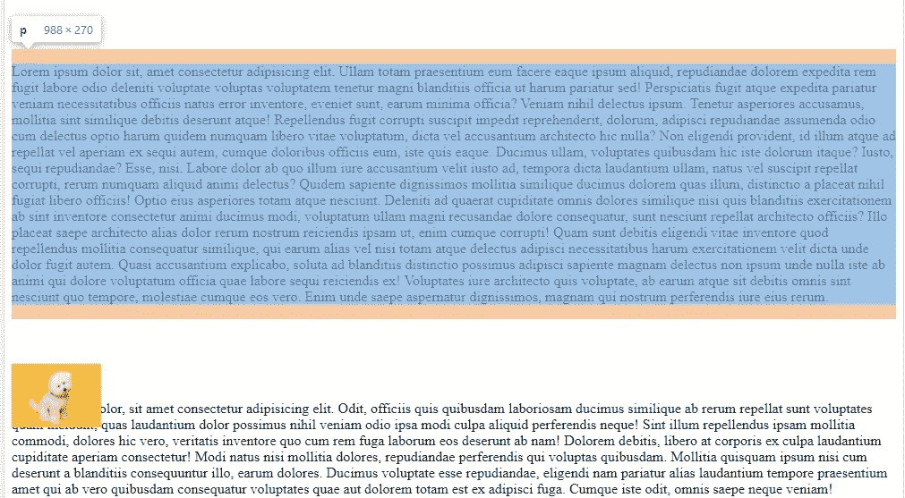

# CSS:相对和绝对位置

> 原文：<https://medium.com/geekculture/css-position-relative-and-absolute-fc5343ca6786?source=collection_archive---------43----------------------->

## 相对于其父节点的绝对位置

在这篇文章中，我们将讨论相对位置和绝对位置。

## 位置:相对

如果我们设置图像位置相对，顶部为 50px。



```
img{position: relative;top:50px; 
```