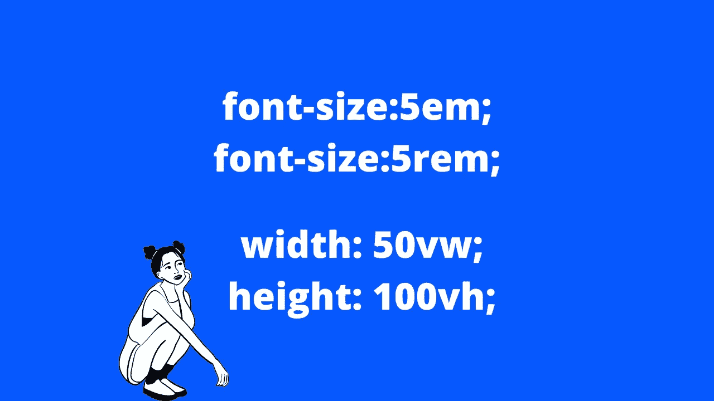

# CSS 中 Rem 和 em 单位，VH 和 VW 有什么区别

> 原文：<https://medium.com/geekculture/css-rem-vs-em-vh-and-vw-3fdb2a08f873?source=collection_archive---------18----------------------->

## 响应网站，字体大小为 rem 和 em，宽度和高度为 vw 和 vh

在这篇文章中，我们将讨论 CSS 中“em”和“rem”的区别，以及在响应式设计中有用的“vw”和“vh”。我们还将演示如何固定顶部和左侧的空白…