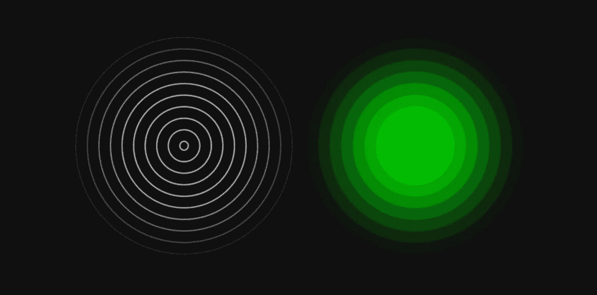
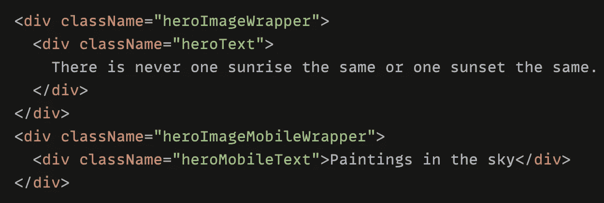
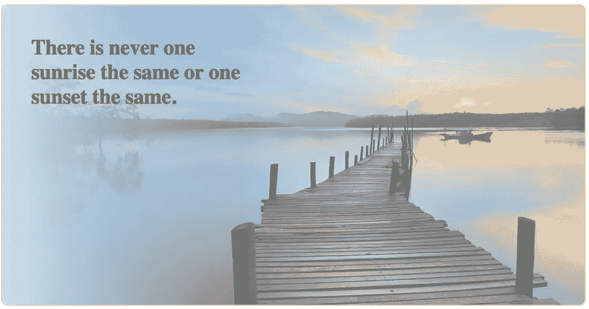
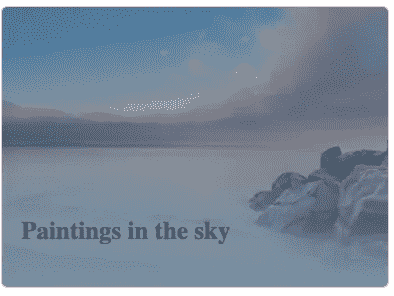
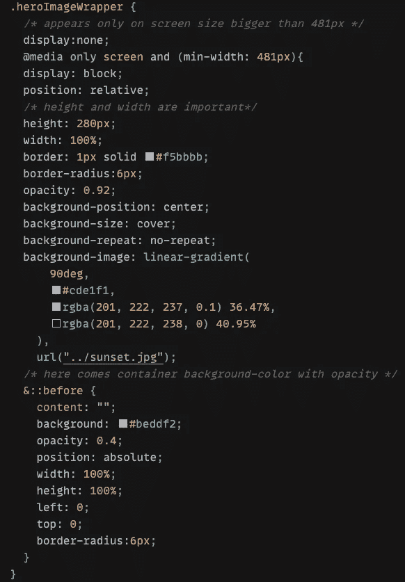
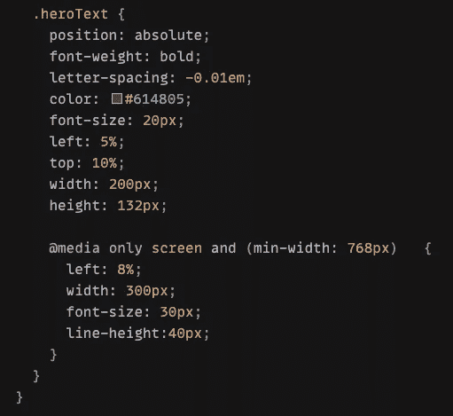
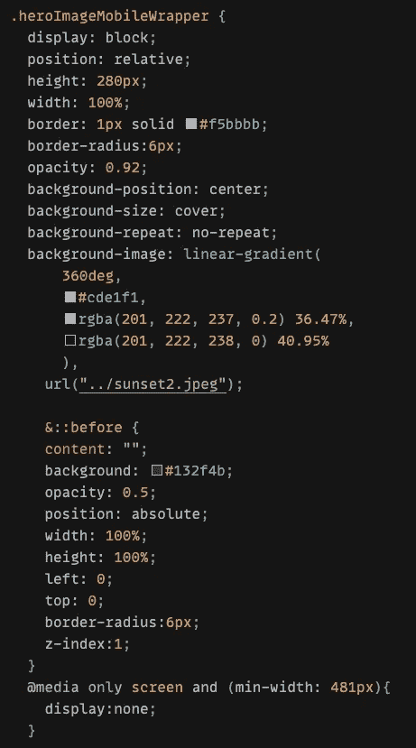
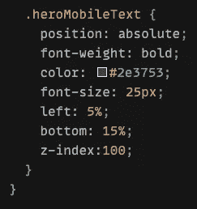

# Css 技巧:给背景图片添加颜色和线性渐变

> 原文：<https://medium.com/geekculture/css-trick-add-colour-and-linear-gradient-to-a-background-image-2dd0fe6125a8?source=collection_archive---------12----------------------->

—一个可以节省您时间的 css 技巧🦋

Knowledge is the torch of wisdom — 知识是智慧的火炬

实现响应式**背景图**很简单，但是将它与附加**背景色**和**线性渐变**结合起来并不像想象中那么简单，如果你还必须让背景图**亮**和**透明**，并且上面还有一些不应该透明的**文本**…

是啊，听起来很麻烦🙈，不过这是我目前项目中遇到的任务，我先用图片说明一下目的。

我们有两个不同的图像(我在这里使用的是示例图像)需要根据屏幕大小显示，**移动**版本和**桌面**版本:👇

this should be a **desktop** background image

this should be a **mobile** background image

对于该组件，我创建了下面的示例代码:

responsive images on desktop and mobile

我的目的是使用 css 属性"[**display**](https://developer.mozilla.org/en-US/docs/Web/CSS/display)**"**来根据屏幕大小确认哪个图像显示在哪个设备上。

✂️实现它们很简单，但是这里出现了**需求**，最终的效果应该是这样的:

desktop image with effect

mobile image with effect

好的，经过第一眼，我看到的是我们可能需要一些**线性渐变、**一些附加的**背景颜色、**一些**文本位置、**一些图像**不透明规则** …

让我们从第一张图片(桌面版)开始🌸

首先，为桌面图像包装器创建 CSS，我将其命名为“**herimagewrapper**”，参见下面的示例代码截图:👇(点击截图查看完整视图)

define `height and width is very important`

*   使用 CSS " **display** ，我们可以确定该图像应该只出现在屏幕尺寸大于 **481px** 的“**桌面**版本”上
*   给包装器一个“**相对的**位置，这样我们以后可以在其中定位文本
*   定义)******90 度** (t *he 值* `***0deg***` *，* `***180deg***` *，* `***270deg***` *，* `***90deg***` *，*相当于`***to top***` *，* `***to bottom***` *，* `***to left***` *，* `***to right***`****
*   ****…添加一些边框、边框半径…****

****🌱现在有趣的部分来了，正如我们从最终效果中看到的，应该有一些额外的颜色，不透明度…，直到现在我们只实现了**线性渐变**和一些**不透明度，**但是图片应该更暗更模糊，我们如何添加另一种颜色到**重叠**整个图像？****

****也许我们可以想象在图像和文本之间有一个**覆盖层**。不管怎样，我们需要一种 CSS 技术来引入这种覆盖。🍁****

****CSS 本身提供了强大的`**::before, ::after**`元素，用于向页面添加不应该影响标记的样式内容。****

****在这种情况下，我解决方案是在之前使用**来添加一个**伪**内容，它实际上只是一个“占位符”，除了一个附加的背景颜色 ***#beddf2*** 之外没有任何内容。******

***👉重要的一点是，所有的伪元素都需要一个* `***content***` *CSS 属性来显示。在我们的例子中，这只是一个空字符串。***

**上面的**:**之前在选中的元素之前插入一个动态元素，在我的例子中是**herimagewrapper**。**

*   **最后一步，给出文本内容**位置:绝对**对于不同的屏幕尺寸高达 481px，768px …，你可以定义更多的 CSS 规则，但这里我只是保持简单👇**

****

**different position with different screen size …**

**👐那是为了桌面图像！**

**现在让我们继续第二张图片(手机)🌸**

**桌面版之后应该很简单，唯一的变化是屏幕尺寸上的**外观**(小于 481px)，线性渐变**方向**(这次用**360 度**模糊底部一点点)，以及“叠加”颜色、不透明度…**

********

**define text position**

**我确信有一个更好的方法来实现背景图片的这些效果，但我认为至少这两个例子是有趣的，我希望你喜欢它！**

**感谢您的阅读！👐**