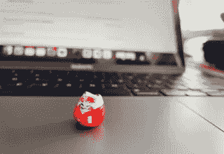
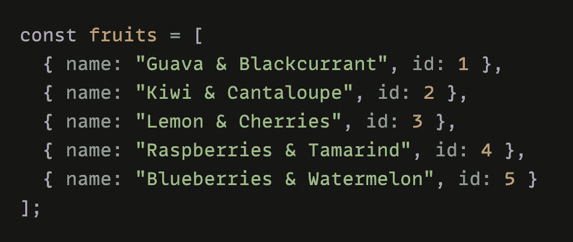
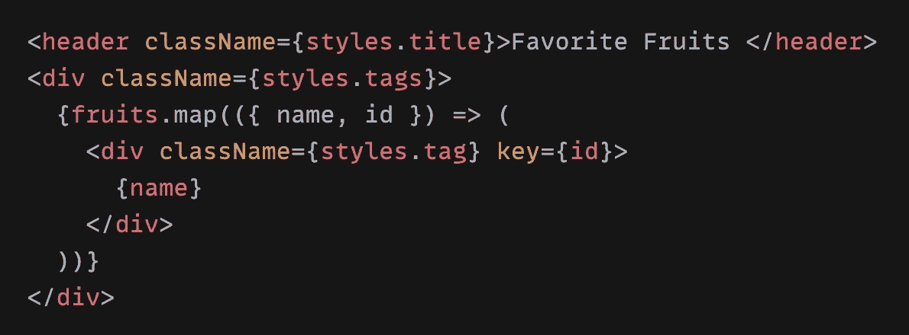
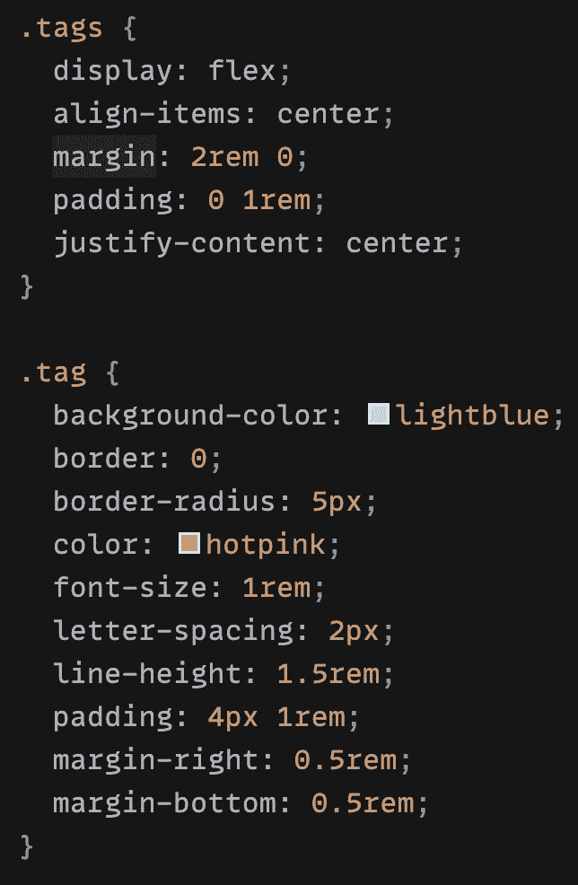
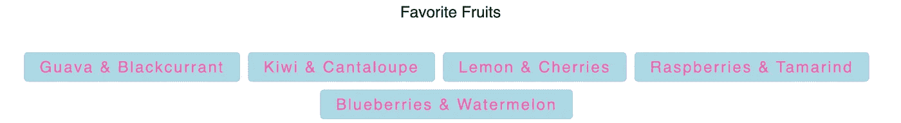
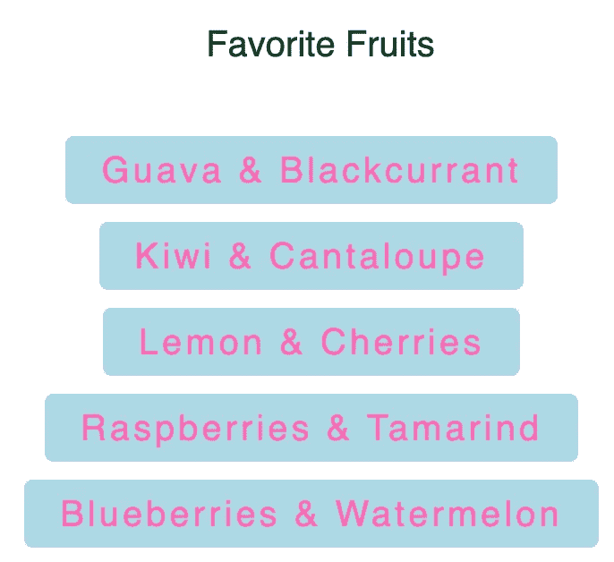
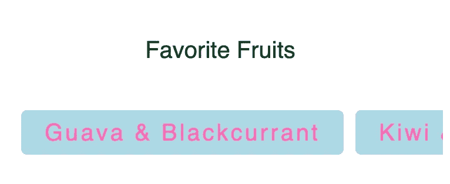
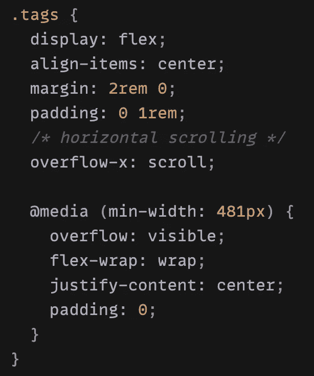
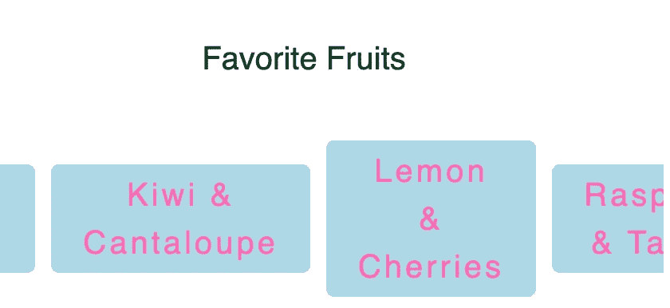
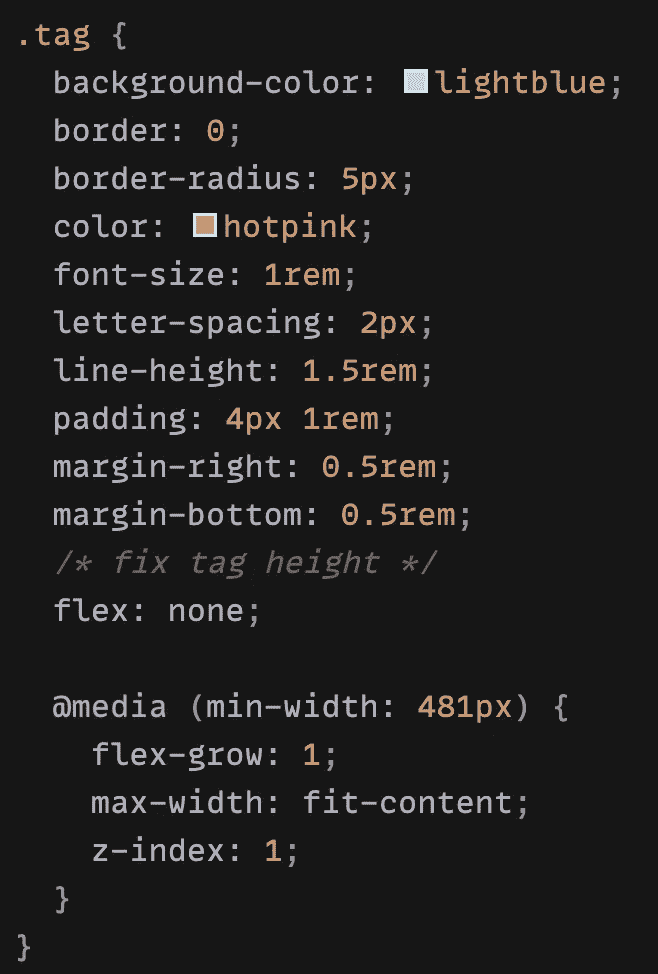

# CSS 技巧:移动设备上的水平滚动列表

> 原文：<https://medium.com/geekculture/css-trick-horizontal-scrolling-lists-on-mobile-devices-87312856d679?source=collection_archive---------3----------------------->

React 组件中一个非常简单的例子

有时候需要在移动设备上为一个列表做一个横向滚动的效果，其实很方便，用 CSS 就可以实现。

例如，你可以在一个水平**导航** **栏**中表示不同的类别，每个类别可以分配一个链接，允许用户直接跳转到不同的页面。

> 当您想要显示异类集合中同类内容的子集时，水平列表最适合。

水平滚动效果的好处在于，它使得网站访问者在使用移动设备时更容易水平浏览某些内容，并且页面不会因内容过多而显得笨重，例如大量的列表等。

在下面，我将创建一个简单的例子来实现这一点。✨

假设我们有一个水果列表，它将显示为标签。

mock fruits list

下面是我们如何在 React 组件中显示它们(*或者也使用列表< ul > < li >* …):

Display the tags within a component

使用一些基本的 CSS，我们可以将每个列表显示为一个标签，如下所示:

Desktop: fruit tags and title

实际上，它现在看起来已经足够好了，但是如果你换成手机:

The content on mobile is too long which makes page cumbersome

所以我决定改变这些标签在手机上的显示，这样用户可以水平滚动它们，我觉得这样会让页面看起来不那么笨重:

Horizontal scrolling lists on Mobile ⬅️ ➡️

为了实现这一点，我们可以使用 ***溢出:在移动*、*上滚动*、将显示**滚动条**并使框内内容可滚动，防止框外内容渲染。**

*也可以自定义或隐藏滚动条，例如 *::-webkit-scrollbar-track，:-webkit-scrollbar-thumb，:-webkit-scrollbar-corner* …我将在本文底部做一些介绍👇

下面是标签选择器的最终 CSS:

**overflow: scroll** on mobile and **flex-wrap** on desktop

现在让我们看看水平滚动的结果:

Tags have different heights ✴️

由于每个标签内容的宽度不同，我们得到的结果看起来并不好。要解决这个问题，我们只需要一点小技巧，更新**标签** CSS:

Trick: flex: none

使用手机上的 ***flex:none*** 来“固定”标签的高度，使用桌面上的***max-width:fit-content***来“固定”标签的宽度。

就这样，现在我们在手机上有了滚动条，在桌面上显示了 flex 内容。🍭

👉有时你可能想要隐藏或定制滚动条，就像我之前提到的，一个简单的例子来实现这些:

隐藏示例:

`-ms-overflow-style: none; // for Internet Explorer, Edge`

`scrollbar-width: none; // for Firefox`

`::-webkit-scrollbar {`

`display:none; // for Chrome, Safari and Opera`
`}`

自定义示例:

`::-webkit-scrollbar-track{
border-radius: ...;
-webkit-box-shadow: ...;
} *::-webkit-scrollbar-thumb:hover {
background-color: ...;
-webkit-box-shadow: ...;
}*`

但是许多 UI 设计师认为“**标准化了的**”像滚动条这样的 UI 组件不应该影响性能，在我看来你可以完全控制。🧊

**注意** : *::-webkit-scrollbar* 只适用于基于 Blink 和 webkit 的浏览器(例如 Chrome、Edge、Opera、Safari、iOS 上的所有浏览器…)，不适用于 Firefox、Internet Explorer、Firefox for Android。如果*溢出:滚动*未设置，则不显示滚动条。

非常感谢您耐心阅读我的文章，如果您对我基于 CSS 的其他文章感兴趣的话:👐

 [## 以反应方式隐藏和替换滚动时的粘性元素

### —棘手但有趣🍡

medium.com](/geekculture/hide-and-replace-sticky-element-on-scrolling-in-a-react-way-8bc3f04e2a81)  [## Css 技巧:给背景图片添加颜色和线性渐变

### —一个可以节省您时间的 css 技巧🦋

medium.com](/geekculture/css-trick-add-colour-and-linear-gradient-to-a-background-image-2dd0fe6125a8)  [## 用 CSS 防止换行

### —reactcomponent🧚中的 css 技巧

medium.com](/geekculture/prevent-line-breaks-with-css-68a9f066db60)  [## 创建以反应方式嵌入的响应 iframe

### —令人惊讶的是，YouTube 没有相应的嵌入代码🦄，我们来玩 css 吧…

enlear .学院](https://enlear.academy/create-responsive-iframe-embed-in-a-react-way-f52075bf3b04)  [## CSS 技巧:将卡片容器中的物品放在底部

### —每多学一点，就少写一行代码

medium.com](/geekculture/css-trick-how-to-keep-the-contents-of-a-card-container-at-the-bottom-1eaf0d59ee96)