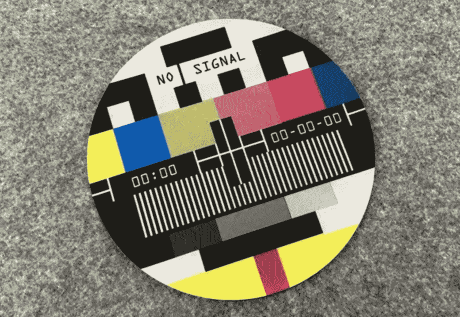
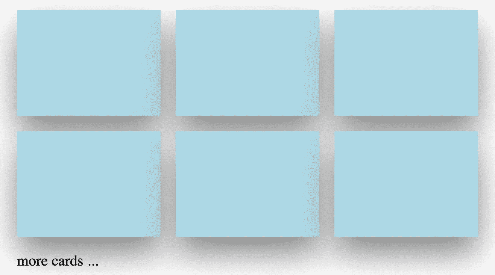
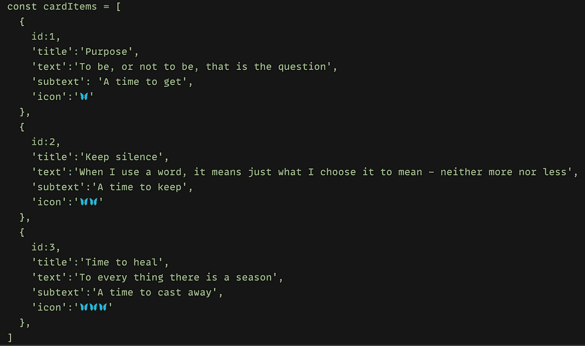
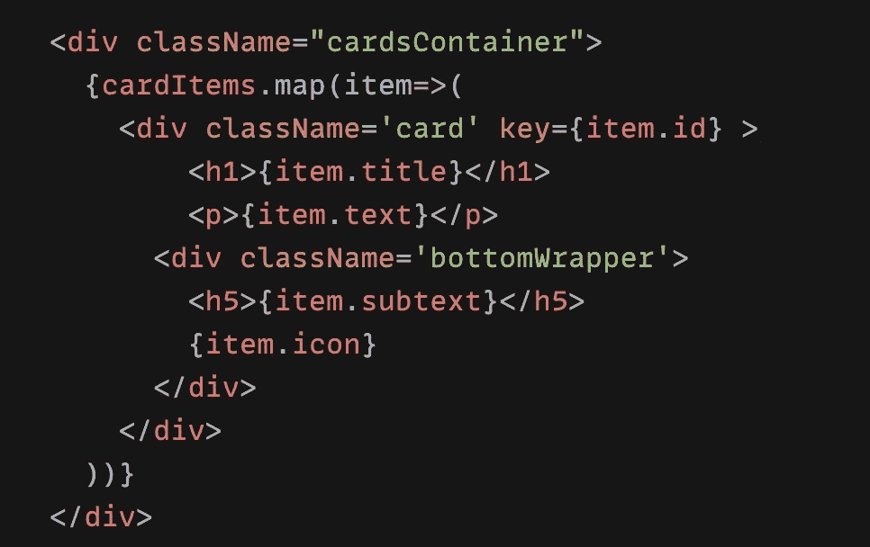
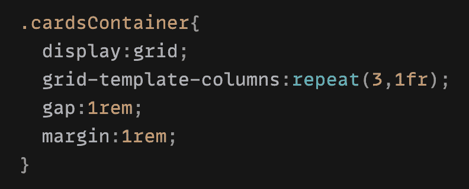
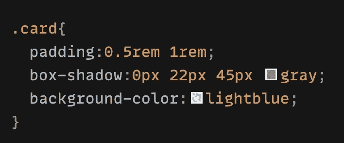
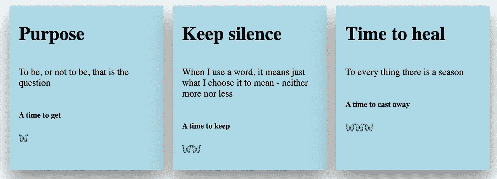
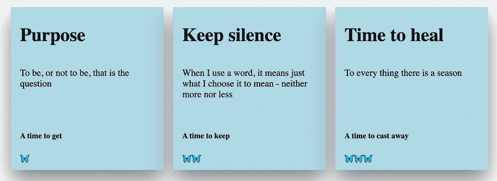
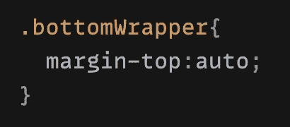
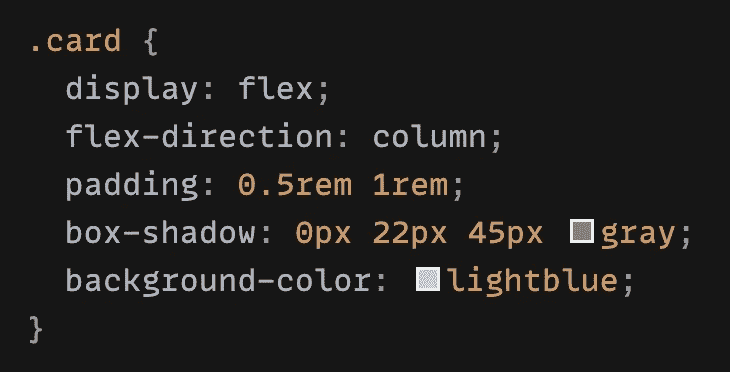

# CSS 技巧:将卡片容器中的物品放在底部

> 原文：<https://medium.com/geekculture/css-trick-how-to-keep-the-contents-of-a-card-container-at-the-bottom-1eaf0d59ee96?source=collection_archive---------9----------------------->

*—每多学一点就少写一行代码*

活到老，学到老 — — Live till you drop, learn till you drop

CSS 让我又爱又恨，一方面 CSS 可以让页面更漂亮，但另一方面，学习和掌握是没有止境的。

作为一个自学成才的前端开发人员，我在 React 结构和 JS 逻辑上花了太多的时间，搜索和学习，尤其是当同事忙于自己的任务，没有时间向你解释任何事情，甚至他们的解释你根本不懂的时候。我以前觉得 CSS 与其说是开发语言，不如说是设计语言，所以对 CSS 比较冷漠。这样做的后果就是，当页面的交互和样式都很丰富的时候，我写的 CSS 代码的线条有时候会很吓人，我再也不想看了。

但是，在努力尝试和碰壁之后，现在我越来越喜欢 CSS 了！🍭

没有过多的前言，让我简单解释一下这篇文章的目的:

假设一个页面中有很多**卡片**，页面上**行**的数量不固定，但是每一行有固定的 **3** 张卡片，所有卡片都是一样的高度和宽度，类似下图的东西。👇这看起来如此简单明了，你可能认为一个**网格**布局就足够了，不是吗？然而，事实并非如此。。。让我们继续……

Page layout with multiple cards

首先，我创建了一个**car titems**模拟数据(一行 3 张卡片),以便稍后在 React 组件中显示它们:

Card Items mock Data

下面的 React 示例代码显示了这 3 张卡片，每张卡片都包含一个**标题**、**文本**、**潜台词**和**图标**:

Ignore the **className=’bottomWrapper’** for now

当然，我们给容器一个***>【卡片容器】*** 和 **网格**布局，这样 3 张卡片在它们周围和之间有空间(**间隙**和**边距**)的情况下排成一行。

grid layout for 3 cards within the cards container

下面是每张卡片的 CSS，我们给它们小的**填充**和**阴影**，这样它们看起来更漂亮:

A nice card

结果如下:👇

Each card has a different content height 💥

你看到垂直问题了吗？然而，我们需要的是，无论**文本**内容占据多少行，图标到卡片底部的间距应该始终相同，如下所示:👇

final result requirement

你可能会想:这很简单，只需在**卡**类名上添加一些东西，比如 **:**

> 显示器:flex
> 
> 伸缩方向:列；
> 
> justify-content: center(也尝试 flex-end，baseline…)；

👀

嗯，这是正确的方向，因为我们将使用 **Flexbox** 布局，但这不会工作:)

还记得上面的 React 代码吗，有一个****bottom wrapper】*****？我们为**图标**和**潜台词**创建这个**包装**的原因是因为更容易一起控制它们，因为到卡片底部的间距应该总是固定的，这实际上意味着我们必须一直将它们**推**到卡片的**底部**。*

*下面是一行小技巧:💡*

**

*Add **margin-top** to push the items to the bottom*

*卡片的最终 CSS:*

**

*Final CSS for card*

*就是这样！众所周知，使用 ***边距自动*** 我们不仅可以控制特定元素的**水平**对齐，还可以控制特定元素的**垂直**对齐。*

*** Margin 将**空格**添加到元素中，例如使用`margin-left:20px`，它将 20px 添加到元素的左侧，从而将元素推到右侧。使用`margin-top:auto`,`auto`计算**整个可用空间**并使该空间位于元素的顶部，在我们的例子中，它将元素(**潜台词** **和** **图标包装器**)一直推到底部，(在其他情况下，margin-bottom 也有效)。*

*👉有一点要提一下:父元素(在我们的例子中是**卡**)应该总是使用 **Flexbox** 属性。*

*非常感谢您耐心阅读我的文章，如果您对我基于 CSS 的其他文章感兴趣的话:👐*

* [## 以反应方式隐藏和替换滚动时的粘性元素

### —棘手但有趣🍡

medium.com](/geekculture/hide-and-replace-sticky-element-on-scrolling-in-a-react-way-8bc3f04e2a81)  [## Css 技巧:给背景图片添加颜色和线性渐变

### —一个可以节省您时间的 css 技巧🦋

medium.com](/geekculture/css-trick-add-colour-and-linear-gradient-to-a-background-image-2dd0fe6125a8)  [## 用 CSS 防止换行

### —reactcomponent🧚中的 css 技巧

medium.com](/geekculture/prevent-line-breaks-with-css-68a9f066db60)  [## 创建以反应方式嵌入的响应 iframe

### —令人惊讶的是，YouTube 没有相应的嵌入代码🦄，我们来玩 css 吧…

enlear .学院](https://enlear.academy/create-responsive-iframe-embed-in-a-react-way-f52075bf3b04)*