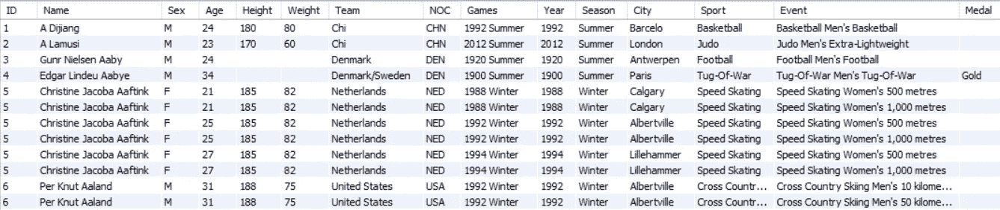
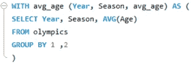
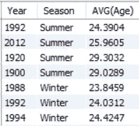
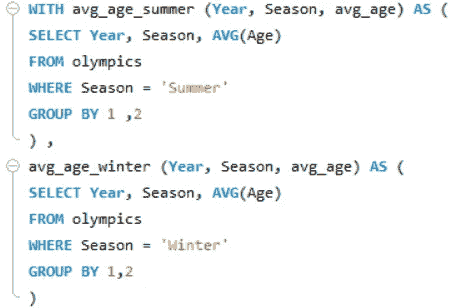
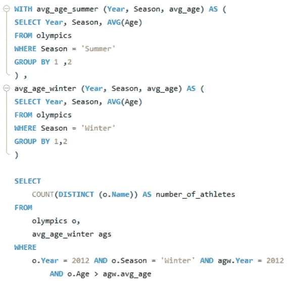

# SQL 中的 cte(公共表表达式)

> 原文：<https://medium.com/geekculture/ctes-common-table-expressions-in-sql-f68ff26bb5b9?source=collection_archive---------6----------------------->

Image from this [Blog](https://mode.com/blog/use-common-table-expressions-to-keep-your-sql-clean/)

公共表表达式(通常称为 cte)类似于临时表，它在查询执行期间创建，在查询完成后删除，并且可以在 SELECT、INSERT、UPDATE 和 DELETE 中引用。

> **如何使用 CTEs:**

cte 由 SELECT、INSERT、UPDATE 和 DELETE 子句之前的 WITH 子句定义，多个 cte 由逗号分隔。

> **举例:**

让我们看看如何将 CTEs 用于奥运会数据库。

snippet from the Olympics Table

现在让我们假设我们想要得到某届奥运会中年龄超过所有运动员平均年龄的运动员的数量。(例如，2016 年奥运会中年龄超过 2016 年奥运会运动员平均年龄的运动员人数。)

The name after with denotes the name of that temporary table and inside the brackets are columns of that temporary table

这个 CTE 存储这些数据，

result of the query inside the above defined CTE.

在一张临时桌子上。

可以通过放置逗号来定义多个 cte。我们甚至可以通过使用两个单独的 cte 来改进上面的查询，一个用于夏季，另一个用于冬季。

Defining Multiple CTEs

现在，如果我们想知道 2012 年冬奥会中，年龄超过该届奥运会所有运动员平均年龄的运动员人数。

> **为什么要用 CTEs:**

使用 cte 有几个优点，其中一些是:

***提高代码的可读性:***

CTEs 没有使用太多的子查询并造成混乱，而是提高了 SQL 查询的可读性。

***易于调试，易于重用:***

由于减少了子查询的使用并提高了可读性，所以在数据库或查询出现问题时进行调试变得更加容易。

因此，视图和[物化视图](https://blog.devops.dev/how-using-materialized-view-can-improve-your-query-bc13b59b68ae?source=your_stories_page-------------------------------------)做同样的事情，那么为什么要使用 cte 以及何时使用 cte。

> **视图和 cte:**

如前所述，cte 就像一个临时表，只在查询执行时存在于内存中，如果您想在其他地方使用它，就必须再次定义它，但是视图存在于内存中，可以在查询中的任何地方使用，因此它有助于避免创建不必要的元数据。

cte 没有索引，而视图有索引。

> **总结:**

在本文中，我们已经了解了一些关于 cte(公共表表达式)以及如何利用它，还了解了它如何提高代码的可读性。

感谢您的阅读……..