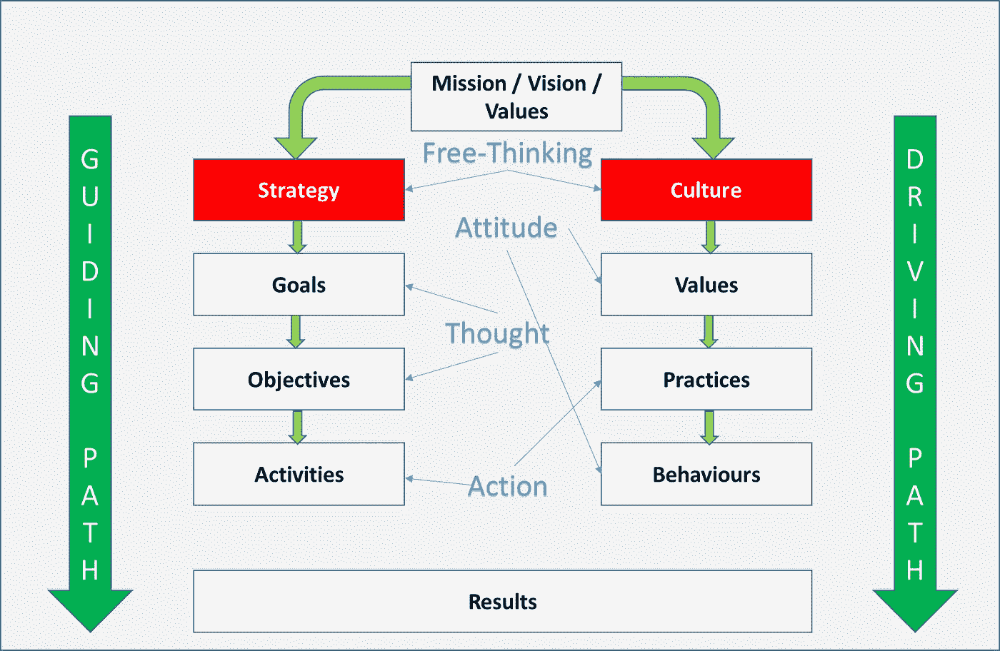
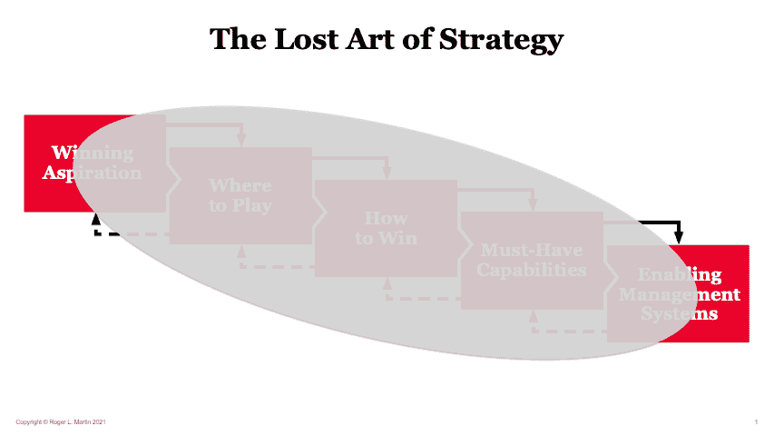
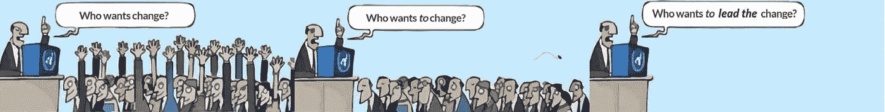

# 文化是任何成功战略的基本促成因素

> 原文：<https://medium.com/geekculture/culture-is-the-fundamental-enabler-of-any-successful-strategy-3e8622ea7826?source=collection_archive---------6----------------------->

**不要让文化在早餐时吃掉你的策略**

**或者为什么思想、自由思维、态度和行动的一致性的完全透明是你的战略之旅的关键因素。**

Image adapted from [Torben Rick](https://www.torbenrick.eu/blog/business-improvement/build-a-culture-that-supports-strategy-implementation/) on his blog

# 开始之前

# 放弃

**本帖为个人中帖**。这里表达的任何观点仅属于作者，并不反映作者曾经或现在隶属的任何公司或组织的任何观点或意见。点击查看完整免责声明[。](https://jhadnr68.medium.com/disclaimer-70803d581009)

# 🎓1|战略的艺术(核心)

是时候开始一个新的战略周期，或者就一个新的战略展开讨论了，无论是针对整个企业还是仅仅针对一个特定的企业领域。

你通常会发现一群经理在漫长的战略规划会议上集思广益。

在一些迭代之后，你得到一个**文档**，这个文档大部分时间完全**与什么策略有关**。而且你再怎么努力，也没有**指导建立计划**。

你通常会发现类似于"**愿景**、" "**战略主题**、" "**指导原则**、"**战略目标**"通常情况下，那些"**战略目标**更多的是一系列**行动，混合着一些渴望**、**期待已久的结果、预期的结果和切实的利益**。所以，只有一套**目标**——一个写有“日期”的**“梦想”大多数时候，甚至与你的策略无关。但最终，你总会得到一个“结束日期”**

**在讨论策略的时候，我总是提醒“** [**收件箱零**](https://whatis.techtarget.com/definition/inbox-zero) **”大部分人还是不理解。**

> [🔥](https://www.tieronepr.com/blog/fire-up-your-marketing-strategy-with-the-first-language-of-digital-emoji) ❝战略已经变成了一个失落的 art❞

不理解战略是什么总是失败的起点。你已经缺乏有效战略规划的关键要素。为什么？你的战略目标甚至没有被分解成步骤，成为一个计划草案。

不要搞错了。在某个时刻，你必须开始理解**组织可能会如何前进**(以及它是否能有所行动)。当策略塑造你的新路径时，你需要准备计划，并为最终的执行和监控做好准备。

最重要的原因不仅仅是**缺乏对**战略的理解。缺乏使用框架和有效方法的知识，你可以一步一步地迭代应用。

> [💭❝，这就是为什么你的新“梦想”永远不会实现。❞](https://emojipedia.org/thought-balloon/)

一如既往，我们总能学到东西。一如既往，我们应该永远向最优秀的人学习。

> ♾️ ❝:这是避免无限期使用“战略”一词的一个进步。❞

> “你不策划战略，你学战略。没有人能够通过一套分析技术来制定策略。战略是综合，不是分析。综合是一个学习过程。这是一种应急策略，而不是深思熟虑的策略。你一步一步地学习你的策略。
> 
> 人们责怪实施，因为他们是制定者。如果它未能得到执行，它就未能得到制定”
> 
> [**——亨利·明茨伯格**](https://www.youtube.com/watch?v=ieyZH1vwErY)

正如罗杰·马丁教授在他的战略框架中明确解释的那样，**将战略与规划联系起来是授权管理系统集群的核心。但是在你最终到达那里之前，你应该预先考虑一些重要的事情。**

1.  你的**获奖愿望**
2.  *你要去哪里 ***玩****
3.  **你打算 ***赢*****
4.  *****必备*** ***能力*** 能让你的**战略成功**。**

**当您最终意识到如何处理您的 ***管理系统*** 集群时，您就拥有了宝贵的支持，可以对所提议的框架的良性循环来回应用几次迭代。**

****

**Image from [Professor Roger Martin](https://rogermartin.medium.com/the-lost-art-of-strategy-5f95edbaa04b)**

> **简而言之，战略是做出一系列综合选择的行为，它使组织处于获胜的位置；而计划是用时间表、可交付成果、预算和责任来安排项目的行为。**
> 
> *****—作家、战略顾问、2017 年全球排名第一的管理思想家罗杰·马丁教授。*****

***在这个良性循环中，来来回回，**策略就是选择**。每当没有选择，或者一个人决定选择一切，你就达到了不需要策略的地步。当然，这也适用于计划周期。***

# ***🚀2|战略和规划***

***思考如何启用您的管理系统集群是**稍后将允许您将战略与规划**联系起来的内容。**如果有疑问，请不要。** **战略和规划是互补的，不是替代的。罗杰·马丁教授再次清楚地解释了原因。*****

> ***简而言之，战略是做出一系列综合选择的行为，它使组织处于获胜的位置；而规划是用时间表、可交付成果、预算和责任来安排项目的行为。”***
> 
> *****-** [**罗杰·马丁教授**](https://rogermartin.medium.com/strategy-vs-planning-complements-not-substitutes-ea08e56809d6)***

*****战略和规划需要如此紧密联系，因为*****

> ***“有效的战略需要周密的计划。而没有战略，规划的价值是有限的。”***
> 
> ***[**——罗杰·马丁教授**](https://rogermartin.medium.com/strategy-vs-planning-complements-not-substitutes-ea08e56809d6)***

*****而且我也相信*****

> ***“从战略中流出的项目所涉及的决策与其说与战略不同，不如说与战略相似。对我来说，每个项目实际上需要另一轮的确定一个综合的选择集合，使组织在那个项目中获胜。当特定项目的一系列选择做出后，将会产生另一系列需要这种规划的项目，等等。据说，这位老太太曾对威廉·詹姆斯说过:“这是一路向下的海龟！”***
> 
> ***[**——罗杰·马丁教授**](https://rogermartin.medium.com/strategy-vs-planning-complements-not-substitutes-ea08e56809d6)***

***计划是让你的策略最终实现的东西。因为每个人都希望它尽可能准确，所以计划可以让你从整体上达到未来企业的目标。***

*****为什么？*****

> ***“永远要为没有计划会按计划进行这一事实做好准备”***
> 
> *****——西蒙·西内克*****

***在这个旅程中，从你的**获胜愿望**到你的**管理系统**，然后是你的**计划**练习，将会有很多内容需要讨论。请记住，战略需要实施、执行和监控。作为一个持续的改进循环，你需要在整个过程中把点点滴滴连接起来。***

> ***❌❝没有做到这一点意味着你根本没有战略。❞***

*****由于战略本身与规划有一点点联系——同样，作为整个旅程的补充，而不是替代——很明显，为什么你需要将思想、自由思维、态度和行动的一致性完全透明的心态作为你旅程的关键要素。*****

> ***🙌❝:这些都是可以用来把战略和计划联系起来的独特元素。❞***

*****要想成功，每个参与其中的人都需要从头到尾努力采用这种心态。否则，我们将不断错过我们的目标。*****

> ***🚫❝和我们注定要失败。❞***

# ***👁️‍🗨️ 3|变革议程***

***当设计一个新的战略和思考你的管理系统时，**你需要把一个新的变革议程放在最近战略的核心。**稍后，你需要将此与你的计划联系起来。***

*****你的变革议程应该始终是你新战略的核心！*****

> ***📅❝The 新**变革议程**需要**塑造**新**变革路径**。❞***

***永远记住你为什么需要改变议程。你有一个伟大的目标，认为你必须改变，并且相信改变是不可避免的。***

***然而，变革议程是不够的。为了让您的变革议程取得成功，您还需要考虑另外两件事:***

*****领导*****

***企业是复杂的组织。***

> ***“人们认为愚蠢是聪明的反义词。事实上，愚蠢是智能在复杂环境中运作的代价。几乎是不可避免的。”***
> 
> *****——亚当·罗宾逊*****

***有时，当在如此复杂的环境中讨论战略主题时，我相信***

> ***“你选择的对立面从表面上看是愚蠢的吗？”***
> 
> *****——罗杰·马丁*****

***变成了真正的挑战。我们需要让管理者和领导者互换。***

> ***“管理者会改变员工以适应系统。***
> 
> ***领导人改变制度以适应人民”***
> 
> *****——亚历山大·登·黑杰*****

***这是我们需要真正的领导者和新领导的首要原因。有时当我们谈论“敏捷”和“服务型领导”时，我们需要确保我们理解并知道你在谈论什么。***

> ***经典的命令-控制型领导要求严格的等级制度，而敏捷型领导则建议在组织的各个层面都采用服务型领导。虽然前者在当今瞬息万变的互联世界中有其明显的缺点，正如更成功的敏捷组织所揭示的那样，但后者并不是所有人的敏捷圣杯。***
> 
> ***[**——帕特里克·海勒**](https://patrickheller.medium.com/the-leadership-fairy-tale-b77aecaa03fa)***

*****新领导人需要投资于人。*****

> ***首席财务官询问首席执行官***
> 
> ***“如果我们投资发展我们的员工，而他们却离开了我们，会发生什么？”***
> 
> ***首席执行官***
> 
> ***如果我们不走而他们留下会怎么样？***

***新的领导者需要支持“自我激励的领导者”***

> ***让自发的领导者来管理组织，不管他们在层级中处于什么位置。如果这种自发的领导得到了组织高层领导的支持，那么底层的层级就变得不那么重要了，从而缩短了决策过程，加快了组织的敏捷性。在当今瞬息万变的世界中，这种速度和灵活性本身就是蓬勃发展所必需的。***
> 
> ***[**——帕特里克·海勒**](https://patrickheller.medium.com/the-leadership-fairy-tale-b77aecaa03fa)***

*****但是，请确保你知道自己在做什么，也知道你需要玩什么游戏！*****

> ***[👺](https://emojipedia.org/goblin/) ❝否则，它可能只是“[花式领导作为变相的权力和控制”](https://lnkd.in/eSGZD23N)。❞***

*****真正的领导者是那些能够引导人们改变体制的人。*****

> ***我担心商业领袖对物质利益比对耐心建立一个强大的组织更感兴趣，而一个强大的组织是从关心他们的员工开始的！
> **——约翰·伍登*****

***但是，请不要被愚弄。你需要采用“思想、自由思考、态度和行动的一致性的完全透明”作为你新咒语的关键成分。***

> ***📢❝:这就是领导力和变革议程对战略如此重要的原因。❞***

*****文化*****

***你现在对**为什么**和**什么有了完整的认识。*****

***您已经将您的**变革议程**与您的**目的**结合起来。***

***你还认为什么都不需要改变吗？从现在走向未来，我们需要考虑什么？***

******你必须做哪些不同的事情？******

***为了确保每一个**变化**都是**区别**，你**需要开始问“为什么不”。*****

***在这样做的同时，你需要最终完全接受一种新的心态，因为你需要采用一种新的领导范式，并使之与你的文化相一致。***

*****新领导需要推动企业文化和流程的变革。**他们需要创造**灵活的工作场所**，允许员工**增长技能**，为他们的职业发展**创造路径**。或许最重要的是，采用**思想一致性、自由思维、态度和行动的完全透明，来制定和传达新企业的目标和战略**。***

> ***“透明并不意味着分享每个细节。***
> 
> ***透明度意味着为我们做出的决策提供背景。"***
> 
> *****-西蒙·西内克*****

***如果你设法做到了，你就完成了新的变革议程！***

> ***💡“让你的变革议程与新的领导心态保持一致，以改变你的文化，这将最终让**企业**塑造一条新的道路。”***

***文化不仅仅是新战略的一个方面。***

***文化不仅仅是游戏的一部分。***

*****文化**就是游戏。***

***所以，永远记住，与你的企业文化不一致的战略将永远注定失败。***

# ***👁️‍🗨️ 4|领导力网:为什么需要它？***

***没有专注而积极的领导承诺，你的变革计划永远不会成功。***

***为什么？***

***首先，如果领导者需要为他们的新战略塑造新的路径，**变革议程也需要考虑企业的文化。这需要时间和努力、全身心投入、适当的计划、执行和监控。*****

***第二，对于大多数企业来说，他们业务的实际**价值将与其改变的能力相关**。***

*****而变化是不可避免的。*****

> ***◔̯◔ ❝我们正在进入非理性的时代吗？❞***

> ***“我们正在进入一个非理性的时代，在这个时代，许多领域的未来将由我们塑造，也将为我们而塑造——在这个时代，唯一正确的预测是没有任何预测是正确的；因此，这是一个在私人生活和公共生活中大胆想象的时代，是一个思考不可能和做不合理的事情的时代。”***
> 
> ******—查尔斯·汉迪，组织文化专员******

***在这个非理性的新时代，我们需要找到领导者来领导变革。如果说领导力只有一个定义，那就是**塑造路径并将战略转化为执行**。这主要是中层管理人员的核心职责。***

***这些新领导人将需要**拥抱领导网**。这些人被期望**将策略与执行**联系起来。这些人被期望**引领变革，塑造路径，并实现执行**。***

*** [## 领导网状结构:在混乱时代领导组织的新范例——第一部分

### 从“七宗罪”到“七种无害的美德”的飞跃 jhadnr68.medium.com](https://jhadnr68.medium.com/leadership-mesh-a-new-paradigm-to-lead-organizations-in-disruptive-times-c2e575a89fd2) 

问题是:

> *🐌❝:在这个非理性的新时代，我们还有真正准备好改变并快速适应以最终引领变革的领导者吗？“❞*

Leadership Mesh: Time to refactor?

> 🤲❝高效的领导者和领导层需要促进尊重文化，以使战略与规划保持一致。这种文化允许你用完全透明的思想一致性、**自由思维、**态度和行动来连接你的战略之旅。"❞

 [## 现代工作场所的战略性创新认可和奖励计划——第二部分

### 企业领导者有效设计创新“激励/认可/奖励计划”的完整指南

medium.com](/geekculture/a-strategic-recognition-reward-program-for-the-modern-workplace-series-part-ii-349d7b2685a8) 

# 👁️‍🗨️ 5|文化

一些企业在任何**战略**尝试中经常失败的原因之一往往与**文化**有关。

> “要了解一家公司的战略，要看他们实际做了什么，而不是他们说他们会做什么。”
> 
> **——英特尔前 CEO 安迪·格罗夫**

我们知道，最终总是组织文化将**驱动一切**。很可能，企业文化也会影响新的战略和实践。但是反过来也是正确的:

> [🎯❝你新的战略和实践将会巩固你的文化、价值观和信仰。❞](https://emojipedia.org/direct-hit/)

**文化**和**战略**应该始终携手并进。肩并肩。无论疾病还是健康。视为天作之合。因为如果**死亡将两者撕裂，到那时你的企业也将死亡**。

**路径是你的环境，塑造你的新战略方向意味着塑造你的环境来塑造你的文化。**

**正如道路是你的环境一样，领导者必须:**

*   用他们的**领导风格**来**塑造**企业的**战略**
*   一个 **lign** 企业**战略**与**规划**
*   在其**环境**中塑造新的**行为**
*   发现什么**让企业走到一起，团结起来**
*   **建立**支持**战略** **实施**的**文化**
*   **重塑**和**传播**新的**文化**

考虑到这些，新的**领导人**需要了解**文化**背后的东西，这样他们才能最终**在他们的**企业环境**中塑造**一条新的**道路**！

**新战略的文化契合度**是你将企业凝聚在一起所需的粘合剂。

塑造一种尊重的文化会让你的企业保持团结。

> ⛐ ❝，你正在推广一种尊重的文化！在这种尊重的文化中，你的员工中的每个人现在都是骑手和大象！❞

**当你到达那个点:**

> ⛐ ❝指导骑手、激励大象和塑造道路成为企业中每个人的习惯。❞

如果你设法到达那里:

> ⛐ ❝，你终于在你的公司环境中塑造了一条新的道路。您组织的文化 DNA。尊重的文化！❞

但是要小心，因为

> ⛐ ❝文化早餐什么都吃！❞

如果你认为一切都符合你的尊重文化，那么现在是时候了

> *🤔❝制定新的变革议程，让所有人都站在同一个 page❞上*

但是首先(再次感谢 Simon Sinek)，你应该总是从为什么开始！

> *🤔❝:为什么(以及如何)你的组织文化应该有助于范式转变？❞*

**假设你认为这是允许每个人朝着同一个方向前进的企业文化，追求同一个目标**并认为这条道路将**带领**每个人走向终点**目标**和**新战略的成功，那么你相信这一点。**

> 📢❝的文化变革必须由各级领导人领导。❞

当你最终到达那里时，你正准备开始。

只有当战略、文化和领导力相结合时，真正的变革才会开始。

思想、自由思维、态度和行动的一致性完全透明！

**从头到尾。**

**完全透明！**

# 在你走之前

如果你想收到我未来的文章，请在 [Medium](https://jhadnr68.medium.com/) 上关注我。如果你喜欢这篇关于“**文化是任何成功战略的基本促成因素，”**的文章，我想你也会喜欢我其余的文章。

你可以在这里给我买杯咖啡来支持它。或者只是分享你的反馈。

**敬请期待！*****