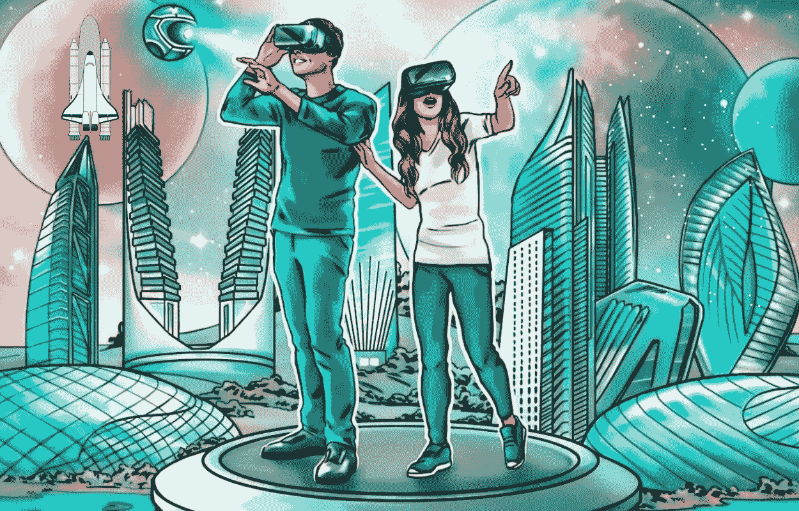

# 当前元宇宙的趋势是任何人都不能忽视的！

> 原文：<https://medium.com/geekculture/current-metaverse-trends-that-one-cannot-ignore-for-any-reason-282658fdd5c7?source=collection_archive---------6----------------------->

虽然虚拟世界可能已经从流行的科幻小说变成现实，但大规模的缪斯尚未出现(至少在 2022 年)。这些环境，通常被称为**“meta vers”、**，已经被越来越多的人采用，一些新颖的用例由创新的头脑提出。这种意识的增强为所有用户提供了比以前想象的更多的东西，而当前的元宇宙趋势正好反映了这一点。尽管处于加密的寒冬，metaverses 的增长是由个人、创业公司、品牌和公司等在这些虚拟世界应用程序中发现一些潜力的推动的。我们将看到最新的元宇宙趋势。

## 元宇宙正在成为主流

当每个人都高度评价 [**【元宇宙】**](https://bit.ly/3N7Tg0l) 作为娱乐和社交活动的可行替代方案时，人们可以理解过去一年的元宇宙趋势对聪明的远见卓识者产生了多大的影响。越来越多的大规模采用和新的真实世界用例使 metaverses 成为未来由区块链技术支持的去中心化互联网的中心。

**Metaverse**

## 🌠知名人士当然感兴趣

当想到像 Meta、Google、微软和苹果这样的科技巨兽如何投入数十亿美元研究这些身临其境的数字环境时，人们就可以意识到元宇宙发展的规模。随着全球人口越来越精通技术，为企业利用 metaverses 被视为一个非常有利可图的前景。

## 🌠NFT 和加密项目的出现

2021 年 NFT 的繁荣向公众展示了加密令牌的潜力，从某种意义上说，metaverses 只是 NFT 和 cryptos 的沉浸式用例。多个 NFT 项目已经建立了独立的元宇宙平台(在 2D)，VR/AR 改进将很快集成。

## 🌠元宇宙项目的大规模投资

在元宇宙开发上的支出不会给沉闷的加密市场带来任何迹象，因为加密风险资本家、社区投资者和公司将数十亿美元投入到元宇宙项目中。花在元宇宙应用程序和设备上的钱也表明了同样的情况，预计数字将很快飙升。

## 🌠元宇宙虚拟世界的相关性

元宇宙开发的虚拟世界，如分散的土地、沙盒和其他方面的名声越来越大，这表明了 Web3 社区对它们的兴趣。这些应用程序中虚拟土地的价格可以揭示出它们作为数字社交场所对于期待新体验的新一代消费者的相关性。

## 🌠事件是新的元宇宙用例

元宇宙开发平台仅用于游戏的日子已经一去不复返了。**元宇宙事件已经成为这些平台的一个经典用例，可以用来从数字上不受任何限制地聚集来自世界各地的难以想象的人群。音乐会，聚会，会议，甚至婚礼都在 metaverses 上举行。**

## **🌠以元宇宙解决方案为特色的工作区**

**近来，许多公司，尤其是那些完全远程工作的公司，正在采用虚拟工作环境，这是一种诱人的元宇宙趋势。甚至微软也开发了团队的扩展版本，称为 Mesh。这些应用程序为员工和雇主提供了许多好处，并由于协作的增加而提高了工作效率。**

## **🌠元宇宙奥运会将永远存在**

**有了这么多元宇宙开发的用例，人们可以简单地忘记游戏。但是，随着新平台不时涌现，元宇宙的游戏空间看起来不会很快消失。扩展现实设备的进步是其增长的主要原因。**

## **🌠保存数字身份将变得更加容易**

**尽管 metaverses 存在恶意伪装者冒用他人身份的问题，但由分散数据分类帐支持的日益增多的验证协议可以提供针对此类问题的保护。此外，黑客入侵链上的身份是不可能的，从图片中排除非法行为。所有这些将确保人们能够有安全的元宇宙经历。**

## **🌠栩栩如生的化身将成为现实**

**今天的元宇宙化身可能是 3D 表示或像素化图像，正在进行的研究使虚拟化身尽可能逼真。元宇宙开发应用程序使用人工智能来完成这项任务，因为它将有助于将数据转换为 3D 效果图。随着测试的进行，预计变化会更快发生。**

## **🌠增强现实和虚拟世界**

**将增强现实用于元宇宙开发平台为用户提供了将现实和虚拟世界结合在一起的体验。游戏已经看到了第一个用例，电子商务将紧随其后，其他的也将在不久的将来出现。对复杂设备需求的减少支持了其在用户中更快的采用。**

## **🌠智能家居将实现虚拟化**

**具有物联网功能的智能家居已经存在，基于 Web3 元素的元宇宙开发将为租户提供个性化体验。来自区块链的数据安全增加了这些体验，让用户在使用这些复杂的虚拟家庭助手时有一种解脱感。**

# **一些包装的想法**

**因此，上述元宇宙趋势为未来的元宇宙开发活动提供了宝贵的见解，因为大多数项目都依赖于其中的一点。这些虚拟环境提供的好处是无穷无尽的，这意味着更多的潜力将被释放，趋势将随着时间的推移而变化。如果你希望利用这种不可思议的趋势，这是开始的理想时机，因为随着更多项目的进行，竞争将变得更加激烈。**让元宇宙成为你的商业方向，建议与优秀的元宇宙发展公司合作。这样的公司将在规定的期限内以可承受的价格提供精致的服务。****