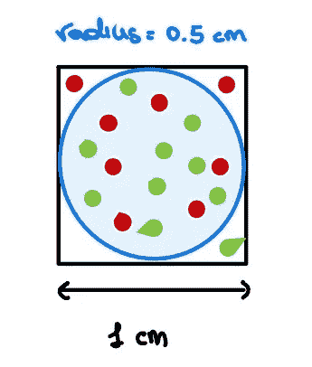
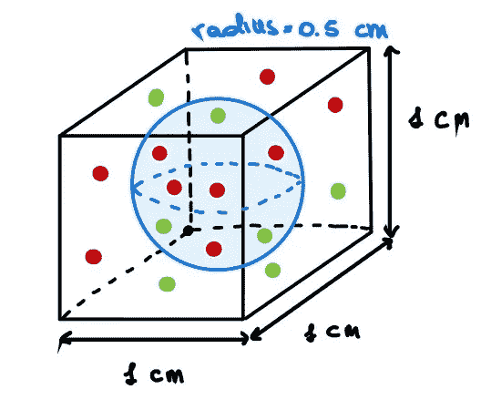
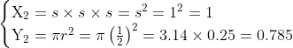
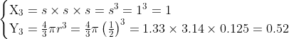
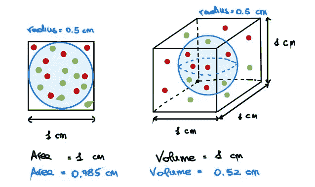
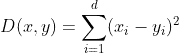

# 维度的诅咒

> 原文：<https://medium.com/geekculture/curse-of-dimensionality-e97ba916cb8f?source=collection_archive---------22----------------------->

Photo by [Sigmund](https://unsplash.com/@sigmund?utm_source=unsplash&utm_medium=referral&utm_content=creditCopyText) on [Unsplash](https://unsplash.com/s/photos/glasses-3d?utm_source=unsplash&utm_medium=referral&utm_content=creditCopyText)

# **简介**

如果你已经在数据科学和机器学习方面积累了一些经验，你可能听说过有人担心可怕的“**维数灾难**”。如果没有，不要慌，我会尽量澄清的！

大多数时候，维数灾难的定义与数据的**稀疏度**严格相关。事实上，随着维度的增加，空间的体积也急剧增加，数据变得越来越稀疏。

数据集稀疏性的一个结果是，我们的机器学习算法将需要更多的数据，以便**推广**！然而，收集标记数据并不总是那么容易。因此，从一开始就解决这个问题比寻找新数据更有效。

# 从另一个角度来看

在我的机器学习数学课程中，教授给了我们一个这种现象的实际表示，我只在少数在线资源中看到过。

让我们考虑一个 2D 特征空间，由一个**单位正方形**表示，并且还考虑一个**内接在这个正方形**上的圆。如您所见，大多数数据点位于圆圈内，而稀疏数据位于角落。

如果我们将特征空间的维度增加 1，我们获得一个**单位立方体**和一个**内接球。**直观上，比以前更多的点是稀疏的(即在角上)。

> 请闭上一只眼睛，想象这个立方体的所有边都一样长！

现在，如果我们继续一段时间，我们将在一个非常高维的空间中结束。会发生什么？嗯，超立方体的体积将永远是 1，而超球体(也称为 n 球，具有 n 维)的体积将呈指数下降。所以，总是越来越多的点会躺在角落里！

你还困惑吗？让我们用数学方法来试试。在**二维**中，给定一个单位正方形，其面积等于 1 whreas，内切圆的面积等于 0.785

有了**三维**，我们有了

最后，有了 n 个维度，我们就有了

> 参见[维基百科](https://en.wikipedia.org/wiki/Volume_of_an_n-ball)了解“n 球”的体积

希望现在，你应该能够“看到”并理解维数和数据稀疏度之间的关系！

# 距离度量呢？

嗯，一些距离度量可能会受到这种现象的强烈影响。特别地，随着维数的增加，欧几里德距离将慢慢失去其相关性。

为什么？首先，回忆一下维为 *d* 的欧几里德距离的定义:

你可以想象，如果你开始增加新的维度，这个总数也会增加。因此，对于足够大的维数，最近点和最远点之间的比率接近 1。因此，谈论“K”最近点(例如在 KNN、LOF 等地)没有任何意义。

# **结论**

综上所述，我们已经试图对**维数灾难**给出一个更正式的解释，这是机器学习中一个非常有争议且被低估的话题。

每当我们有非常多的功能时，我们都有几个选项可以考虑，例如:

*   移除高度[相关](https://en.wikipedia.org/wiki/Pearson_correlation_coefficient)或不相关的特征
*   相似特征分组
*   使用[主成分分析](https://en.wikipedia.org/wiki/Principal_component_analysis)和类似技术

# 参考

*   维度的诅咒:[维基百科](https://en.wikipedia.org/wiki/Curse_of_dimensionality)
*   维度的历程:[朱莉·德隆](https://mathematical-coffees.github.io/slides/mc08-delon.pdf)，
*   维度的诅咒:[托尼·姚](https://towardsdatascience.com/the-curse-of-dimensionality-50dc6e49aa1e)