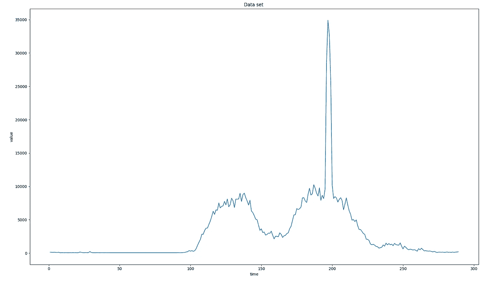
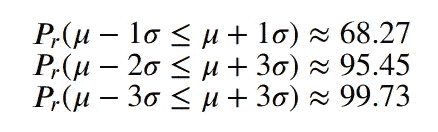
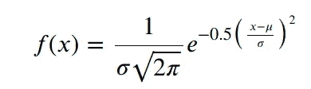
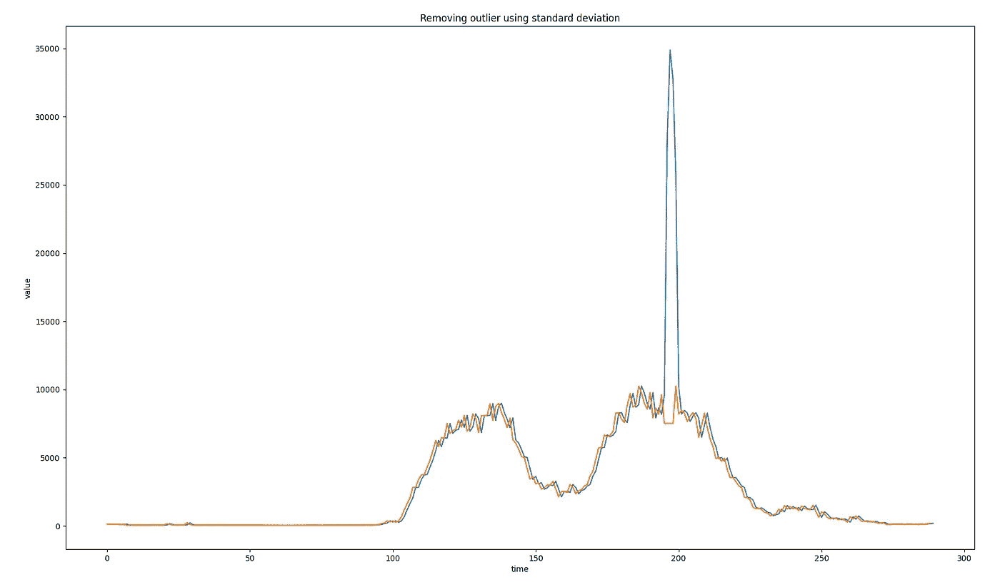
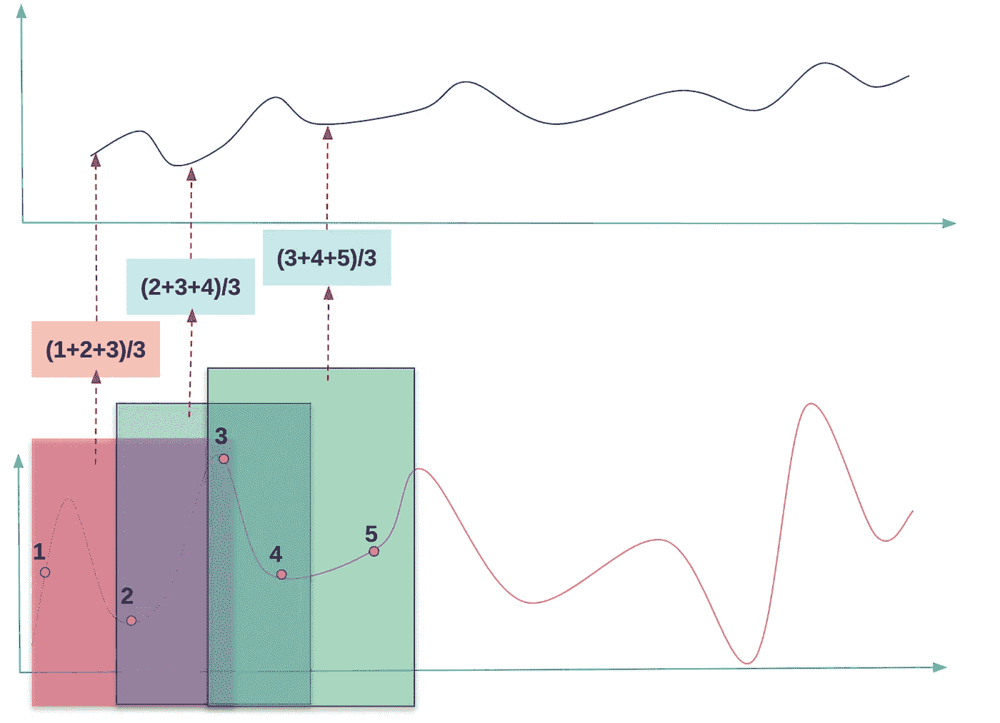
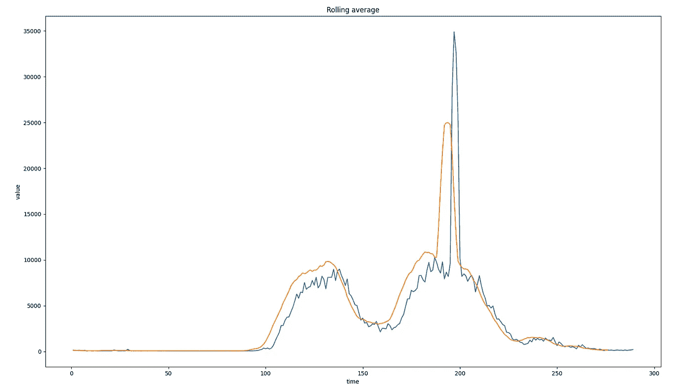
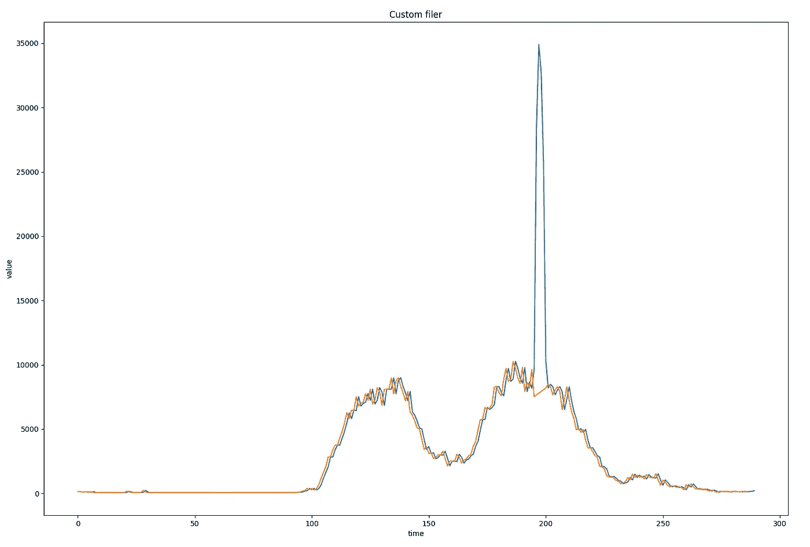

# 使用 C++进行曲线平滑和异常值去除。

> 原文：<https://medium.com/geekculture/curve-smoothing-and-outliers-removal-using-c-d3bf6e2fbc78?source=collection_archive---------4----------------------->


by author

以下文章定义了在我们执行与特定数据集(或测量)相关的工作时，特定事件的发生([异常值](https://en.wikipedia.org/wiki/Outlier))。异常值是一个数据样本，它与观测值/测量值有很大不同，通常会降低分析性能，引入噪声。在特定情况下，异常值会扭曲最终结果或影响失败的决策。
此外，文章展示了检测异常值并从数据集中移除或被某些值替代简单方法。
异常值检测过程和与该值的弱化相关的动作也可以理解为 s 曲线平滑过程。

在这篇文章中，我将展示和部署三个非常简单的方法，它们可以很容易地应用于所有的情况和领域。方法的使用是无限的。它可以用于存在异常值问题的任何地方。以下方法既可以离线使用，作为后处理，也可以在线使用，作为实时异常值去除(曲线平滑)。

请注意，在下面的文章中，所有给出的例子都利用了预制的 [**数据集**](https://gist.github.com/markusbuchholz/5a314e1602ab03e9dbd7ec6fe583da70) ，这为您自己的研究提供了一个完美的开端。提出的程序结合了库，给机会来绘制你的结果(类似于 Python)。我真的建议检查下面的[库](https://github.com/lava/matplotlib-cpp)。头文件-克隆 repo(用于打印库)必须与 cpp 位于同一文件夹中。

这篇文章的意思是描述做大事的简单方法。我不打算深入 C++代码，因为它是不言自明的。对于所有的图，我应用了以下惯例。蓝色曲线表示数据集，橙色表示已处理的数据(使用文件管理器后)。

本文中给出方程是以 Latex 格式编写的。你会在我的[要点](https://gist.github.com/markusbuchholz/2f4f0d6f8cd1a3a3ed7634e9ba5b1cfe)中找到出处。

包括的程序，您可以编译并运行如下:

```
//compile
g++ my_prog.cpp -o my_prog -I/usr/include/python3.8 -lpython3.8// //run
./my_prog//folder tree
├── my_prog
├── my_prog.cpp
├── matplotlibcpp.h
```

本文中使用的数据集可以绘制如下。请注意，我们将尝试删除可见的异常值，主要是大约 10.000 以上的值。



by author

# 使用标准差去除异常值。

在本节中，我将展示使用[](https://en.wikipedia.org/wiki/Standard_deviation)****和**[**68–95–99.7 规则**](https://en.wikipedia.org/wiki/68%E2%80%9395%E2%80%9399.7_rule) 移除异常值有多容易。******

********

****在统计学中，**标准偏差**(考虑下图和包含的代码)是一个值，用于测量每个数据集样本/总体元素相对于平均值的变化/偏差。在每个正常的数据集中有一个有趣的关系，其中大约 68%的值(我们的探针或数据集的其他特征)在一个标准偏差范围内。当范围将扩展到两个标准偏差时，大约 95%的数据集值落入该空间。进一步扩展到三个标准偏差保证了大约 99.7%的数据集值将被放置在该空间内。****

********

****确定的空间(三个标准偏差)为异常值的检测提供了极好的机会。这意味着，如果样本在三个标准差范围之外，那么它可以被视为异常值，并从即将到来的处理中移除(被过滤)。
上述概念已用于从我们的数据集中移除异常值。如您所见，移除异常值非常简单。请检查 C++方法 applyFilterB()代码，并相应地调整 filer 最感兴趣的范围——“样本接受”范围。****

********

****by author****

# ****滚动平均值。****

****[**滚动平均**](https://en.wikipedia.org/wiki/Moving_average) 是用于平滑曲线或去除异常值的简单方法。
该方法的概念可在下图中呈现。首先，我们需要定义的是窗口的长度(在本例中，窗口的长度等于 3)。请注意，窗口长度直接取决于数据集类型。****

********

****by author****

****窗口长度决定了我们为了计算平均值而考虑多少样本，平均值进一步被认为是来自所讨论的滤波器(平滑块或异常值去除)的输出值。计算平均值时，窗口将向右移动一个采样时间(在时域中),并计算新窗口的平均值。
滚动平均过滤器已部署到 rollingMeanFilterB()中。应用长度为 6 的窗口，我们能够降低异常值。****

********

****by author****

# ****自定义过滤器。****

****当您运行流程或测量值时，可能会发生值的突然变化。在这种情况下，不建议应用过滤器(异常值去除)，因为我们错过了有价值的值，例如“激活”过程警报或描述系统的真实状态(可观察过程)。在下图中，我准备了系统如何工作的主要概述。我们还使用了窗口概念(长度可调)。然后，如果连续样本高于限值，系统将采取措施。
在下面的例子中，我们应用的窗口长度等于 3。如果连续 3 个样本高于限值，则报警会弹出或设置适当的值。在我们的例子中，用 C++代码——apply filtera()方法表示，输出值被设置为标准偏差+平均值。****

****该方法应用于所考虑的数据集的结果如下图所示。****

********

****by author****

****下面是实现了所有给出的功能的代码。****

****感谢阅读。****