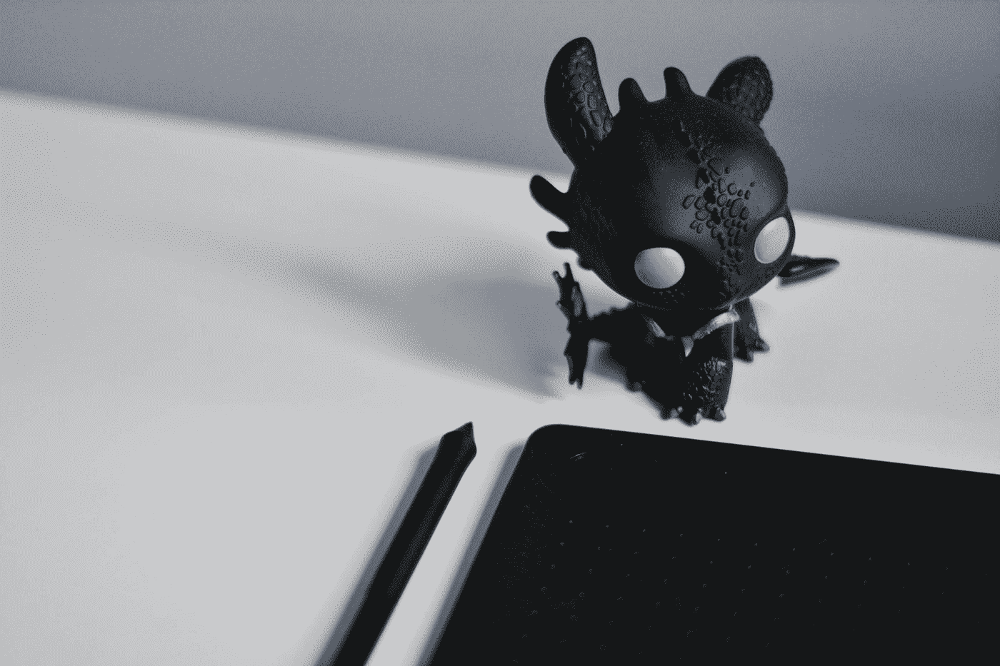
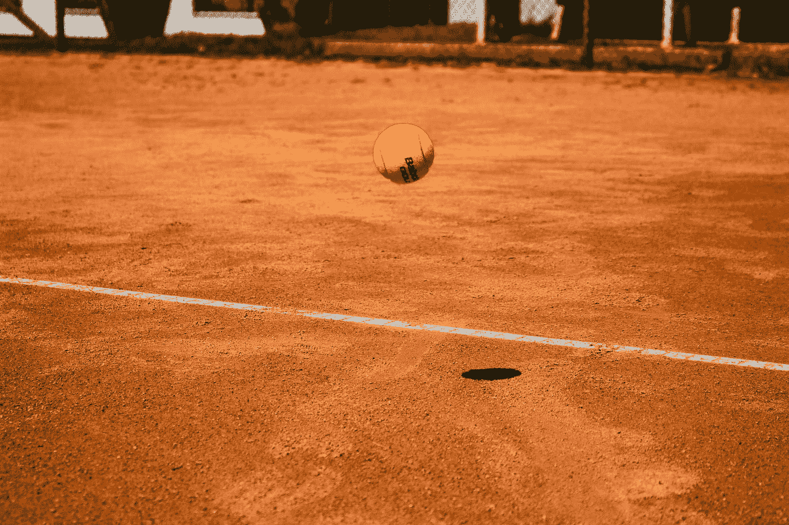
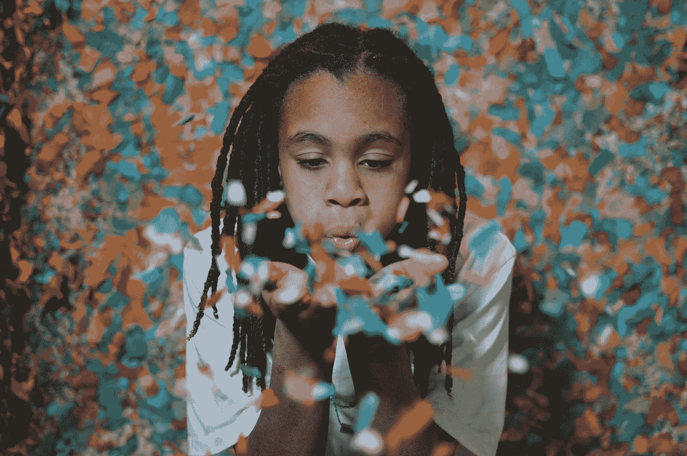
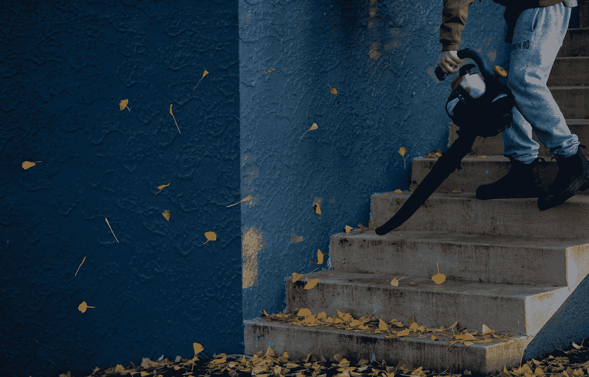
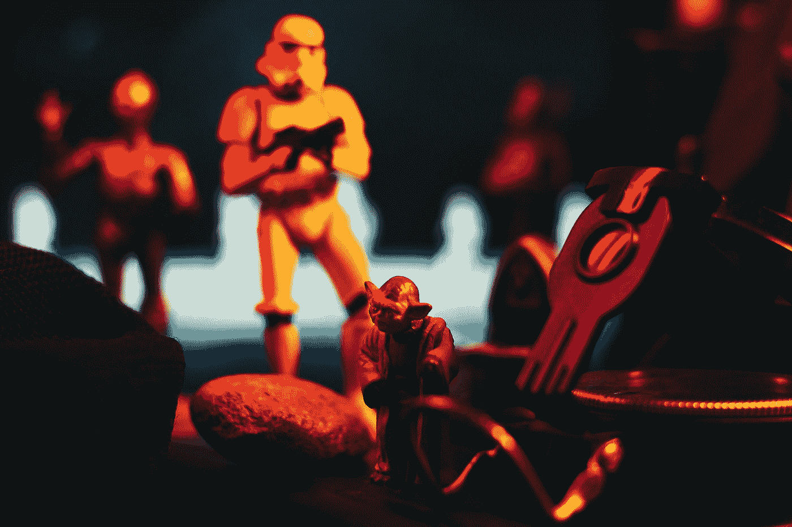

# 颤振中的自定义动画

> 原文：<https://medium.com/geekculture/custom-animation-in-flutter-1cca2752a2ab?source=collection_archive---------10----------------------->

以及如何有效应用。



Photo by [Content Pixie](https://unsplash.com/@contentpixie?utm_source=medium&utm_medium=referral) on [Unsplash](https://unsplash.com?utm_source=medium&utm_medium=referral)

H 我，各位。这是[yua](http://linkedin.com/in/yusasarisoy)，我在 [WeWALK](http://wewalk.io/) 做软件工程师。近期开始学习 Flutter，真的很喜欢。我认为，颤振的一个迷人的概念是动画。在这个故事中，我们将看看动画以及如何定制它。您可以对任何项目使用相同的方法来自定义动画。所以，让我们来看看我们能做些什么。

# 初始化 AnimationController


Photo by [Federico Vitale](https://unsplash.com/@fedevitale?utm_source=medium&utm_medium=referral) on [Unsplash](https://unsplash.com?utm_source=medium&utm_medium=referral)

首先我们会定义[**animation controller**](https://api.flutter.dev/flutter/animation/AnimationController-class.html)来动画出我们想要的东西。

```
**late** **AnimationController** controller;
```

我们使用关键字“ **late** ”，因为我们将在 [**initState**](https://api.flutter.dev/flutter/widgets/State/initState.html) 方法中初始化控制器，它不必立即初始化。

```
**@override
void** **initState**() {
  **super**.**initState**(); controller = **AnimationController**(
    duration: **Duration**(seconds: **1**),
    vsync: **this**,
  ); controller.**forward**(); controller.**addListener**(() {
    **setState**(() {});
  });
}
```

之后，我们在 initState 中初始化**控制器**，以便在视图准备就绪时激活。我们将**持续时间**设定为 **1 秒**。 [**forward**](https://api.flutter.dev/flutter/animation/AnimationController/forward.html) ()方法提供开始动画直到结束， [**addListener**](https://api.flutter.dev/flutter/animation/ReverseAnimation/addListener.html) ()每次值变化时调用监听器。我们设置 **setState** 以便能够在我们的小部件上显示更改。关键参数是 **vsnyc** 。对于 **vsync** ，我们必须设置一个[**ticker provider**](https://api.flutter.dev/flutter/scheduler/TickerProvider-class.html)值。我们将用 **this** 关键字为此设置我们的类。为了能够做到这一点，我们必须对我们的类做一些添加，“T42 与 SingleTickerProviderStateMixin”。

```
**class** **_WelcomeScreenState** **extends** **State**<**WelcomeScreen**> **with** **SingleTickerProviderStateMixin**
```

# 初始化曲线动画



Photo by [Samuel-Elias Nadler](https://unsplash.com/@mrsamuelelias?utm_source=medium&utm_medium=referral) on [Unsplash](https://unsplash.com?utm_source=medium&utm_medium=referral)

[**曲线动画**](https://api.flutter.dev/flutter/animation/CurvedAnimation-class.html) 允许我们将曲线应用到另一个动画中。

像 AnimationController 一样，我们使用关键字“ **late** ”，因为我们将在 [**initState**](https://api.flutter.dev/flutter/widgets/State/initState.html) 方法中初始化控制器，它不必立即初始化。

```
**late** **Animation** animation;
```

然后，我们在 **initState** ()中初始化它。

```
animation = **CurvedAnimation**(parent**:** controller, curve**:** **Curves**.bounceOut);
```

**曲线动画**有两个参数。第一个是**父**，接受一个**动画控制器**实例；第二个是**曲线**，接受我们想要使用的一种类型的 [**曲线**](https://api.flutter.dev/flutter/animation/Curves-class.html) 。我想用**反弹**的曲线。

因为 **animation.value** 取 0 到 1 之间的值，所以我将该值乘以 100。

```
**Hero**(
  tag: 'logo',
  child: **Container**(
    child: **Image**.asset('images/logo.png'),
    height: animation.value * 100,
  ),
)
```

我们将该值设置为 app logo 的高度，这是一个 [**图像**](https://api.flutter.dev/flutter/widgets/Image-class.html) ，让我们看看会发生什么。

Animation of the app logo.

# 初始化 ColorTween



Photo by [IIONA VIRGIN](https://unsplash.com/@virgin?utm_source=medium&utm_medium=referral) on [Unsplash](https://unsplash.com?utm_source=medium&utm_medium=referral)

我们可以用[](https://api.flutter.dev/flutter/animation/ColorTween-class.html)**来代替**曲线动画**。ColorTween 提供两种颜色之间的插值。例如，如果我们想在**红色**和**蓝色**之间进行插值，我们可以用下面的代码行来完成。**

```
animation = **ColorTween**(begin: **Colors**.red, end: **Colors**.blue).**animate**(controller);
```

**我想保持**图像**的高度，并用这个改变的值改变背景颜色。**

```
**@override**
**Widget** **build**(**BuildContext** context) {
  **return** **Scaffold**(
    backgroundColor**:** animation.value,**...**
```

**最后，我们来看看背景色会有什么变化。**

**Change of the background color from red to blue.**

# **处置动画控制器**

****

**Photo by [Callum Hill](https://unsplash.com/@inkyhills?utm_source=medium&utm_medium=referral) on [Unsplash](https://unsplash.com?utm_source=medium&utm_medium=referral)**

**当动画运行时，它会消耗大量内存。为了避免这种情况，当类被销毁时，我们必须处理掉**动画控制器**。为了实现这一点，我们可以覆盖 [**dispose**](https://api.flutter.dev/flutter/widgets/State/dispose.html) 方法并处置 **AnimationController** 实例。这样，它就停止了霸占所有的资源。**

```
**@override**
**void** **dispose**() {  
  **super**.**dispose**();

  controller.**dispose**();
}
```

# **结论**

****

**Photo by [D A V I D S O N L U N A](https://unsplash.com/@davidsonluna?utm_source=medium&utm_medium=referral) on [Unsplash](https://unsplash.com?utm_source=medium&utm_medium=referral)**

**作为结论；我们学习了如何使用 Flutter 制作自定义动画。还学习了如何在两种不同的颜色之间改变背景。你可以在这里 访问我使用动画 [**的 GitHub 库。**](https://github.com/yusasarisoy/chatalk)**

****更新:**我有个好消息要告诉你！你可能知道,“我们行走”曾被《时代》杂志评为年度最佳发明之一。现在，WeWALK 已经被亚马逊评选为 5 大创业公司之一。获胜者将在 7 月 7 日之前通过公众投票选出，并将由亚马逊宣布为“年度创业公司”凭借€100，000 奖金，我们将把它用于向世界各地更多的视障人士提供智能手杖。请投票支持我们的使命。**

**下面是链接:【www.wewalk.io/amazon**

**谢谢大家的支持！**

****祝大家有个健康的一天！****

****#跨#扑#镖#动画#自定义动画****