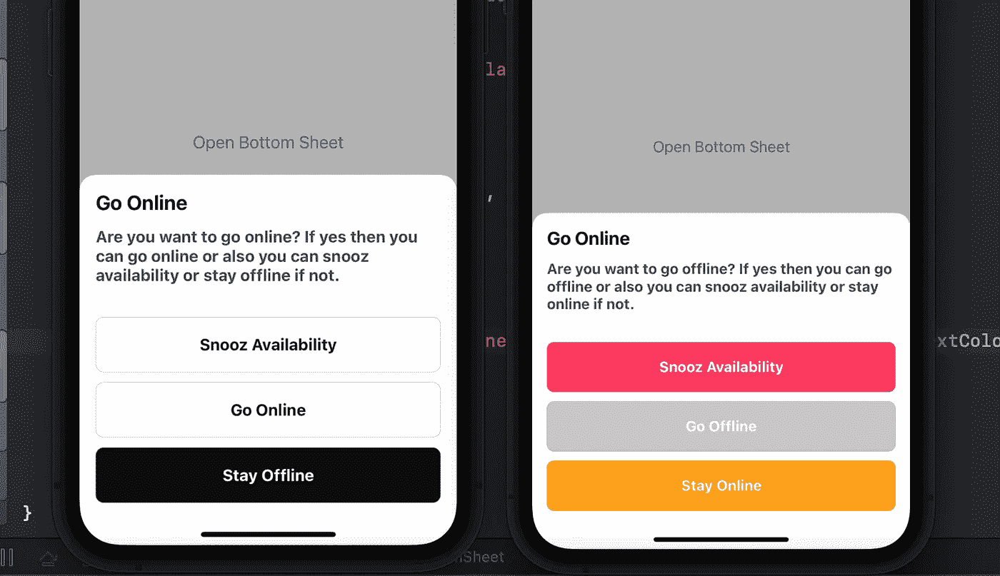
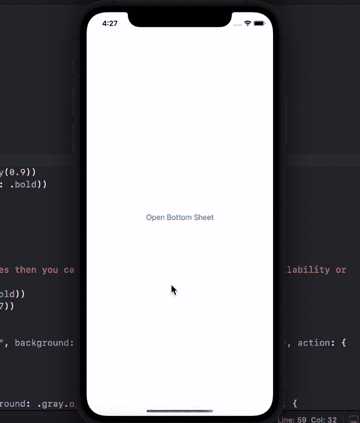

# SwiftUI 中的自定义底部表单

> 原文：<https://medium.com/geekculture/custom-bottom-sheet-in-swiftui-48ab9188a809?source=collection_archive---------0----------------------->

大家好，在这个博客中，你将学习如何在 SwiftUI 中创建一个自定义的底部表单。在这个博客的结尾，你也可以找到源代码链接。在 XCode 中创建一个全新的 SwiftUI 项目，跟着我一起做吧。

> 在这个博客之后，你将能够创建这样的自定义底部表单:

# **底板视图**

在创建了一个全新的 SwiftUI 项目之后，让我们创建 **BottomSheetType** firet。 **BottomSheetType** 将是一个枚举，我们在这里只声明了两种情况**在线**和**离线。**

之后，在 **BottomSheetType** 中创建一个函数 **view()** ，该函数将为每个案例返回一个视图。现在，它为两个声明案例返回两个视图。 **OnlineBottomSheet** 和 **OfflineBottomSheet** ，我们稍后将创建这两个。

在 BottomSheetType 之后，现在创建一个 **BottomSheet** 视图， **BottomSheet** 将是一个**容器**，我们将传递其中的内容，该视图将显示类似 BottomSheet 的内容。底板获取两个参数。

1.  **isShowing:** 控制视图的外观
2.  **内容:**是**底单**中将要呈现的视图

使用 **ZStack** 对准**。底部**，因为我们需要在**底部表单**中显示我们的底部视图。在 ZStack 之外使用三个修饰符。

1.  **框架:**用于给出**底板**的高度和宽度
2.  **ignore safe area():**包括**底板**的安全区域空间
3.  **动画:**用于在**底板**上应用动画

在 **ZStack** 内部，我们使用 if 条件，如果**显示**为真**则我们的**底单**内部内容视图显示。我们使用不透明度为 0.3 的**黑色**作为该视图的背景，在 **ZStack** 的顶部，我们的内容视图将显示我们正在传递到底层的内容。**

我们正在使用。**过渡** **修改器**将**过渡**应用到从**底部到顶部**的内容视图上。如你所见**。过渡(。移动(边缘:。底))。**如果你需要任何类型的**过渡**那么，你可以改变**边缘:**值来改变**过渡**。

> 我们没有使用 SwiftUI 的**背景修改器**来给出背景颜色，因为我们需要在**底部表单**出现或消失时动画显示背景。

# 按钮大视图

创建底部工作表后，创建一个自定义按钮，该按钮将在底部工作表视图中重复使用。

这里我创建了 ButtonLarge 视图，它有四个参数。

1.  **标签:**为按钮文本
2.  **背景:**为按钮的背景颜色
3.  **文本颜色:**为文本颜色
4.  **动作:**将用于按钮动作

还有一个常数 **cornorRadius** 。然后创建一个按钮，并给它背景色和 **cornorRadius** ，对于按钮标签，我们使用 **HStack** 并使用按钮文本和给框架。无限向**h 堆叠**并且**覆盖**的**圆角矩形**为**边框**到按钮。

# 圆角

对于顶部圆角，我们将创建**圆角** **形状**，它将**圆角**和**半径**作为输入。之后，我们将创建一个自定义修改器**。圆角半径**将**圆角**和**半径**作为输入，并将**圆角半径**应用到**视图**的** **圆角**中。**

# 在线 BottomSheet 视图

现在，创建一个视图，我们将把它传递到 BottomSheet 中，并在 BottomSheet 中显示它。创建 OnlineBottomSheet 视图。使用 **VStack** 并在其中使用一些**文本**，然后多次使用我们之前创建的**按钮大**视图。您可以看到下面的代码。

# 脱机底部工作表视图

OfflineBottomSheet 视图也与 OnlineBottomSheet 相同，只是一些文本和颜色不同，但代码相同。

# 内容视图

在创建了 BottomSheet 和一些虚拟视图之后，现在我们需要在 ContentView 中呈现 BottomSheet。

创建将与 BottomSheet 绑定的 isShowingBottomSheet @State bool 属性。现在，使用 ZStack，然后创建一个简单的按钮，该按钮将切换 isShowingBottomSheet 属性以显示底部工作表。ZStack 的底部使用 BottomSheet 并使用 BottomSheet 绑定 isShowingBottomSheet 并通过使用 BottomSheet 类型传递内容，如

> BottomSheetType.online.view()

这将返回对应于**的视图。在线**案例。对于**。在线**情况下，会返回 **OnlineBottomSheet** 视图，可以看到 **BottomSheetType** 枚举。

> BottomSheetType.offline.view()

这将返回对应于**的视图。线下**案例。对于**。离线**情况下，会返回**离线 BottomSheet** 视图，因为可以看到 **BottomSheetType** 枚举。

现在，运行代码并点击按钮**“打开底部表单”**，您将看到从底部出现的**底部表单**。

希望你能理解这个博客。如果有任何困惑，你可以在这个博客上发表评论。感谢您阅读 **…。**

# 源代码

 [## GitHub-muhammadabbas 001/CustomBottomSheet:swift ui 中的自定义底部表单。

### 此时您不能执行该操作。您已使用另一个标签页或窗口登录。您已在另一个选项卡中注销，或者…

github.com](https://github.com/muhammadabbas001/CustomBottomSheet) 

## 订阅模式

 [## 米（meter 的缩写））阿巴斯正在创造内容

### 立即成为 M.Abbas 的赞助人:获得世界上最大会员的独家内容和体验…

www.patreon.com](https://www.patreon.com/abbasgujjar)