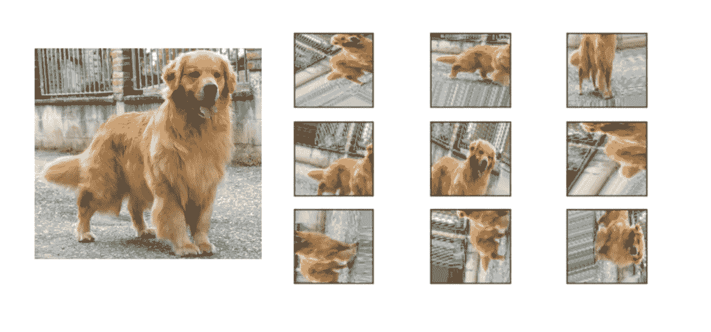
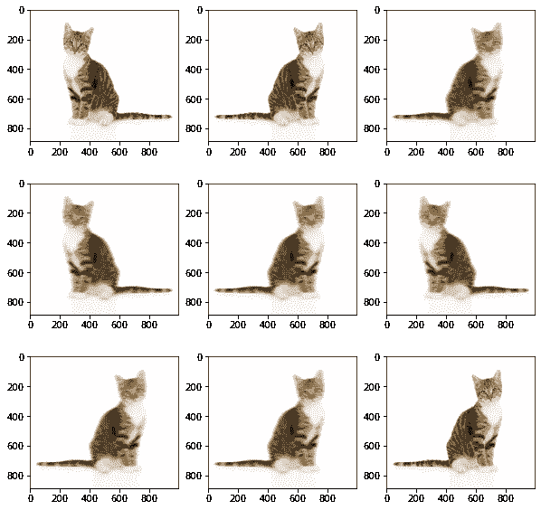

# 使用 Keras ImageDataGenerator 的自定义数据扩充

> 原文：<https://medium.com/geekculture/custom-data-augmentation-using-keras-imagedatagenerator-7cfd58e54171?source=collection_archive---------5----------------------->

我们在训练神经网络时经常会遇到麻烦，因为我们没有足够的数据来训练它。众所周知，大多数机器学习模型，尤其是深度学习模型，都只能达到给定的训练数据的水平。现在我们可以尝试收集更多的数据，但收集数据是一项耗时且繁琐的任务。这个问题的解决方案是数据扩充。

**本博客内容如下:**

1.  什么是数据增强？
2.  Keras 图像数据生成器
3.  创建自定义转换的步骤


# 什么是数据增强？

扩充是一种通过对现有数据应用不同的变换并使用它们创建新样本来增加数据集大小的技术。如图 1 所示，可以使用旋转和裁剪等变换来放大一张狗的图像。增强的目的不仅仅是增加数据集中的样本数量，还可以在数据集中产生变化，这将防止过度拟合，并帮助模型在看不见的图像上更好地概括。



Figure 1\. Augmented Images of a Dog

# Keras 图像数据生成器

增加数据而不产生大量开销的一种简单方法是使用 Keras ImageDataGenerator。ImageDataGenerator 通过实时数据扩充生成批量张量图像数据。这确保了我们的模型将接收每个时期的数据变化，这有助于防止过度拟合。同时，ImageDataGenerator 使用更少的内存，因为它分批加载所有图像，而不是一次加载所有图像。

ImageDataGenerator 还提供了广泛的转换:

1.  旋转
2.  聪明
3.  剪(羊毛)
4.  一款云视频会议软件
5.  水平和垂直翻转

但是如果你想添加更多的转换呢？如何保留 ImageDataGenerator 的所有出色特性，并向其中添加您的自定义转换呢？因此，在这篇博客中，我将向您解释如何向 ImageDataGenerator 添加自定义转换。

# 创建自定义转换的步骤

创建自定义转换的最有效方法是创建一个从原始 Image Data Generator 类继承的自定义图像数据生成器类。这个类可以很容易地扩展，以便在将来添加新的扩展。现在让我们进入代码。

我们将实现 2 个自定义转换:垂直和水平运动模糊。这将帮助我们理解如何实现多重转换。

## 步骤 0:导入库

```
import cv2
import numpy as np
from tensorflow.keras.preprocessing.image import ImageDataGenerator
import matplotlib.pyplot as plt
```

## 步骤 1:声明 CustomDataGenerator 类

Figure 2\. Skeleton Code for CustomDataGenerator

如您所见，我们扩展了 ImageDataGenerator，这样我们可以在 **__init__()** 方法中指定我们的参数。我们将**处理 _ 函数**声明为**动作**，我们将把我们的变换称为水平和垂直运动模糊。现在让我们在 **__init__()** 函数中定义我们的参数。

## 第二步:__init__()函数

Figure 3\. Declaring parameters in __init__()

我们在这里声明了两个参数， **v_kernel_size** 和 **h_kernel_size，**分别用于垂直运动模糊和水平运动模糊。

## 步骤 3:编写转换逻辑

Figure 4\. Logic for Transformations

这不是实现这些变换的最有效的方法，但是为了实现多重变换，我们为运动模糊创建了两个不同的函数。请注意，这种转换也可以使用单个函数来完成。你可以看看这个[运动模糊的实现。](https://www.geeksforgeeks.org/opencv-motion-blur-in-python/#:~:text=Horizontal%3A,vector%20to%20create%20the%20filter.)

## 步骤 4:动作功能逻辑

Figure 5\. Action Function

在这里，我们称之为我们的转变。我们需要随机选择一个转换，为其创建一个转换列表，并生成 0 到 1 范围内的随机值，对应于每个转换。然后，我们选择具有最高值的转换。

## 第 5 步:将所有功能放在一起

Figure 6\. Complete CustomDataGenrator Script

这是我们的 CustomDataGenerator 的外观。现在是时候执行这个数据生成器了，看看输出是什么样子。请注意，我们仍然可以使用 ImageDataGenerator 中存在的转换，因为我们将它们继承到我们的自定义数据生成器中。

Figure 7\. Executing the CustomDataGenerator

这个脚本的输出可以在图 8 中看到。这里要注意的一点是，我们还包含了 ImageDataGenerator 类的默认参数 **horizontal_flip** ，可以在子情节 1、2 和 9 中看到。我们的自定义变换应用于支线剧情 3、4、5、6、7 和 8。



Figure 8\. Output of CustomDataGenerator

# 结论

我们最终用我们的自定义转换构建了一个 CustomDataGenerator，而且只用了几行代码。你可以尝试实现其他的变换，比如分块随机补丁和添加高斯噪声。我希望这篇博客能帮助你使用 Keras ImageDataGenerator 创建定制的增强，没有任何问题。如果你喜欢阅读这篇博客，请考虑在 Medium 上关注我的类似内容，并在 LinkedIn 上与我联系！

点击这里查看我的其他文章！

参考资料:

[](https://www.analyticsvidhya.com/blog/2020/08/image-augmentation-on-the-fly-using-keras-imagedatagenerator/) [## 图像增强 Keras

### 了解图像增强使用深度学习时使用 Keras ImageDataGenerator 学习图像增强…

www.analyticsvidhya.com](https://www.analyticsvidhya.com/blog/2020/08/image-augmentation-on-the-fly-using-keras-imagedatagenerator/) [](https://stepup.ai/custom_data_augmentation_keras/) [## 教程:Jeras 中的自定义数据扩充

### 开箱即用，Keras 提供了许多优秀的数据增强技术，您可能已经在之前的…

stepup.ai](https://stepup.ai/custom_data_augmentation_keras/)  [## TF . keras . preprocessing . image . image data generator | tensor flow v 2 . 10 . 0

### 通过实时数据扩充生成批量张量图像数据。

www.tensorflow.org](https://www.tensorflow.org/api_docs/python/tf/keras/preprocessing/image/ImageDataGenerator)