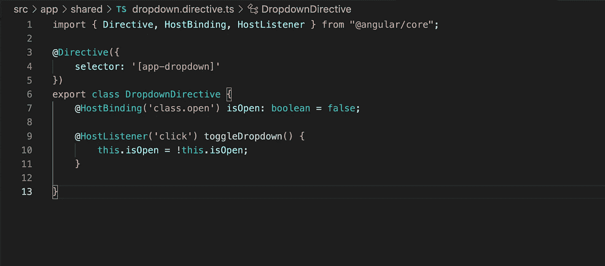
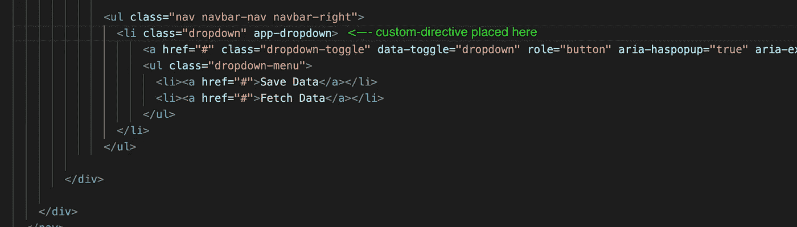
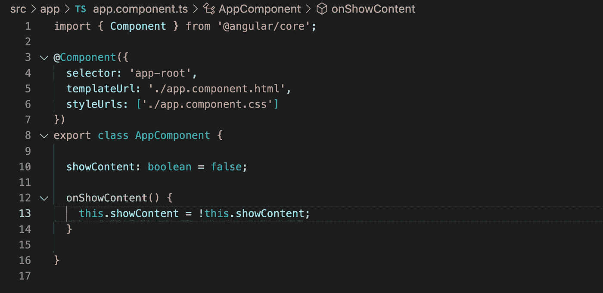
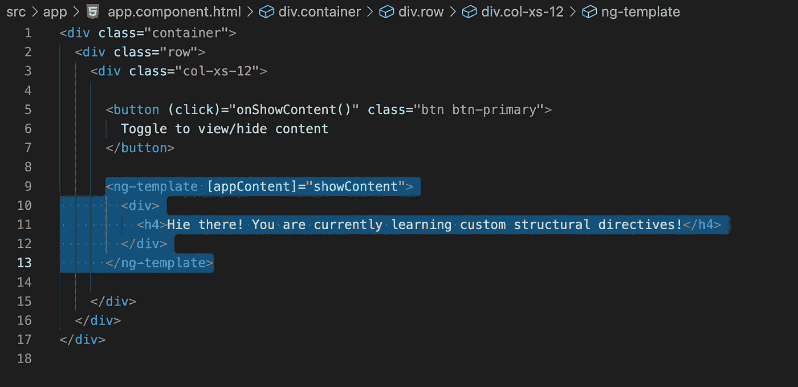
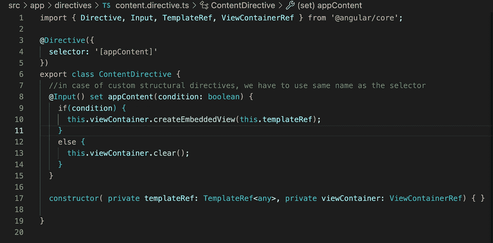
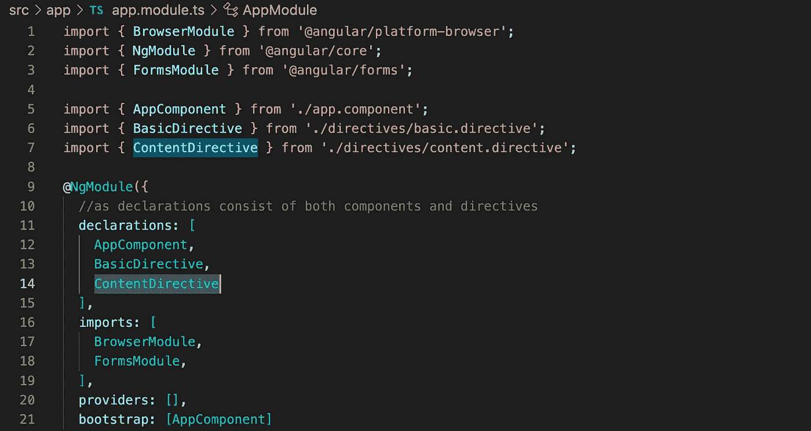

# 角度中的自定义指令

> 原文：<https://medium.com/geekculture/custom-directives-in-angular-251080ef2b85?source=collection_archive---------2----------------------->

## 用 Angular 编写自定义指令


Angular custom directives

在我们继续用 Angular 编写自定义指令之前，您必须对内置指令有一个基本的了解。查看这篇关于内置指令的文章。

一旦你完成了内置指令，现在让我们试着理解两个术语: **HostListener** 和 **HostBinding** ，它们将在创建我们自己的属性指令时使用。

**主机监听器**

在 Angular 中， **@HostListener()** 函数 decorator 允许你在 directive 类中处理 host 元素的事件。

让我们考虑以下需求:当您单击一个主机元素时，您希望显示一个警告窗口。为此，您需要处理在 directive 类中的 host 元素上引发的事件。在 Angular 中，可以使用 **@HostListener()** 来实现。

**主机绑定**

在 Angular 中， **@HostBinding()** 函数 decorator 允许您从指令类中设置主机元素的属性。

假设您想要更改样式属性，如高度、宽度、颜色、边距、边框等。或指令类中宿主元素的任何其他内部属性。这里，您需要使用@HostBinding() decorator 函数来访问主机元素上的这些属性，并在指令类中为其赋值。

@HostBinding() decorator 接受一个参数，即我们希望在指令中赋值的主机元素属性的名称。

## **自定义属性指令**

要创建自定义属性指令，您需要添加一个带有指令装饰器的类，它可以从@angular/core 导入，并为它提供一个选择器，以便在整个应用程序中唯一地使用该指令。



The Directive which handles toggling of a dropdown

正如你在上面的代码中看到的，我把我的指令放在一个单独的共享文件夹中(但是你可以把它放在你的应用程序中的任何地方),并把它命名为 dropdown.directive.ts

此外，我使用了一个属性选择器作为[app-dropdown],因为我将把它作为一个属性添加到我的下拉按钮中。

HostBinding 将我们的指令[app-dropdown]与 open class 属性绑定，其中该属性将根据提供给 isOpen 的值动态变化。

当用户单击放置指令的元素时，HostListener 将侦听(click)事件并调用 toggleDropdown()方法。在我们的代码中，我们只是将 open class 属性切换为 true 和 false，从而打开和关闭我们的下拉列表。

*现在，为了在我们的应用程序中使用它* *，我们需要让 Angular 知道我们已经添加了一个自定义指令。我们在包含组件和指令声明的声明数组内的 app.module.ts 中声明类 DropdownDirective。*



code showing placing of custom directive

如果您运行您的应用程序并单击下拉按钮，它将打开和关闭下拉菜单。

## **自定义结构指令**

结构指令负责 HTML 布局。我们可以动态地在 DOM 布局中添加和删除元素。使用该指令的 HTML 元素称为该指令的宿主元素。指令只对宿主元素及其后代有效。为了在 DOM 布局中添加和删除主机元素，我们可以在结构指令中使用`TemplateRef`和`ViewContainerRef`类。

让我们试着用一个例子来理解它:

我们将创建一个按钮，为我们切换隐藏和显示标题。现在我们可以直接在。ts 类，然后使用内置的 ngIf 结构指令来处理这个问题。但是让我们看看如何通过编写我们自己的结构指令来实现它。

首先，在中创建属性。ts 类，并编写按钮的(click)事件的逻辑。请参考下面的代码快照:



AppComponent code

我们将用于隐藏或显示数据的 showContent 属性。我们将绑定按钮的(click)事件，用于在模板 HTML 中进行切换。



AppComponent template HTML code

我们可以在*或 ng-template 中使用结构指令。在我的例子中，我将使用 ng-template(如上面代码中突出显示的)。

我的开始和结束<ng-template>标签都有一个 div 容器，其中放置了标题，我们想用按钮-> Toggle 来切换以查看/隐藏内容。</ng-template>

在你被下面的逻辑弄糊涂之前

```
<ng-template [appContent]="showContent">
```

被放置在 ng-template 标签中，让我们首先跳到我们的自定义结构指令，然后回来，希望事情会被清除。

我创建了一个名为 ContentDirective 的自定义指令。正如在上面的自定义属性指令中所看到的，我们同样将指令 decorator 放在 ContentDirective 的类上，并为它提供一个唯一的选择器。

现在创建一个用`@Input()`装饰的 setter 方法。

***注意:*** *我们需要注意的是方法名应该和指令名相同。*

该方法将 condition 作为一个参数，我们可以在其上放置 IF 逻辑并相应地呈现内容。请参考下面的代码截图。



ContentDirective code

要改变 DOM 布局，我们应该在结构指令中使用`TemplateRef`和`ViewContainerRef`。
**TemplateRef** :表示一个嵌入式模板，可以用来实例化嵌入式视图。
**ViewContainerRef** :表示一个容器，可以附加一个或多个视图。

要在我们的指令中使用上面的类，首先，我们需要实例化它们。在构造函数中使用依赖注入来实例化这些类，如下所示。

```
constructor( private templateRef: TemplateRef<any>,
             private viewContainer: ViewContainerRef) { }
```

要在 DOM 布局中添加一个主机元素，我们需要调用`createEmbeddedView()`的一个方法`ViewContainerRef`。找到代码行。

```
this.viewContainer.createEmbeddedView(this.templateRef);
```

如果我们想清除视图容器，调用下面给出的`ViewContainerRef`的`clear()`方法。

```
this.viewContainer.clear();
```

为了让 Angular 知道我们的自定义指令，我们必须在声明中声明它以及 AppModule 文件中的组件(如下面的代码所示)。



Directive declared in AppModule file

让我们回到<ng-template>标签，我们在标签中放置了一些逻辑:</ng-template>

```
<ng-template [appContent]="showContent">
```

这里[appContent]是我们的自定义指令选择器， **showContent** 是到达方法参数-条件中的指令的被传递的属性。

一旦你完成了所有这些，使用 ng serve 运行应用程序，切换按钮，你可以看到你的模板的隐藏/显示。