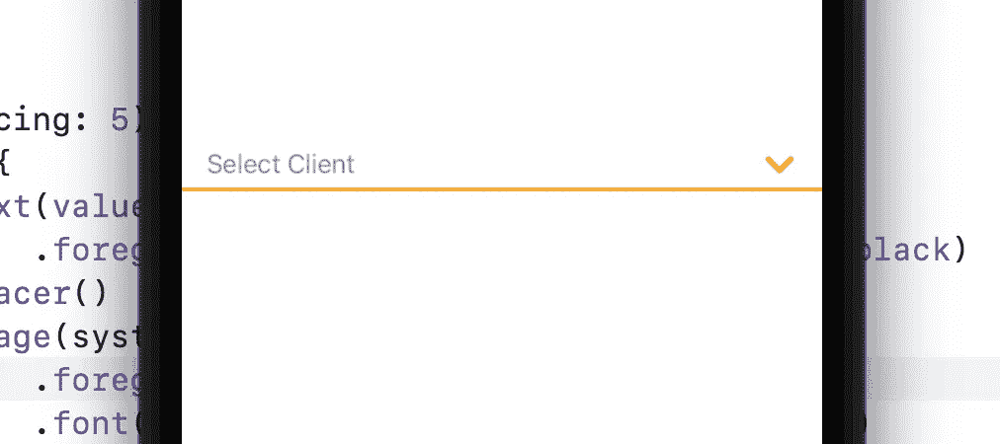
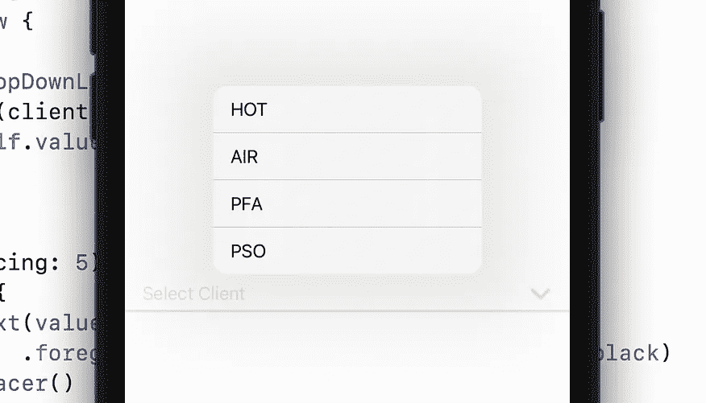
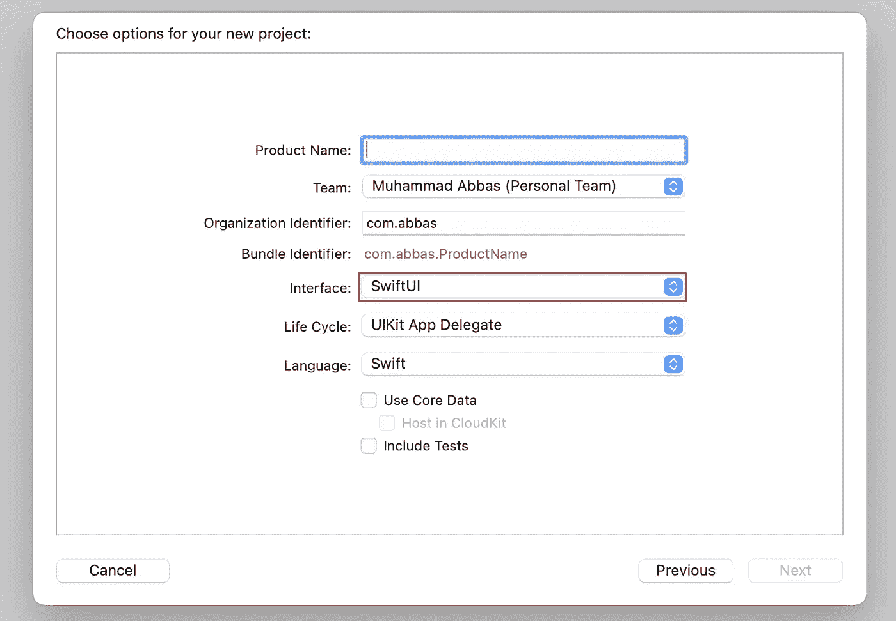

# SWIFTUI 中的自定义下拉文本字段

> 原文：<https://medium.com/geekculture/custom-drop-down-text-field-in-swiftui-a748d2cebbeb?source=collection_archive---------0----------------------->

嗨伙计们。在这篇博客中，我将教你如何在 **SwiftUI** 中创建一个定制的下拉文本字段。

# 第一步

使用 SwiftUI 创建一个 XCode 项目。

# 第二步

转到 ContentView 文件并创建三个变量

**值**将是**@状态**的 var。**占位符**将是用作自定义文本字段占位符的**字符串**，而 **dropDownList** 将是用作下拉列表的**字符串列表**。

 [## 三星 Galaxy S21 超 5G 出厂解锁安卓手机 128GB 美版智能手机…

### 三星 Galaxy S21 Ultra 5G 手机在各方面都是史诗般的，具有引人注目的新设计，迄今最快的 Galaxy 处理器，以及…

amzn.to](https://amzn.to/35knqeL) 

# 第二步

现在在 ContentView 主体中创建菜单。

# 第 3 步—设计

现在创建 CustomTextField 的设计。

使用间距为 5 的 **VStack** 。进入 **VStack** ，首先我用 **HStack** 配**文字**、**间隔符** & **图片**。文字被用来显示占位符& **间隔符**被用来表示文字**&**图像** & **图像**被用来表示图像**图标**。其次，我使用矩形视图打印 **HStack 下的线条。****

> 当**值**为空时，占位符文本将显示在**文本** &中**颜色**将为**灰色** &当用户选择任何下拉项目时，该值将打印在文本&中，颜色将为**黑色**。

# 纪念

> **VStack:** 视图的垂直堆叠
> 
> **HStack:** 视图的水平堆叠

**将此视图放入菜单的标签部分。**

# 第四步

现在使用 ForEach 并迭代 **dropDownList** &在每个 **dropDownList** 项目上打印按钮。

现在，当我们按下 CustomTextField 设计时，这些按钮将显示在屏幕上。

在每个按钮选择上，项目值将等于**@状态变量值**，然后该值将打印在占位符的位置。

**完整代码**

希望你们都明白，如果不明白，请告诉我👌👌 👌 👌👌 👌👌👌 👌👌👌 👌

## 订阅模式

 [## 米（meter 的缩写））阿巴斯正在创建 IOS 开发者| Patreon

### 立即成为 M.Abbas 的赞助人:获得世界上最大会员的独家内容和体验…

www.patreon.com](https://www.patreon.com/abbasgujjar)