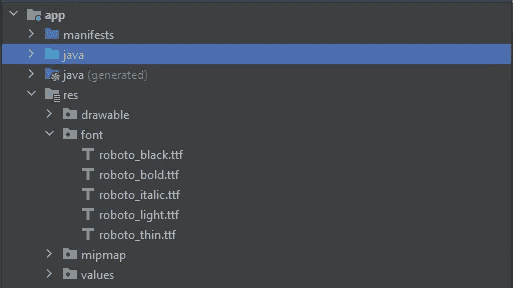
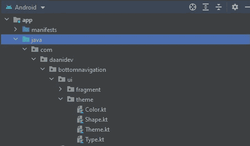
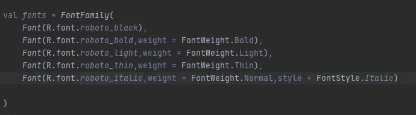
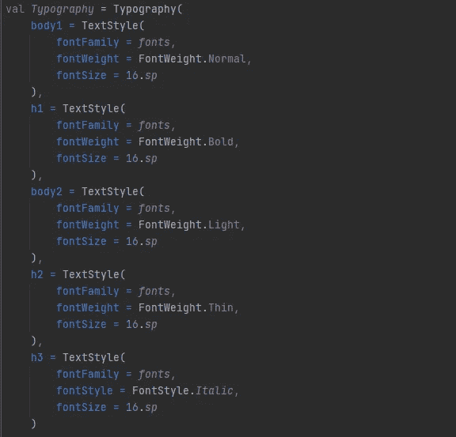
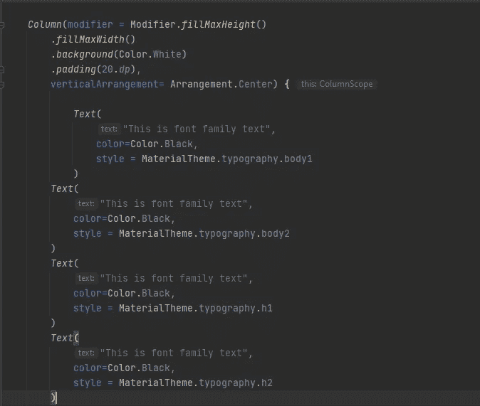
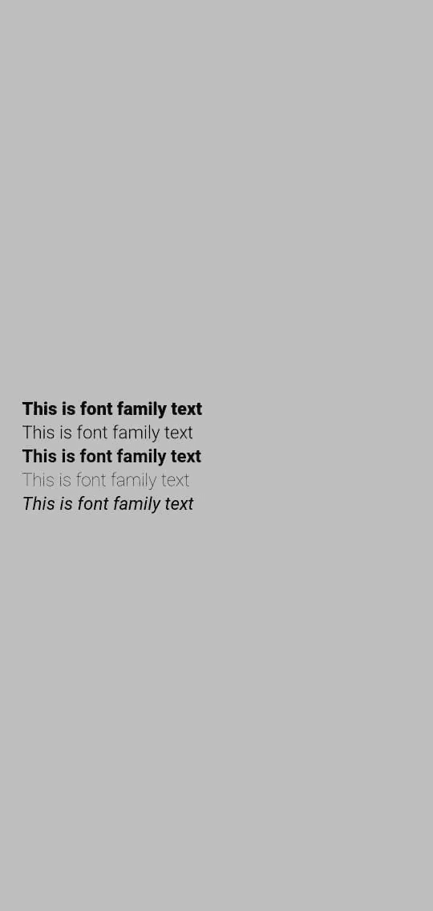

# Android Jetpack Compose 中的自定义字体系列

> 原文：<https://medium.com/geekculture/custom-font-family-in-android-jetpack-compose-d03efed193b?source=collection_archive---------1----------------------->

在这篇文章中，我将向你解释如何在 android 中为文本视图或按钮设置自定义字体。我假设你对 android jetpack compose 有所了解。

我从[*【https://fonts.google.com/】*](http://google fonts)*下载了字体，然后在 res 目录下新建了一个名为 font 的目录，复制字体。ttf 文件在里面，你可以在下面的图片中看到。*

放置了。ttf 文件在字体目录中你需要在主题目录下的 Type.kt 文件中做一些改动，就像你在下图中看到的那样。

现在你需要创建字体系列变量，并声明你的所有字体，如下图所示

## 注意:你需要用它们各自的字体风格和字体粗细来声明字体，否则会导致运行时异常。

创建变量后，现在你需要对排版变量进行一些修改，这是在你创建 android jetpack compose 项目时由 android studio 自动创建的，如下图所示

现在是时候在 MainActivity.kt 文件的@Composable 函数中将这些字体设置为 Textviews 了，如下图所示

# 输出:

就这样，祝贺你已经成功地学会了在 android jetpack compose 中定制字体系列。