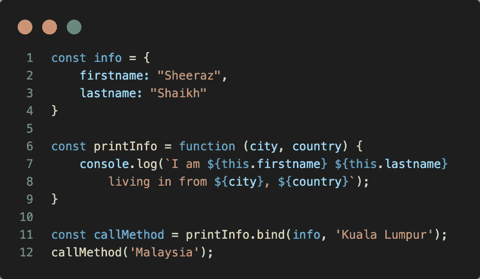
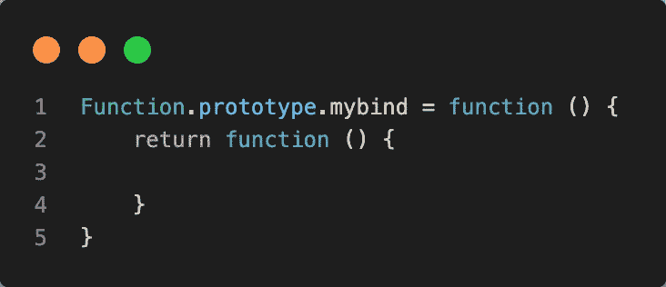
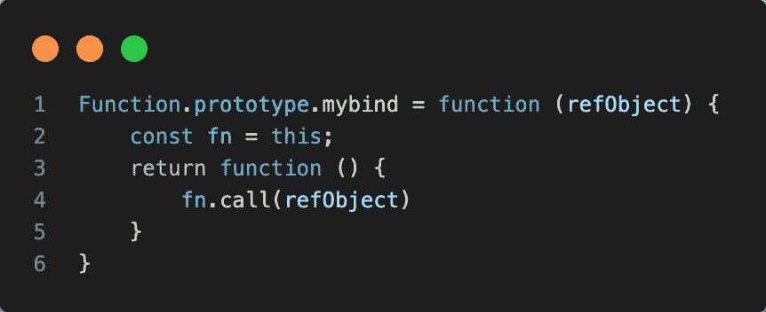
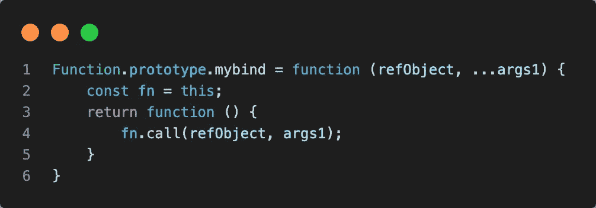
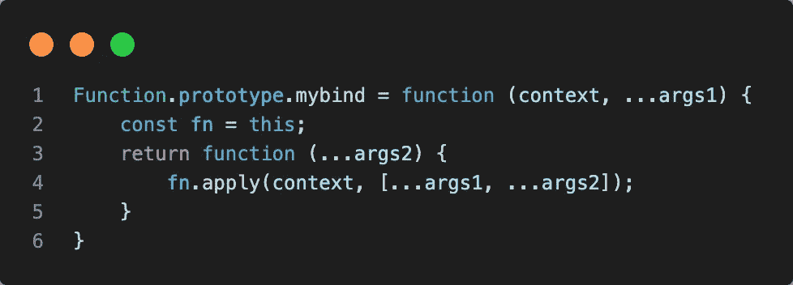
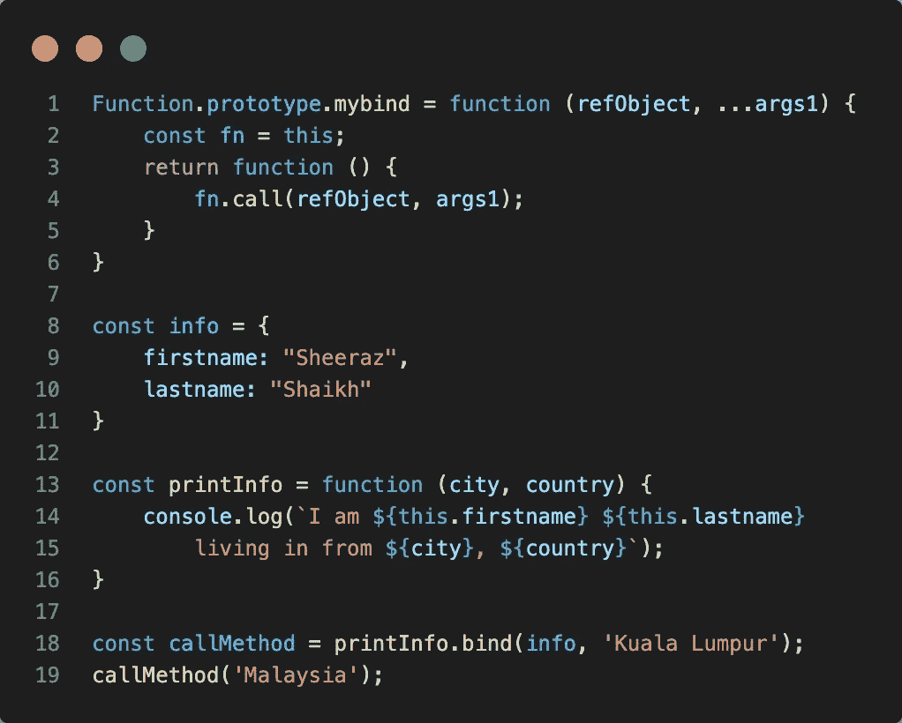

# Javascript 中 bind 方法的自定义实现

> 原文：<https://medium.com/geekculture/custom-implementation-of-bind-method-in-javascript-c5db931b1cf4?source=collection_archive---------8----------------------->

如何为 bind 编写聚合填充

Photo by [Caspar Camille Rubin](https://unsplash.com/@casparrubin?utm_source=medium&utm_medium=referral) on [Unsplash](https://unsplash.com?utm_source=medium&utm_medium=referral)

Polyfill 本质上是对我们的旧浏览器所没有的方法的支持。我将解释如何编写一个在任何地方都受支持的 bind 自定义实现。下面是原始绑定方法的用例:

Usecase for bind method

在代码片段中，bind 方法基本上是一个可供所有函数使用的原型方法。bind 的第一个参数是对一个对象的引用，该对象可以通过关键字`this`在调用函数中访问。一旦我们将`info`作为 bind 的第一个参数传递，那么`info`的属性将作为`printInfo`函数中的`this`关键字被访问。

**创建我们自己的** `**mybind**`实现的步骤。

*步骤 1* :我们将在[函数原型](https://developer.mozilla.org/en-US/docs/Web/JavaScript/Reference/Global_Objects/Function)中创建一个原型函数。之所以将其创建为原型函数，是因为像`bind`方法这样的每个函数都需要访问它。

Step 1

您会注意到第 2 行返回了另一个函数。因为在最初的绑定方法中，它返回一个函数。

*第二步*:需要返回一个调用函数的引用。这意味着调用`mybind`的函数需要被返回，它的第一个参数应该是对一个对象的引用。

Step 2

在这段代码中，您会注意到`mybind`方法正在接受一个对对象`refObject`的引用，该对象作为第一个参数传递给调用函数。此外，我们需要一个在第 2 行中设置的调用函数的引用，为此我们将`this`的引用设置为变量`fn`

第三步:由于基本框架已经完成，我们已经接近完成了。下一步，我们将不得不容纳传递给函数的参数(如`city`)。这可以通过下面的代码片段来实现。

Step 3

在调用函数中，我们传递在`mybind`函数中传递的其余参数。我们几乎完成了实现。

等等，我们仍然需要容纳传递给引用函数的另一组参数(即`country`)。在第一个代码片段中，您会注意到我们正在调用`callMethod('Malaysia')`。

*第 4 步(最后一步)*:可以将另一组参数传递给引用函数。

在这段代码中，我们在第 3 行包含了`args2`,这样我们就可以将它传递给调用函数。另外，在第 4 行中，我们将`call`改为`apply`。因为我们需要将参数作为一个组合列表来传递，而`apply`方法确实提供了将参数作为一个列表来传递的功能。

最后，我们完成了自定义的`mybind`函数。在我们最初的(第一个)代码片段中，如果我们用`mybind`替换`bind`，您将得到相同的结果。

感谢阅读这篇文章。这帮助我理解了 javascript 的`call`、`apply`、`bind`方法的概念。我希望你能学到一些东西。