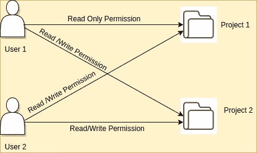
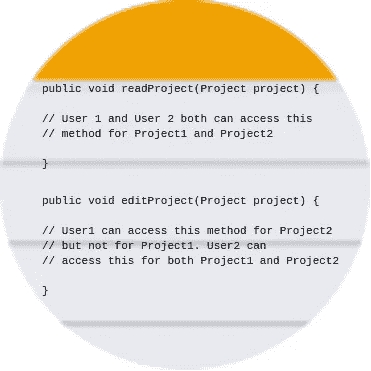
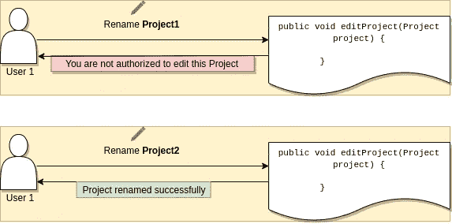

# 使用 Spring 表达式语言和 Spring AOP 定制安全注释

> 原文：<https://medium.com/geekculture/custom-secured-annotation-using-spring-expression-language-spring-aop-e086e5b9499d?source=collection_archive---------12----------------------->

# **简介**

我们大多数人都知道 Spring Security 及其用法。它支持使用 *@Secured* 注释的方法级授权。它允许我们指定可以访问特定方法的角色列表。因此，如果用户至少拥有一个给定的角色，他将只能访问一个方法。这是一个常见的用例，已经在 Spring 安全模块中默认提供了。

我们有一个稍微不同的用例要实现，它涉及到方法级的授权，但是还有一个条件。用例的完整解释如下。

# P问题陈述



有多个项目和用户。每个用户对不同的项目有不同的权限。考虑一个对项目执行 CRUD 操作的服务。例如，用户 1 对项目 1 具有读权限，对项目 2 具有读/写权限，而用户 2 对这两个项目都具有读/写权限。因此，如果有一个方法涉及到对 Project1 的任何更新操作，它就不应该被 User1 访问。



简单地说，当用户 1 试图为项目 2 使用该方法时，他被授权访问相同的方法，但是当他为项目 1 访问该方法时，他是未授权的。



# 解决方案

我们使用了 [Spring AOP](https://docs.spring.io/spring/docs/4.3.x/spring-framework-reference/html/aop.html) 和 [Spring 表达式语言(SpEL)](https://docs.spring.io/spring/docs/4.3.10.RELEASE/spring-framework-reference/html/expressions.html) 来实现用例。Spring AOP 让我们在实际方法执行之前/之后执行一些逻辑，等等…我不会深入 Spring AOP 的细节。现在知道它可以使用不同的注释拦截应用程序中的方法就足够了。这与 spring 中的@Transactional 注释的工作方式相同。

为了解决这个问题，我们还创建了一个定制的注释，它将像@Secured 接受角色一样接受角色。在访问实际的方法之前，我们通过 Spring AOP 拦截它，并验证用户是否被授权访问该项目(考虑 projectId 或任何唯一的项目标识符作为该方法的参数)。使用 AOP，我们可以获得执行时出现的所有参数，如它们的名称、值等。

SpEL 开始解析参数及其名称以获得动态 projectId。我觉得理论就够了。让我们做一些实际的代码。

# 一、实施

让我们创建一个自定义注释 **@ProjectSecured** 。它接受一个角色数组和保存 projectIdField 的参数的名称。

```
@Target(ElementType.*METHOD*)
@Retention(RetentionPolicy.*RUNTIME*)
public @interface ProjectSecured {

    Role[] roles() default {};

    String projectIdField() default "";

}
```

现在可以对 ProjectService 的方法进行如下注释。这里要检查的重要内容是注释的 **projectIdField** 参数。这取决于方法中传递的实际参数及其名称。projectIdField 是一个可解析的字符串，它将被 Spring 表达式语言解析以获得 projectId 的动态值。

```
@ProjectSecured(roles = {Role.*READ*}, projectIdField = "#project.projectId")
public Project readProject(Project project) {
    // some read operation
}

@ProjectSecured(roles = {Role.*READ*}, projectIdField = "#id")
public Project readProject(String id) {
    // some read operation
}**// pay attention to projectIdField**
@ProjectSecured(roles = {Role.*WRITE*}, projectIdField = "#project.projectId")
public Project editProject(Project project) {
   // some edit operation
}**// pay attention to projectIdField**
@ProjectSecured(roles = {Role.*WRITE*}, projectIdField = "#id")
public Project editProject(String id) {
   // some edit operation
}
```

下一个要考虑的重要组件是截获方法并验证用户是否被授权执行操作的方面。正如我们在下面看到的，aspect 截获所有用 ProjectSecured 注释的方法，获取方法签名、参数，并将其传递给 SpEL Parser，以便在运行时获取值。

```
@Aspect
@Component
public class SecureProjectAspect {

    @Autowired
    UserService userService;

    @Around("methodsAnnotatedWithProjectSecuredAnnotation()")
    public Object processMethodsAnnotatedWithProjectSecuredAnnotation(ProceedingJoinPoint joinPoint) throws Throwable {
        MethodSignature signature = (MethodSignature) joinPoint.getSignature();
        Method method = signature.getMethod();
        ProjectSecured projectSecuredAnnotation = method.getAnnotation(ProjectSecured.class);**// parse and fetch the projectId**
       String projectId = (String) CustomSpringExpressionLanguageParser.
                *getDynamicValue*(signature.getParameterNames(), joinPoint.getArgs(), projectSecuredAnnotation.projectIdField());
        Role[] roles = projectSecuredAnnotation.roles();**// If user is authorized, then proceed else throw an exception
**        boolean isUserAuthorized = userService.isUserAuthorized(projectId, Arrays.*asList*(roles));
        if (isUserAuthorized) {
            return joinPoint.proceed();
        } else {
            User currentUser = userService.getCurrentUser();
            throw new Exception(currentUser.getUserName() + " is not allowed to perform this operation on project with id:" + projectId);
        }
    } @Pointcut("@annotation(com.example.demo.conf.ProjectSecured)")
    private void methodsAnnotatedWithProjectSecuredAnnotation() {

    }
}
```

最后但同样重要的是 SpEL 解析器，它解析 projectIdField 表达式并返回动态 projectId。

```
public class CustomSpringExpressionLanguageParser {
    public static Object getDynamicValue(String[] parameterNames,  
                                   Object[] args, String key) {
        ExpressionParser parser = new SpelExpressionParser();
        StandardEvaluationContext context = new  
            StandardEvaluationContext();

        for (int i = 0; i < parameterNames.length; i++) {
            context.setVariable(parameterNames[i], args[i]);
        }
        return parser.parseExpression(key).getValue(context,  
             Object.class);
    }
}
```

所有这些因素加在一起就会产生预期的结果。

```
@SpringBootTest
public class ProjectServiceAuthorizationTest {

    @Autowired
    private ProjectService projectService;

    @Autowired
    private UserService userService;

    @Test
    public void testReadProject() {

        **// given: current user is User1**
        userService.setCurrentUser("1");

        **// when: User1 tries to read Project1**
        Project project = projectService.readProject("1");
        **// then: operation is successful**
        Assertions.*assertEquals*("Project1", project.getName());

        **// when: User1 tries to read Project2**
        project = projectService.readProject("2");
        **// then: operation is successful**
        Assertions.*assertEquals*("Project2", project.getName());

       ** // given: current user is User2**
        userService.setCurrentUser("2");

        **// when: User2 tries to read Project1**
        project = projectService.readProject("1");
        **// then: operation is successful**
        Assertions.*assertEquals*("Project1", project.getName());

        **// when: User2 tries to read Project2**
        project = projectService.readProject("2");
        **// then: operation is successful**
        Assertions.*assertEquals*("Project2", project.getName());
    }

    @Test
    public void testEditProject() {

        **// given: current user is User1**
        userService.setCurrentUser("1");

        **// when: User1 tries to edit Project1**
        Executable exe = () -> projectService.editProject("1");
        **// then: exception is thrown**
        Throwable e = Assertions.*assertThrows*(Exception.class, exe);
        e = ((UndeclaredThrowableException) e)                               
            .getUndeclaredThrowable();
        Assertions.*assertEquals*("User1 is not allowed to perform       
        this operation on project with id:1", e.getMessage());

        **// when: User1 tries to edit Project2**
        Project project = projectService.editProject("2");
        **// then: operation is successful**
        Assertions.*assertEquals*("New Project2", project.getName());

        **// given: current user is User2**
        userService.setCurrentUser("2");

        **// when: User2 tries to edit Project1**
        project = proherejectService.editProject("1");
        **// then: operation is successful**
        Assertions.*assertEquals*("New Project1", project.getName());

        **// when: User2 tries to edit Project2**
        project = projectService.editProject("2");
        **// then: operation is successful**
        Assertions.*assertEquals*("New Project2", project.getName());
    }

    @Configuration
    @ComponentScan(basePackages = "com.example.demo")
    static class SpringConfig {
    }
}
```

这个用例的完整代码可以在[这里](https://github.com/Richa-b/custom-security-app-using-aop-and-spel)找到。这里的代码[可能也与某些人有关。](https://github.com/Richa-b/custom-annotation-with-dynamic-values-using-aop)