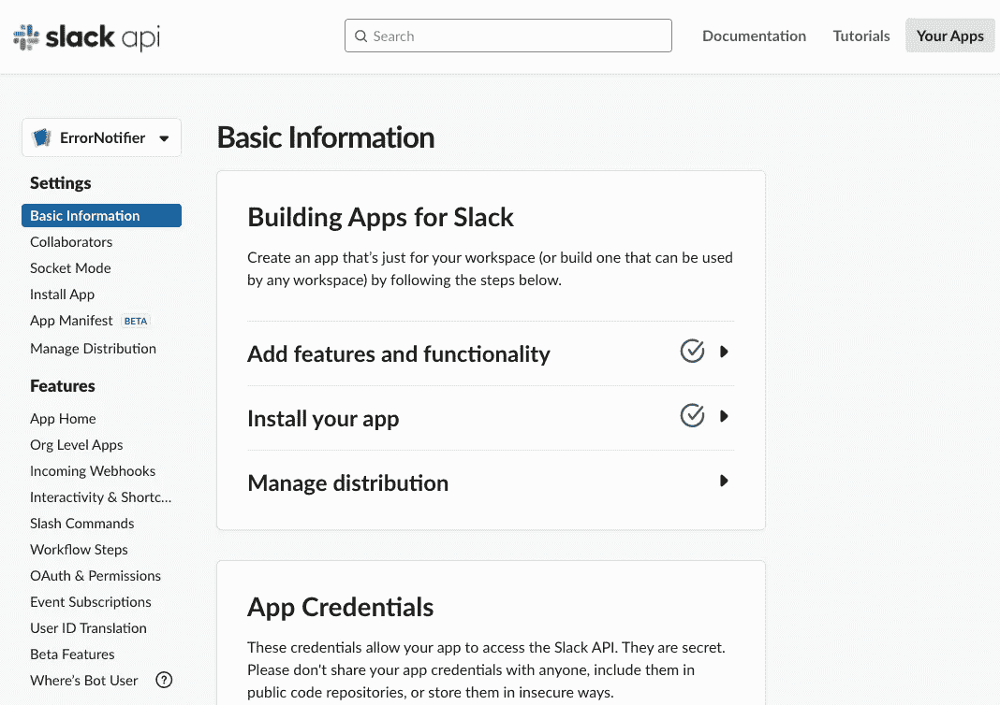
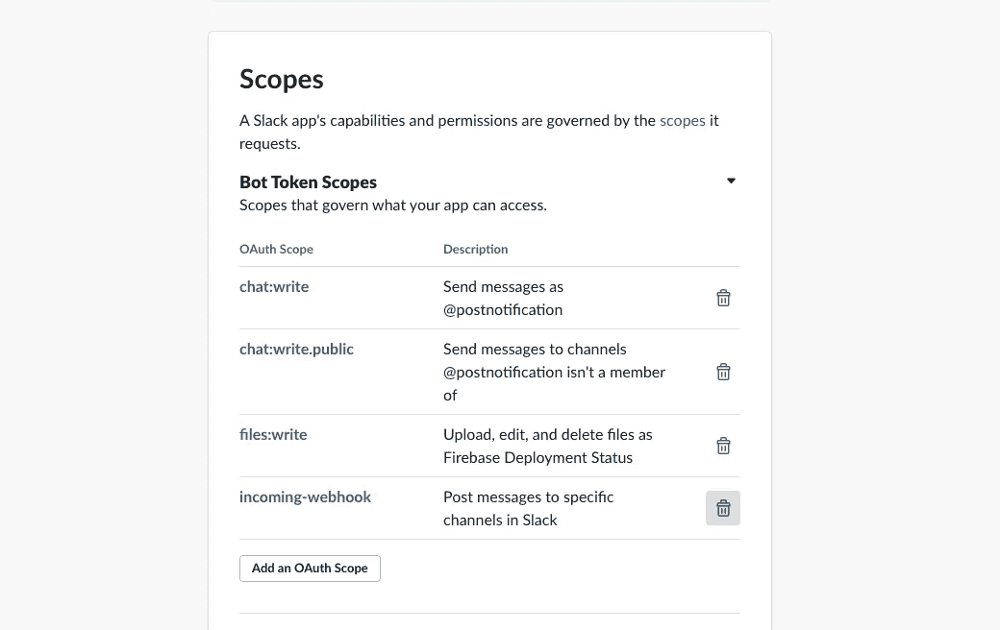
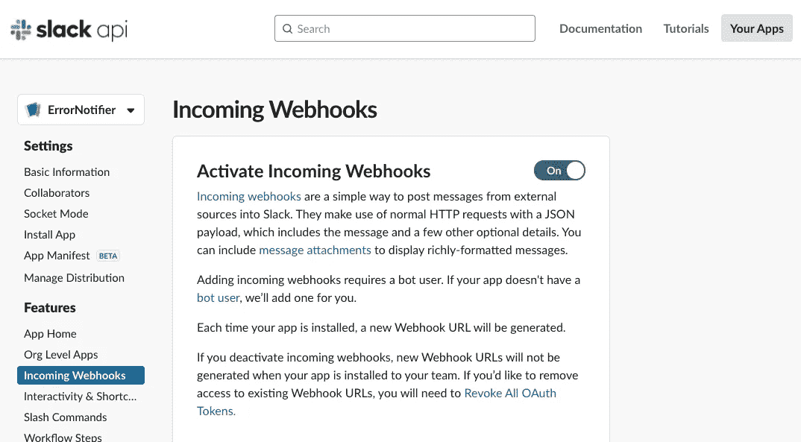
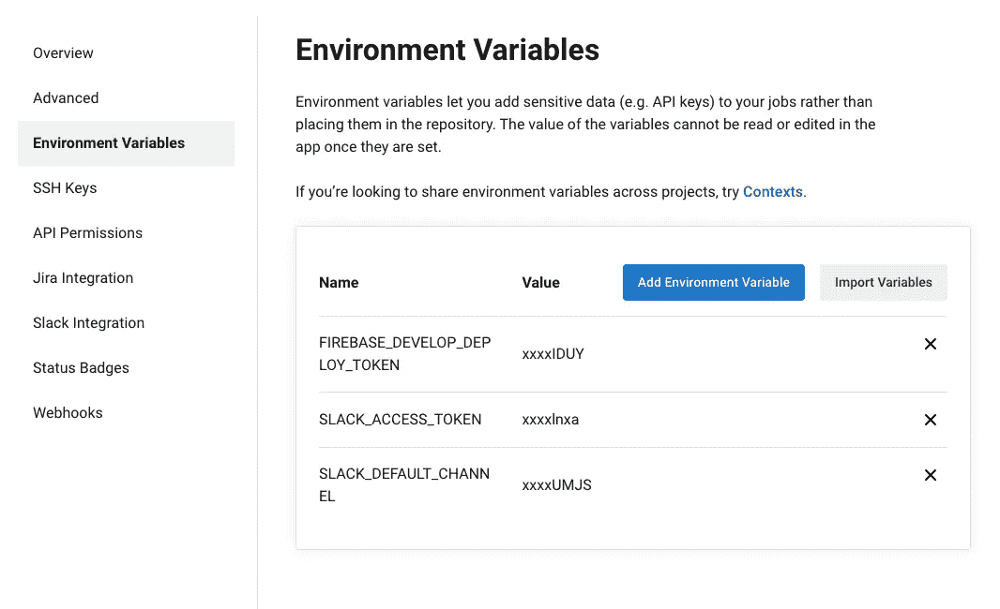
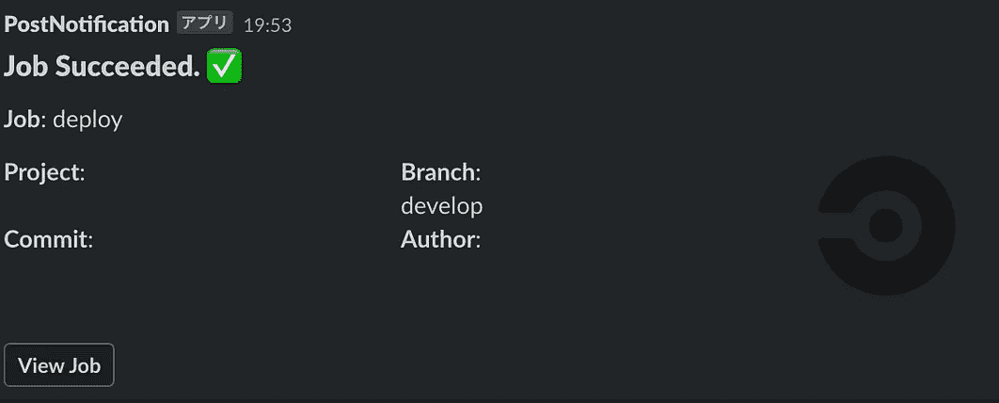
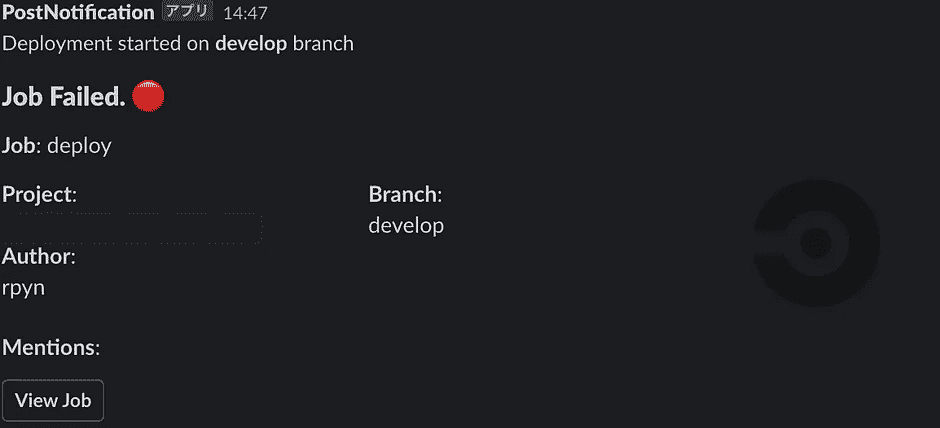
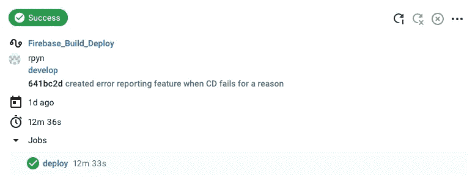

# 如何将松弛通知与 CircleCI 管道集成？

> 原文：<https://medium.com/geekculture/custom-slack-notification-with-circleci-workflow-9f42d9b767d2?source=collection_archive---------5----------------------->

Photo by [Sigmund](https://unsplash.com/@sigmund?utm_source=medium&utm_medium=referral) on [Unsplash](https://unsplash.com?utm_source=medium&utm_medium=referral)

## 轻松实现与 CircleCI 的松散通知集成，支持更好的开发。

在[的前一篇文章](/geekculture/make-a-slack-app-for-your-slack-channel-95d3a30d2f8e)中，我写了关于 Slack Incoming Webhook 的文章，它向你指定的频道发布一个定制的通知。在本文中，我想向您展示如何用不同的方式发布一个时差通知，用 CircleCI 现代持续集成和持续交付(CI/CD)平台。

您可以用 shell 脚本创建一个程序，只在部署成功或失败时自动发送 Slack 通知，但为什么要用 CircleCI 呢？这是因为无需编写 shell 脚本，CircleIC 就能提供这种功能和许多内置功能，你可以从所谓的 **Orb** 中使用这些功能。

> Orb 是一个可重用的 YAML 配置包，它将重复的配置压缩成一行代码。

可重用的代码片段帮助您自动化重复的过程，加快项目设置，并使其易于与第三方工具集成。

# 综合

> 如果你只是想要完整的源代码，请向下滚动:)

## 设置

首先，让我们给你的 Slack 应用一些从外部服务访问的权限。如果您还没有创建，您可以从这个[页面](https://api.slack.com/apps)创建一个。创建 Slack 应用程序后，转到应用程序的基本信息页面。您需要添加范围。

从**功能**部分，点击 OAuth &权限按钮。

请从**添加 OAuth 范围**按钮添加这三个范围。

1.  聊天:写作
2.  聊天:写:公开
3.  文件:写入

底部的传入 webhook 作用域在这里是不需要的，但是如果你想让你的应用程序使用传入 Webhooks 和 CircleCi，那么应该启用它。

Add appropriate scopes

启用 webhook 后，此作用域应该会自动添加到这里。

Enabling Incoming Webhook

添加这些范围后，转到 CircleCI 项目设置页面。在左下方的**环境变量**中，添加两个变量；松弛访问令牌和通道 id。分别调用它们 **SLACK_ACCESS_TOKEN** 和 **SLACK_DEFAULT_CHANNEL** ，*否则 CircleCI 不识别它们。请仔细检查你是否拼写正确。*

*SLACK_ACCESS_TOKEN* 是一个以`xoxb-`开头的令牌，可以从我们之前看到的 OAuth &权限页面中找到。复制 **Bot 用户 OAuth 令牌**并将其放入 SLACK_ACCESS_TOKEN。

*SLACK_DEFAULT_CHANNEL* 是一个 Slack channel id，链接到您希望 CircleCI 发布通知的频道。当您右键单击 Slack 中的频道时，您可以**复制链接。**链接是这样的；https://$ {项目名称} . slack . com/archives/$ {频道 id}。通道以 C 开头，因此复制它并将其放入 SLACK_DEFAULT_CHANNEL。

很好，现在你完成了 CircleCI 的设置。

## CircleCI 开发

这个文件在名为. circleci 的文件夹下创建为 config.yml。

让我们来看看每个步骤，让我将文件分成 5 个块。

这意味着我们在 4.3.0 版中使用 slack orb。正如我在本文第一部分中解释的，orb 是 YAML 配置的可重用包。一行导入许多松弛特性。`circleci/slack@4.3.0`在文件中可以作为`slack`访问

接下来，我们来看看命令。正如该部分的标题所示，您可以在这里创建命令，这样您就可以通过在 jobs 部分指定命令名来运行它们，我们稍后将对此进行研究。

这里，我们有两个命令，叫做 notify_slack_error 和 notify_slack_pass。第一个命令在部署失败时触发，第二个命令在部署成功时触发。在这里，我们使用通知特性作为上面声明的`slack`的`slack/notify`。

CircleCI 提供了一个叫做`template`的便捷工具。只需指定模板名称，就可以轻松创建松弛通知 UI。如果你想创建一个自定义的时差通知用户界面，是的，你可以。

正如我们在我的[上一篇文章](/geekculture/make-a-slack-app-for-your-slack-channel-95d3a30d2f8e)中了解到的如何定制消息传递，您可以使用`custom`字段对[消息有效负载](https://api.slack.com/reference/messaging/payload)进行编程。例如，我们可以这样写来创建一个自定义的 UI 通知；

更多技术细节，请查看 CircleCI 的[页面](https://circleci.com/developer/ja/orbs/orb/circleci/slack)。

接下来，让我们定义工作。它有一项名为部署的工作。它使用 docker 映像，因为它需要在执行中运行 node.js。这里设置为中等，但你可以付费增加音量。

步骤由可运行脚本组成，每个步骤都有一个命令及其名称。正如我们在上面的命令部分中看到的，我们有两个自定义命令，称为 notify_slack_error 和 notify_slack_pass **。**这些命令在其他步骤运行后执行。

如果作业不成功，事件变为`fail`，这意味着仅触发 notify_slack_error。相反，如果作业中没有错误，则忽略 notify_slack_error 并调用 notify_slack_pass。就是因为事件变成了`pass`。如果你想一直触发，你也可以设置`always`。

最后，我们来看看工作流程。它有一个名为 Firebase_Build_Deploy 的工作流。我做了一个叫做部署的工作。我希望 CircleCi 只在开发部门有新的推动时才运行它。您可以通过这种方式添加过滤器来实现。

如果我解释的所有内容都被正确集成，您应该会在下面看到相同的结果。

# 结束语

在我最近的项目中，我研究了 Github Actions、云构建和 CircleCI，以便在我们的项目中集成 CI/CD，我最初想写一篇关于比较的文章，但因为我们决定集成 CircleCI，我需要开发它，所以我写了我对实现的学习。

随着 CircleCI 的采用，我们的项目环境变得更好了，我很喜欢它:)将来，也许我会再写一些关于 CI/CD 相关主题的文章。希望这篇文章也能帮助到别人！

我现在也正在撰写与电子商务和支付相关的其他文章，所以请随时关注我，以便在我未来的文章准备好时立即得到通知。我的账户主题是电子商务、支付和生产力。

(如果您希望向我发送提示🙂☕️)
-以太坊地址
0x 45 b 8 c 8712159 be fab 29 C3 B1 e 97 b 4534272 ADF 31