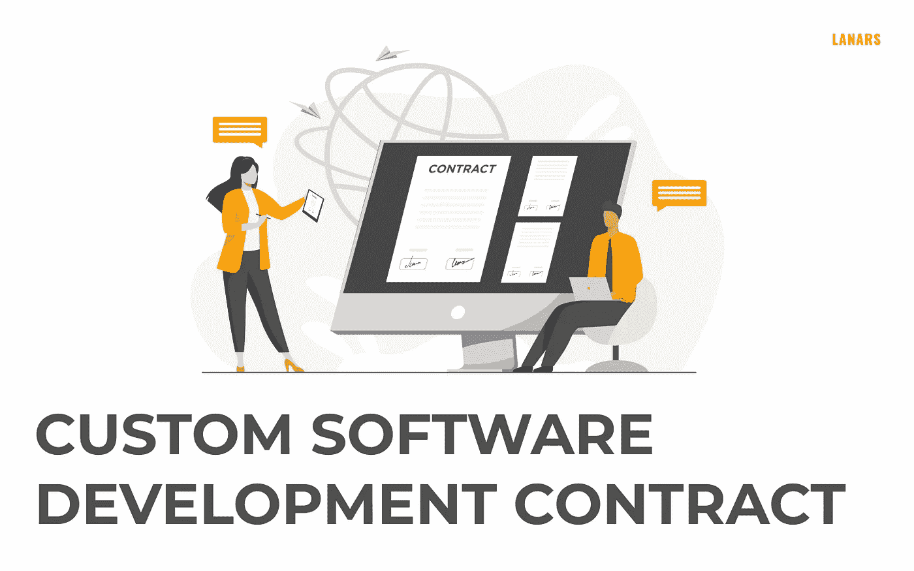

# 定制软件开发合同:如何与供应商签订协议

> 原文：<https://medium.com/geekculture/custom-software-development-contract-how-to-sign-agreements-with-vendors-113fef666128?source=collection_archive---------21----------------------->

在供应商和客户之间建立可信赖的关系是成功合作的基石。但它的本质部分是什么，以及如何设置所有必要的规则？为了回答这个问题，我们需要探索什么是软件开发合同，它的主要条款是什么。