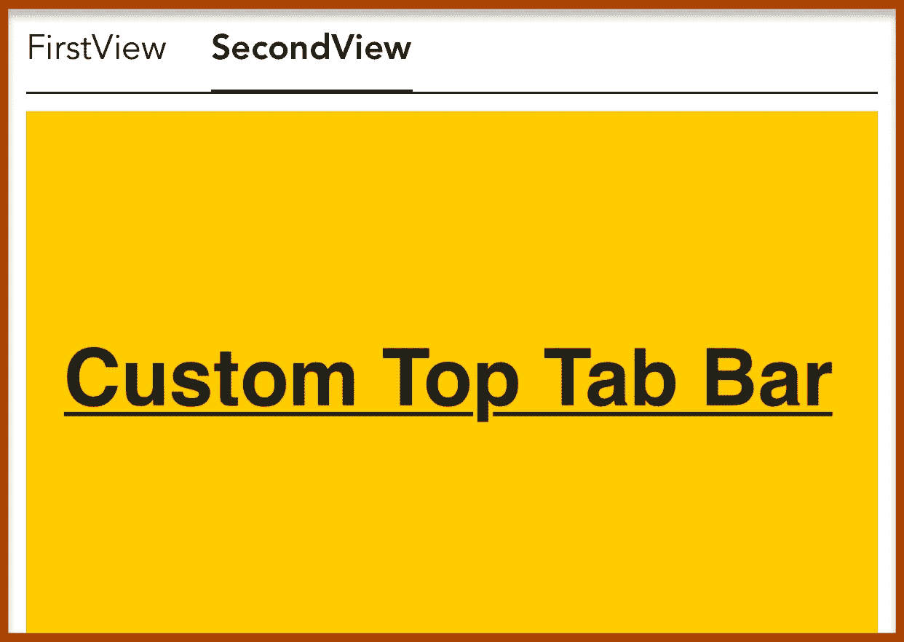
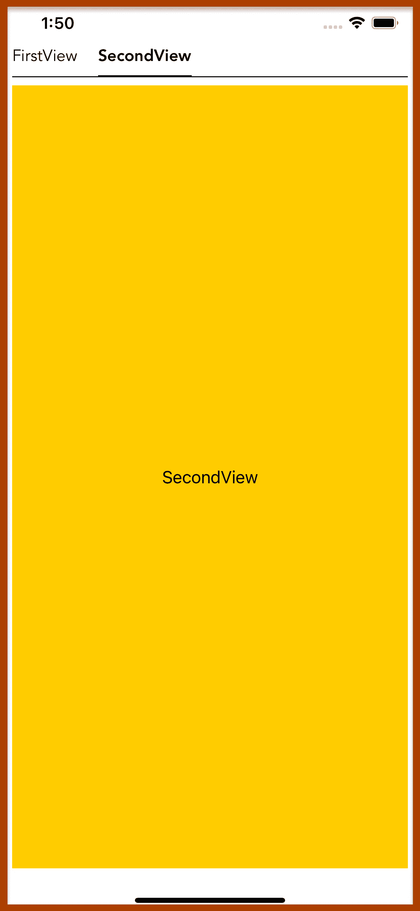

# IOS 中的自定义顶部标签栏(Swift、SwiftUI)

> 原文：<https://medium.com/geekculture/custom-top-tab-bar-in-ios-swift-swiftui-93e4fc3e5d5b?source=collection_archive---------1----------------------->

大家好，在这个博客中你可以学习如何使用**Swift**&**Swift ui**在 **IOS** 中制作一个**自定义顶部标签栏**。为了更好地理解，请阅读完整的博客。谢谢:)

# **步骤 1)**

用 **SwiftUI** 创建一个 **XCode** 项目。看下面的截图。

**步骤 2)**

现在创建两个虚拟视图，我们将在每个选项卡选择上显示它们。就像在这里，我正在制作“**第一视图**”&”**第二视图**”。

//第一个视图

//第二视图

这些只是简单的虚拟视图，您可以使用自己的视图，不要担心。

# **第三步)**

现在创建一个 **TabBarButton。**

在 **TabBarButton** 、**两个**属性传递到按钮中。

*   **文本** →在**标签栏**中显示为**标签文本**
*   **is selected**→Passing**is selected****@ Binding var**用于将**边框**交换到底部按钮&交换**。fontWeight** 。

这里我们使用的是**文本**视图和**文本**上使用的四个修改器。

*   **。字体粗细** →这用于改变**文本**的字体粗细
*   **。字体** →用于给**文本**赋予**自定义**字体和大小
*   **。垫料** →这是用于垫料的。这里我们给底部填充。
*   **。边框** →这是一个自定义修改器。您可以在**步骤 5** 中看到这一点。

# **步骤 4)**

现在创建一个自定义选项卡栏视图

在 **CustomTopTabBar** 视图中，我们正在传递**@ Binding**var**tabIndex**。这个 **tabIndex** 只是控制选择哪个选项卡。这里我们使用了两次**选项卡按钮**,这意味着我们有两个选项卡或两个选项卡项目。默认情况下， **tabIndex** 将为“ **0** ”。这意味着视图出现时**第一个**标签项将被**选中**或者第一次渲染**。**

这里，我们创建了一个名为 onButtonTapped 的函数。该函数接受一个整数参数，并将其传递给 tabIndex。当 **tabIndex** 的值改变时，它将通过使用 **TabBarButton** 来传递。常数(tabIndex == 0)或。常数(tabIndex == 1)。如果 tabIndex 不等于“ **0** ”，则**。constant(tabIndex == 0)** 函数将返回 **false** ，然后“0”tabIndex 将被取消选择，如果 tabIndex 等于“1”，则**。constant(tabIndex == 1)** 函数将返回 **true，**则“1”tabIndex 将被选中。这意味着我们只是将**布尔值**传递到 **isSelected** 属性中的 **TabBarButton** 中。

 [## 三星 Galaxy S21 超 5G 出厂解锁安卓手机 128GB 美版智能手机…

### 三星 Galaxy S21 Ultra 5G 手机在各方面都是史诗般的，具有引人注目的新设计，迄今最快的 Galaxy 处理器，以及…

amzn.to](https://amzn.to/35knqeL) 

# **步骤 5)**

现在创建一个 EdgeBorder 视图

EdgeBorder 是一个视图，用于为特定边上的任何视图提供边框。为了将此视图用作**修饰符**，我们将编写**视图** **扩展**，如下图所示。

**希望你理解。感谢阅读:)如果您有任何问题，请在下面评论。**

# **完整代码:**

**希望你明白，如何制作一个自定义的顶部标签栏。谢谢:)😀如果你有任何问题，请在下面评论。**

## 订阅模式

 [## 米（meter 的缩写））阿巴斯正在创建 IOS 开发者| Patreon

### 立即成为 M.Abbas 的赞助人:获得世界上最大会员的独家内容和体验…

www.patreon.com](https://www.patreon.com/abbasgujjar)