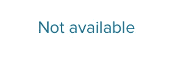

# 自定义 UI 组件 NormalBold TextView 样式— Android — Kotlin

> 原文：<https://medium.com/geekculture/custom-ui-component-normalbold-textview-style-android-kotlin-4612e4839c2?source=collection_archive---------8----------------------->

## 有时我们有一个特殊的场景，我们没有本地 UI 组件，我们在寻找定制的 UI。


Photo by [Thiébaud Faix](https://unsplash.com/@thips?utm_source=medium&utm_medium=referral) on [Unsplash](https://unsplash.com?utm_source=medium&utm_medium=referral)

最近我不得不在一个有两种状态的 UI 上工作。如果数据不可用，则显示**正常**和**小**尺寸文本，在其他状态下显示**粗体**和**大**尺寸文本。检查下面



那么，只有一个 **TextView** 怎么解决这个问题呢？一种方法是添加 textChange 侦听器，另一种解决方案是拥有一个自定义的 textview 类。
XML 中的普通 TextView 声明如下所示(使用 MaterialTextView)

```
<com.google.android.material.textview.MaterialTextView
    style="@style/regularText"
    android:layout_width="wrap_content"
    android:layout_height="wrap_content"
    android:text="@{translation.not_available}"
    tools:text="Not available" />
```

kotlin 中的自定义 **MaterialTextView** 视图类:

```
class LargeRegularTextView(context: Context, attrs: AttributeSet? = null) :
    LinearLayout(context, attrs) {

    init {
        *orientation* = *VERTICAL* inflate(context, R.**layout**.***large_regular_view***, this)
        context.obtainStyledAttributes(attrs, R.**styleable**.***LargeRegularTextView***).*apply* **{** setTextColorRes(color = getColor(R.styleable.*LargeRegularTextView_textColorRes*, -1))
        **}**.recycle()
    } //set text to bold and large size
    fun setBold(text: String) {
        tvValue.**setTextAppearance**(*context*, R.**style**.*headingText*)
        tvValue.*text* = text
    } //set text to normal and small size
    fun setNormal(text: String) {
        tvValue.**setTextAppearance**(*context*, R.**style**.*smallText*)
        tvValue.*text* = text
    } // if you want to set text color as well
    fun setTextColorRes(color: Int) {
        tvValue.**setTextColor**(color)
    }

}
```

现在您已经缺少了**布局**、**样式化、**和**样式**。

**布局**(large _ regular _ view . XML):
注:别忘了 **< merge/ >**

```
<?xml version="1.0" encoding="utf-8"?>
<merge xmlns:android="http://schemas.android.com/apk/res/android"
    xmlns:tools="http://schemas.android.com/tools"
    tools:orientation="vertical"
    tools:parentTag="LinearLayout">

    <com.google.android.material.textview.MaterialTextView
        android:id="@+id/tvValue"
        style="@style/eliqBodyRegularText"
        android:layout_width="wrap_content"
        android:layout_height="wrap_content"
        tools:text="text" />

</merge>
```

**可样式化**(RES->values->attrs . XML):

```
<?xml version="1.0" encoding="utf-8"?>
<resources><declare-styleable name="LargeRegularTextView">
    <attr name="value" />
    <attr name="textColorRes" format="integer" />
</declare-styleable></resources>
```

最后**风格**:

```
//Bold-Large
<style name="headingText" parent="Widget.MaterialComponents.TextView">
    <item name="android:textColor">#...</item>
    <item name="android:textSize">@dimen/tvHeadingSize</item>
    <item name="android:fontFamily">@font/brand_font</item>
    <item name="android:textStyle">bold</item>
</style>//Normal-Small
<style name="smallText" parent="Widget.MaterialComponents.TextView">
    <item name="android:textColor">#...</item>
    <item name="android:textSize">@dimen/tvSmallSize</item>
    <item name="android:fontFamily">@font/brand_font_light</item>
</style>
```

现在，以 XML 布局声明您的自定义 textview，如下所示:

```
<package_name.LargeRegularTextView
    android:id="@+id/tvCustom"
    android:layout_width="wrap_content"
    android:layout_height="wrap_content"
    tools:text="7,6 kWh" />
```

然后像这样简单地设置值:

```
tvCustom.setNormal("...")tvCustom.setBold("...")tvCustom.setTextColorRes(ContextCompat.getColor(*context*, R.color."your color res*"*))
```

希望它能解决你的一些问题。

尽情享受吧！