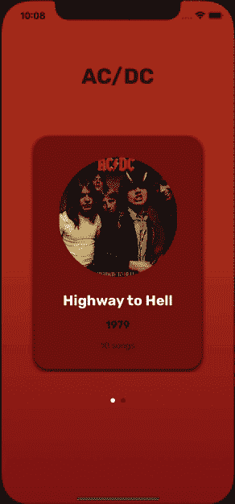

# Swift 中的自定义视图控制器转换

> 原文：<https://medium.com/geekculture/custom-view-controllers-transitions-aa8c052f8049?source=collection_archive---------1----------------------->

## 通过创建您自己的过渡来提升您的应用程序 UX

Photo by [Farzad Nazifi](https://unsplash.com/@euwars?utm_source=unsplash&utm_medium=referral&utm_content=creditCopyText) on [Unsplash](https://unsplash.com/s/photos/mobile-developer?utm_source=unsplash&utm_medium=referral&utm_content=creditCopyText)

这可能是 iOS 开发中最被低估的主题之一，也是最难掌握的主题之一。当你在开发技能方面有了一些坚实的基础，你就会开始挖掘更高级的功能，比如动画。如果你经常使用 Instagram、脸书、Airbnb、Spotify 等最受欢迎的应用程序。，你大概开始用开发者的眼光看他们了。那就是质疑事物是如何工作的，他们使用什么类型的架构，动画和过渡是如何如此流畅，等等。

当你玩这类应用程序时，你肯定会注意到，当一个新的视图控制器出现时，它很少使用默认的 **pushViewController** 动画。取而代之的是，他们用一些很酷的动画来定制过渡。当我们试图吸引用户使用应用程序时，这是一个非常重要的价值。

对于这篇文章，我准备了一个简单的应用程序，其中有几张 AC/DC 的专辑(为了简单起见，我只添加了两张)。当你点击一张专辑时，它会带你到一个新的视图，里面有该专辑的歌曲。

因此，我想向您展示我们如何在视图控制器之间进行这种自定义转换。

所以我们先从一些基本概念开始。每当我们推送一个新的视图控制器时， **UIKit** 会询问 **UINavigationController 的**代表是否有一个自定义的转换来调用这个函数:

如果委托没有实现或者返回值为零，那么我们将得到默认的视图控制器的推送和弹出行为。相反，如果我们返回一个**UIViewControllerAnimatedTranistion**对象， **UIKit** 将使用该对象制作动画。

如果你看一下**UIViewControllerAnimatedTransition**协议，你会发现我们只需要实现两个功能:

在第一个例子中，我们返回转换的持续时间。

在第二个是魔术发生的时候=)。这里我们可以从视图控制器(初始视图控制器)访问**，也可以从**访问视图控制器**(转换后的视图控制器)。**

我们需要做的第一件事是创建一个实现**UIViewControllerAnimatedTransition**协议的类。

我们知道我们需要在 animateTransition 函数中制作过渡动画。首先，我们必须访问转换的上下文视图。您可以将上下文视图视为在动画仍在运行时将出现在“从视图”控制器的视图和“到视图”控制器的视图之间的视图。这个上下文视图只是一个空视图。它没有任何东西在里面，所以我们需要添加元素，我们想在我们的过渡动画。

在我们的项目中，我们将制作以下视图的动画:

1.  集合视图单元格的内容视图。
2.  专辑封面图片。

如果你看演示，你会注意到，当我们点击一个相册，它的内容视图扩展并满足屏幕，同时封面图像移动到视图的顶部，同时它的形状从圆形变为方形。

当我们向 containerView 添加一些视图时，我们必须给它正确的框架，以匹配它在视图控制器视图中的确切位置。为此，我们可以使用 **convert(_ rect: CGRect，from coordinate space:UICoordinateSpace)->CG rect**函数。

最后但同样重要的是，我们需要复制我们想要制作动画的视图的所有属性，以便复制它们在原始视图中的相同布局。

让我们结束这一切，开始编写我们的动画转换函数。

1.  获取初始视图控制器(引用为 fromViewController)并将其转换为一个 **AlbumsViewController** 类型。
2.  获取最终的视图控制器(引用为 toViewController)并将其转换为一个**AlbumDetailViewController**类型。
3.  获取集合的当前单元格。在 AlbumsViewController 中，每当用户在相册之间滚动时，我们都会更新该属性。
4.  从当前单元格获取相册封面图像。
5.  获取 AlbumDetailViewController 的标题视图。在这个标题视图中，我们放置了封面图像。因此，我们需要访问这个视图来获得图像的最终位置。
6.  我们得到了上下文容器视图。这是我们将用于过渡的视图
7.  我们需要添加最终视图(AlbumDetailViewController 的视图)。当动画完成后，这就是将要留下的。如果我们不添加它，我们将得到一个黑屏结束。
8.  在整个转换完成之前，视图需要保持隐藏。

现在我们已经准备好了容器视图，我们可以开始制作动画了。

对于我们想要进行的过渡，我们只需要改变动画块内的视图帧。此外，我们将相册图像视图层的圆角半径设置为零，因此我们在第一个屏幕中的圆形边框会在过渡中平滑地消失。

在完成块中，我们需要显示 AlbumDetailController 的视图，然后删除我们为动画添加的快照。最后，我们告诉上下文转换已经完成。

现在我们已经准备好开始使用我们的定制转换了。但是首先，我们必须实现 **navigationController 的**委托来告诉 **UIKit** 现在它必须使用我们的 **TransitionManager** 类来动画化转换，而不是默认行为。

我们有几个选择来做这件事。我们可以在 **AlbumsViewController** 中实现委托，并返回 **TransitionManager** 的一个实例。

另一种选择是在 TransitionManager 内部实现委托，并在 AlbumsViewController 中将 TransitionManager 设置为 navigationController 的委托。

有了这些，现在您就有了自己的定制过渡。我在这里展示了一个简单的过渡动画，但是您可以从一个视图控制器到另一个视图控制器制作任何您想要的动画。

这在开始时可能会让人不知所措，但是一旦你完全理解了过渡的关键概念，你就只需要担心你想要执行的动画了。想象一下你想在转换中完成什么，然后认为大部分工作将在 **func animateTransition(使用 transition context:uiviewcontrolercontexttransitioning)**函数中完成。

在这篇文章中，我介绍了 push 操作，pop 操作非常相似，我们只需要对代码做一些小的调整。如果你对第二部分感兴趣，请告诉我。

感谢阅读！我希望这对你有帮助。如果你愿意，你可以在这里查看完整的项目。如果你有任何问题，给我留言，我很乐意帮忙。