# 利用 Spark 进行客户流失预测

> 原文：<https://medium.com/geekculture/customer-churn-prediction-with-spark-f71c358a48bb?source=collection_archive---------42----------------------->

2020 年 6 月 15 日

## 项目定义

客户流失预测具有挑战性，但这是数据分析师和/或企业在所有 B2C 行业中经常遇到的问题。
准确而成功地预测客户流失对每个 B2C 公司来说都是非常高效和节省时间/金钱的。

这是我在一门叫做 Udacity 数据科学 Nanadegree 的课程中的最后一个项目。我曾在一家名为 Sparkify 的虚拟音乐流媒体服务上预测客户流失。为此，我使用了最小的可用数据集(128MB)，但它们有一个中型和一个大型，但对于最后一个，建议使用 IBM Watson Studio 或 AWS 来构建和调整机器学习模型。

## 问题陈述

通过 Sparkify，用户可以播放他们想要的歌曲，如果他们需要就喜欢它们，如果他们必须强调与歌曲相关的挑战，就提供拇指向下。用户可以付费订阅，也可以免费收听。

作为 Sparkify 数据科学家团队的一员，我们被要求寻找客户流失的指标。从探索数据开始，看看我们可以使用数据集中的哪些功能，我们将进行探索性的数据分析，并根据用户特征评估适合的模型。

在我们的数据集中，我们创建了一个名为“Churn”的新列，我们将使用它作为我们的机器学习模型的标签。我们将使用取消确认事件来定义该项目的变动。

数据集中大约有 23%的用户有过不愉快，这表明数据集是不平衡的。

## 韵律学

为了解决这个问题，我们将使用分类算法。

为了预测数据集的类别，我们可以使用许多分类算法。当我们在开发我们的机器学习模型时，我们会训练和评估一定数量的机器学习模型，我们会保留那些预测性能更好的机器学习模型。我们将使用其中的 3 种:逻辑回归、随机森林和梯度。被提升的树。

两个指标用于评估我们的模型:

准确度衡量分类器做出正确预测的频率。它是正确预测数与总预测数的比率。

F1 分数，它是精确度和召回分数的加权平均值。该分数的范围从 0 到 1，1 是 F1 的最佳分数。

## 数据探索和可视化

加载和清理数据集

在以 JSON 格式加载原始数据集之后，我们丢弃了所有不必要的或缺失的数据，比如没有 userids 或 sessionsIDs 的记录。

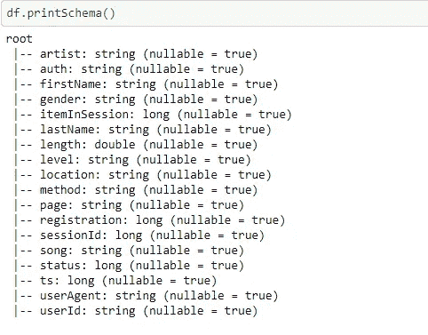

在这里，我们将深入观察那些留下来的 cs 用户的行为，那些流失的用户以及影响流失的属性。

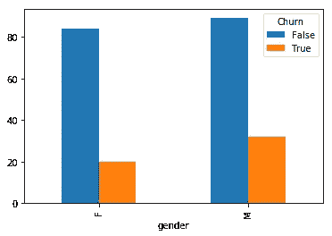

Churn based on gender

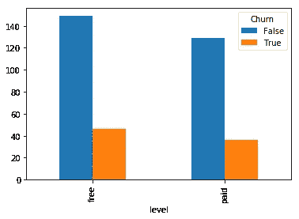

Churn based on free or paid users

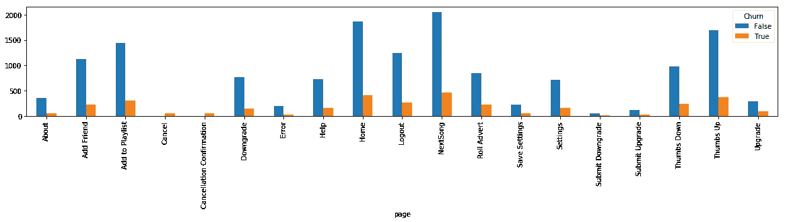

Churn based on activities

从第一张图表中，我们可以看到 19%的女性用户和 26%的男性用户有过不愉快的经历。男性用户的流失率更高，从第二张图表可以看出，免费用户的流失率比免费用户高。在最后一张图表中，我们可以看到与客户流失相比的活动相关变量。很难有一个明确的互动访问页面和流失。滚动规避、提交降级/升级、拇指向下、升级等属性似乎比其他页面访问与客户流失的关系更密切。

## 特征工程

基于前面的分析，我们将生成以下特征:

*   任期:最后一次访问日和注册日之间的天数
*   state:位置变量中的州名
*   浏览器:从用户代理检索的浏览器信息
*   os:从用户代理检索的操作系统信息
*   设备:从用户代理检索的设备信息
*   num_songs:用户听的歌曲数量
*   num_artists:用户收听的艺术家数量
*   avg_length:用户听的歌曲的平均长度
*   几个布尔变量表示对“滚动避免”、“提交降级”、“提交升级”、“拇指向下”、“添加朋友”和“添加到播放列表”的页面访问

## 特征转换

使用 StringIndexer 和 OneHotEconderEstimator 将分类变量转换为数字变量，以便在我们的机器学习模型中使用它们，并使用 StandardScaler 来避免特征“支配”其他特征。然后，我们建立我们的管道，我们将使用 3 个机器学习模型来预测流失:逻辑回归，随机森林分类器和梯度增强树分类器。

## 字符串索引

所有分类变量以及我们的标签列(' churn ')都需要使用 Sparks StringIndexer 进行索引，以便这些列不再包含表示类别值的字符串，而是包含索引。

## 一个热编码

我们的分类特征不是有序的，正因为如此，我们希望使用 Sparks OneHotEncoder)执行一次热编码，这将为每个分类值创建一个新的二进制列(虚拟变量)。

## …向量化…

由于 Spark 分类器希望特性以单个列的形式出现，我们将应用 VectorAssembler。

## 缩放比例

最后，我们将使用 Sparks StandardScaler 来缩放特征值。当数值变量的范围差别很大时，这是有意义的。正如我们上面已经提到的,“下一首歌”事件比其他页面事件发生得更频繁。因此，计数变量的范围会有很大不同，缩放似乎是一个很好的选择。

此外，我们将在建模前删除一些不必要的列。

## 建模

对于我们的预测模型，我们将数据分成两个子集，分别用于训练(70%)和测试(30%)。

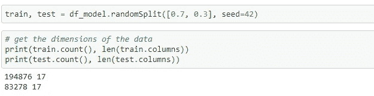

机器学习的最佳实践还建议创建一个验证数据集，但我们不会这样做，原因如下:
验证数据集通常在模型优化过程中使用。只有在所有优化迭代之后，测试数据集才用于最终评估模型。
我们将使用 PySparks CrossValidator 进行模型优化，现在没有必要。交叉验证将仅获得训练数据集作为输入，并将其分成几个子集用于优化本身。因此，我们将只需要一个进一步的数据子集(测试数据)来评估模型的性能。不创建验证集的优点是训练集可以更大(我们可以进行 70/30 分割，而不是 60/20/20 分割)，这对于最终的模型性能可能是至关重要的，因为我们现在只处理相当小的数据集，并且正在处理类不平衡。

下一步是训练和评估我们的模型。

在使用默认超参数拟合这些分类器之后，我们可以看到梯度。提升的树分类器表现最好，具有 0.991 的相当好的 f1 分数。

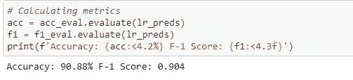

**Logistic Regression Model**

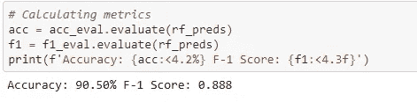

**Random Forest Classifier**

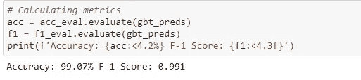

**Gradient.Boosted Tree Classifier**

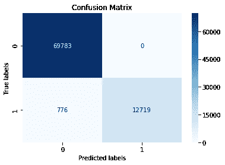

Confusion Matrix for Gradient.Boosted Tree Classifier

我们将通过交叉验证使用超参数调整。这些参数用于减少运行时间。

让我们从性能最好的分类器开始，尝试用一组不同的超参数来优化它的性能。

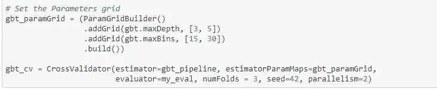

在拟合交叉验证模型之后，我们再次使用其最佳模型来预测 test_data。表演稍微好了一点。

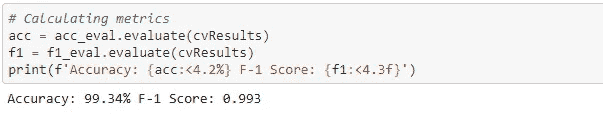

超参数调整
对第一轮中表现最好的分类器进行交叉验证后，结果是选择梯度。提升树分类器。
可以假定，这种发展主要是由数据的小尺寸引起的。当使用交叉验证时，训练数据将被分成几个子集，用作训练具有不同超参数组合的几个模型的输入。
因此，建议在最终选择预测用户流失的模型之前，在云中的更大数据集上重复超参数调优。

## 结论

我们已经设法交付了良好的结果与梯度。Boosted 树分类器和小数据集，但也有一些改进的空间:

*   我们使用了小型数据集(128MB)，而不是 Udacity 提供的中型数据集(231MB)或完整数据集(12GB)。Spark 最适合较大的数据集，为了实现其全部潜力，我们现在应该将我们的解决方案迁移到云中的 Spark 集群，并使用原始数据集运行它。我们还可以考虑对数据进行(向下)采样，以解决建模阶段已经存在的类别不平衡问题。
*   由于运行交叉验证需要大量的时间，我已经调优了超参数，但不是以最好的方式。
*   有些功能我还没有在项目中探索。
*   为了根据我们的数据集预测用户流失，我们可以在本地环境中使用 Spark 处理更小的数据子集。
    尤其是在将数据聚合成更小的功能集之后，数据可能不够大，不足以训练和评估企业的最终解决方案。
*   一旦模型最终确定，我们可以通过运行 A/B 测试来验证它的业务影响。最后但同样重要的是，这种验证也与证明持续维护和改进模型的努力和成本是合理的相关。