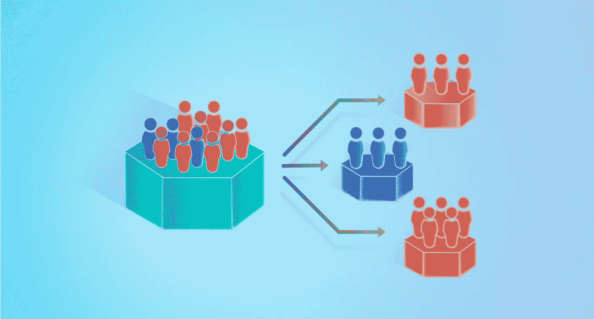
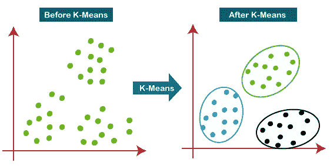
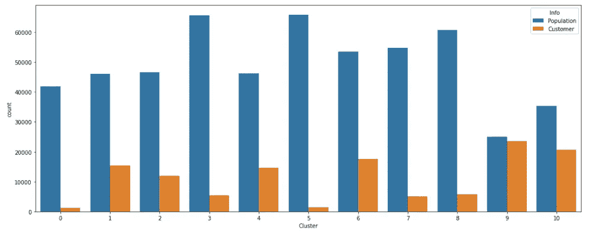
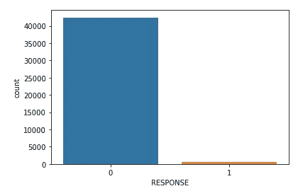
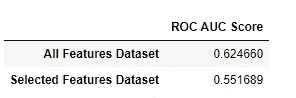
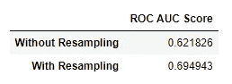
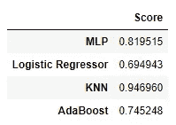

# 客户细分项目

> 原文：<https://medium.com/geekculture/customer-segmentation-project-116c47d7a4df?source=collection_archive---------3----------------------->



# **简介**

作为我在 Udacity 的[数据科学家纳米学位](https://www.udacity.com/course/data-scientist-nanodegree--nd025)项目的最后一个项目的一部分，我选择解决**贝塔斯曼/阿瓦托项目。**

这个项目背后的想法是处理 Arvato 的数据科学小组必须处理的现实生活中的问题:寻找新客户。

这个项目的主要目的是找出目前是顾客的人和不是顾客的人之间的相似之处。然后，使用这些信息来寻找潜在的新客户群(目前不是客户但与客户有高度相似性的人)。

该项目分为三个部分:

*   第一部分:数据分析和数据清理
*   第二部分:客户细分
*   第三部分:监督学习模型

# 目标


该项目主要分为两个目标:

T 该项目的第一个目标是分析德国一家邮购销售公司客户的人口统计数据，并将其与一般人群的人口统计信息进行比较。目的是在两个群体中找到相似的特征，在一般人群中为营销活动寻找好的候选人。

第二个目标是开发一个机器学习模型，该模型可以使用每个人的人口统计信息将新样本分类为营销活动的好候选或坏候选。

# 第一部分:数据分析


Photo by [Stephen Dawson](https://unsplash.com/@dawson2406?utm_source=medium&utm_medium=referral) on [Unsplash](https://unsplash.com?utm_source=medium&utm_medium=referral)

**任何数据科学项目的第一步**都是分析将要使用的数据。

对于本项目，**四个**数据集具有以下特征:

1.  **azdias** :德国一般人口的人口统计数据。891211 人(行)x 366 个特征(列)。
2.  **客户**:一家邮购公司客户的人口统计数据。191652 人(行)x 369 特征(列)。
3.  mailout_train :作为营销活动目标的个人的人口统计数据。42982 人(行)x 367 人(列)。
4.  作为营销活动目标的个人的人口统计数据。42833 人(行)x 366 人(列)。

还使用了两个包含数据信息的 excel 文件。

1.  **DIAS 信息级别-属性 2017:** 关于数据集中存在的特征的信息。
2.  **DIAS Attributes-Values 2017:**关于值的信息以及它们在数据集的每个要素中所代表的内容。

因为除了 excel 文件之外，很少提供关于数据的背景信息，所以它们将非常用于指导使用哪些功能。

**数据探索**

加载完数据集后，就该研究所提供的数据了。

提出的意见是:

*   数据集中没有重复的样本。
*   数据包含需要注意的空值。
*   数据集中的列比包含元数据的 excel 文件中的列多。因此，只使用了 excel 中的列，因为我们不知道 excel 文件中不存在的列代表什么。**之所以采取这种极端的措施，是因为没有其他方法来识别缺失的列是什么**。
*   excel 文件中的某些列在数据集中不存在，已被删除。
*   被删除的列主要是事务性数据

在第一个过程之后，大约有 100 根柱子被移除。

## 数据清理


Photo by [JESHOOTS.COM](https://unsplash.com/@jeshoots?utm_source=medium&utm_medium=referral) on [Unsplash](https://unsplash.com?utm_source=medium&utm_medium=referral)

在此步骤中，将处理之前检测到的空值。

正如在数据探索中看到的，有许多列具有空值，有些列具有大量的空值。使用的方法是从数据集中移除空样本。

因为没有一列的空值超过 30%，所以我没有删除任何列(除了在探索步骤中已经删除的那些)。

# 第二部分:客户细分


完成数据分析和清理后，就该找出阿兹迪亚斯数据集中的德国人口中哪些人与客户数据集中的人具有相似的特征了。

为了计算不同人之间的相似性，使用了无监督算法 **K-means** 。

## k-均值算法



K-means 算法通过尝试将样本分成等方差的 *k* 组来对数据进行聚类，从而最大限度地降低被称为*惯性*或类内平方和的标准。

K-means 算法应用于每组要素(这些组在 excel 文件中)，具有最大比例数据分布的聚类(来自 azdias 和 customers 数据集)被选为良好的聚类，用于查找两个数据集之间的相似特征。



Example of result obtained: cluster 9 is a good cluster while clusters 0 and 5 are bad ones.

这些功能组是:

*   人
*   家庭
*   建筑物
*   微蜂窝(RR4_ID)
*   微蜂窝(RR3 ID)
*   邮政编码
*   RR1_ID
*   PLZ8
*   社区

然后，绘制该组中包含的所有特征的箱线图，以查看好的聚类与坏的聚类有何不同。

## 结果

在所有小组都完成这一程序后，我得出了成为客户的良好候选人的以下特征:

德国人口中与客户样本最相似的部分倾向于:

*   多做被动老人或者文化老人；
*   年龄在 46 岁以上；
*   有很高的经济利益；
*   成为非常省钱的人；
*   来自多人家庭；
*   来自多代同堂的家庭；
*   有高收入；
*   他们年轻时的主导运动是经济奇迹或牛奶吧/个性化；
*   非常虔诚；
*   不要太肉欲；
*   要非常理性；
*   更有责任感和传统意识；
*   更传统一点。
*   拥有更加美食化、多样化的消费类型；
*   在过去 12 个月和 24 个月中交易活动非常少；
*   拥有 2499ccm 以上的汽车份额较高；
*   女性车主的比例较低；
*   在顶级德国制造商(奔驰、宝马)中占有较高份额；
*   拥有较低份额的小型汽车(参考全县平均水平)；
*   拥有更高的高档车份额(参考县平均水平)；
*   发动机功率小于 59 千瓦的汽车比例较低；
*   拥有 119 千瓦以上发动机功率的汽车份额较高；
*   作为微蜂窝中最常见的汽车制造商:顶级德国或大众奥迪；
*   拥有更高份额的高级轿车(在 AZ 特定定义中)；
*   在微蜂窝中有更大尺寸的发动机；
*   小型和超小型汽车(福特嘉年华、福特 Ka 等)的份额较低。)在微蜂窝中；
*   在中高档车和高级车(BMW5er、BMW7er 等)中占有较高份额。);
*   拥有更高份额的高级轿车(宝马 7er 等。)在微蜂窝中；
*   在微蜂窝中拥有更高的跑车和敞篷车份额；

有了这些信息，协调**营销**活动的团队可以**缩小**他们打算发送广告的人群，**优化结果**和**降低成本**。

# 第三部分:监督学习模型


对于这最后一部分，提供了一个新的数据集，其中包含一个标签列，表明该人在营销活动后是否成为了客户。这个新的数据集是高度不平衡的，42430 个样本属于没有响应活动的那一类人，532 个样本属于响应了活动的那一类人。



Class distribuition

## 韵律学

需要指出的是，由于属于每个类别的样本数量的不平衡，使用模型的准确性作为衡量标准来评估其性能并不是一个好主意。

这是因为，例如，如果模型预测所有样本都属于具有大多数样本的类(在本例中为类 0)，则模型的准确性将为 98.7%，这是一个非常好的值。


Formula to calculate the accuracy of the model

这种高精度并不意味着模型表现良好，因为他遗漏了属于第 1 类的所有样本的预测。为了评估这个项目的模型，ROC AUC 分数将被用作一个性能指标，因为它使用假阳性率和真阳性率，最适合于不平衡数据的问题。

该模型的开发过程如下:

1.  **数据集的分析。**使用所有特征并仅使用在客户聚类部分中找到的选定特征的训练和测试。逻辑回归分类器将用于确定哪一个是最好的。分层 K-Fold 交叉验证算法也将用于尝试处理不平衡数据。
2.  **取样再分配技术。**重采样技术(随机欠采样和随机过采样)将用于处理不平衡数据。将使用重新采样的数据再次训练和测试相同的分类器，并将结果与先前获得的结果进行比较。
3.  **最佳模式的定义。**将使用几个机器学习模型来寻找提供最佳结果的模型。
4.  **超参数调谐。**最佳模型的超参数将被调整，以找到优化结果的组合。

## 数据集分析结果

比较使用两个数据集获得的 ROC AUC 评分，很明显使用所有可用的特征比仅使用选择的特征更好。这可能是因为排除列时会丢失大量信息。



Dataset comparison result

## **采样再分配结果**

使用随机欠采样和随机过采样算法的组合，逻辑回归获得 0.69 的平均 ROC AUC 分数。将此结果与上一步获得的结果进行比较，可以看出使用重采样技术改善了整体结果。从现在开始，重新采样的数据集将用于进一步的分析。



Results comparison

## **最佳模型的定义**

模型开发部分的下一步是找到最佳的工作模型。有许多可能的模型可供选择，在此分析中，只有少数几个经过测试，以了解哪一个表现更好。测试的模型有:

*   多层感知器(Scikit-learn)
*   逻辑回归
*   k-最近邻
*   adaboost 算法

对于项目的这一部分，上面的所有模型都是使用默认参数初始化的。我使用重复分层 KFold 方法对每个模型进行交叉验证。

用于评估每个模型的数据是应用了重采样技术的数据。保存每次折叠获得的结果，并通过计算每次折叠分数的平均值获得每个模型的总分数。

每个模型获得的结果如下表所示。



从表中可以看出，性能最佳的模型是 K-最近邻模型，这将是下一步使用的模型。

## **超参数调谐**

模型开发部分的最后一步是找到所选模型的最佳超参数。为此，将使用贝叶斯搜索算法来查找模型超参数的最佳值。

对于该器件，调整的参数为:

*   n_neighbors:邻居的数量(取值范围从 3 到 21)
*   权重:预测中使用的权重函数(测试了均匀性和距离)
*   leaf_size:传递给 BallTree 或 KDTree 的叶大小(取值范围从 20 到 100)
*   p:闵可夫斯基度量的幂参数(值范围从 2 到 20)

超参数的最佳值为:

```
leaf_size = 20, n_neighbors = 3, weights = 'distance'
```

## 模型评估和验证

使用新参数，使用与之前相同的交叉验证再次评估该模型，现在获得 0.951 的 auc。

计算得到的所有分数的标准差，结果表明模型是稳定的，各折的结果相差不大。

```
Scores standard deviation = 0.007875
```

在计算出最佳超参数后，使用可用数据训练模型，然后使用 pickle 库保存。现在，该模型已准备好用于预测新数据。

# **结论**


Photo by [Patrick Robert Doyle](https://unsplash.com/@teapowered?utm_source=medium&utm_medium=referral) on [Unsplash](https://unsplash.com?utm_source=medium&utm_medium=referral)

**这个项目做起来非常有趣！**

这是一个在一家公司的客户获取部门开发的**现实项目**的例子。所有的评论都是我的真实想法，所采取的步骤和分析与我在这家公司工作时所采取的相似。

在这个项目的**客户细分**部分，检测到几个**特征**，可以帮助**缩小**可能的**新客户**和**优化**营销活动，**降低成本**同时**提高**整体结果**。**

在**有监督的机器学习模型**部分，在处理一些现实生活中的问题如**缺失数据**和**不平衡的类分布**时开发了一个模型。进行了几次分析以改进最终结果，如**找到最佳数据集**，测试**重采样技术**和**不同的机器学习模型**和**优化**最终模型**超参数**以达到最佳结果。

这部分可以做一些**改进**:**可以测试不同的机器学习模型**以查看不同的模型是否执行得更好，并且**可以使用其他更简单的模型开发定制的模型**。此外，可以测试**特征选择和维度缩减**技术(如 PCA ),看看它们是否也能对结果产生积极影响。这些只是一些可以用来观察结果是否会改善的测试。

## 正当理由；辩解

在这个项目中找到的解决方案被认为是充分的。

对于项目的**客户细分**部分，在分析的两个数据集之间发现了几个相似的特征，可用于指导营销团队。

对于**监管的机器学习模型**部分，测试了几个机器学习模型，分析了不同的数据集，然后调整获得的最佳模型，改善了整体结果。最后，验证步骤表明，该模型能够为大多数测试样本正确分配标签。

重要的是**说一个数据科学项目**很少**遵循一条**直线**路径，从开始到结束。**通常**所发生的事情类似于 **PDCA** 循环:你制定行动计划( **Plan** )，你执行计划( **Do** )，你检查获得的结果并查看可能的改进( **Check** )，最后，你执行这些改进( **Act** )。然后，循环继续，直到获得满意的结果。**

非常感谢您的阅读！

我希望我能够清楚地展示一个数据科学项目的例子，一步一步地，用所有的分析和思考。

欢迎任何意见和建议！

完整的代码可以在我的 GitHub 页面上找到

[**GitHub**](https://github.com/alerlemos/DataScienceNanoDegree_Udacity)

请随时通过我的 Linkedin 页面联系我

[**领英**](https://www.linkedin.com/in/alexandre-rosseto-lemos/)