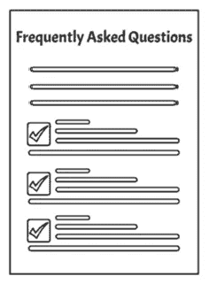
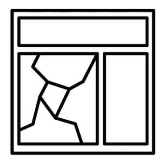
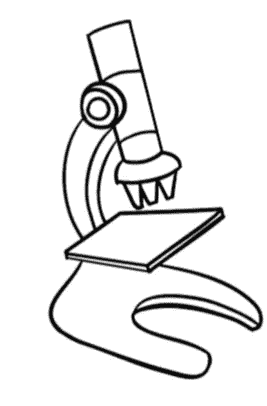

# 软件工程师的客户支持—第一部分

> 原文：<https://medium.com/geekculture/customer-support-for-software-engineers-part-i-cd749ae5f5fd?source=collection_archive---------18----------------------->

## 缺陷管理

## 如何在发布之后(和之前)管理生产缺陷

Photo by [Jon Tyson](https://unsplash.com/@jontyson?utm_source=medium&utm_medium=referral) on [Unsplash](https://unsplash.com?utm_source=medium&utm_medium=referral)

客户支持对软件公司的成功至关重要。软件会有缺陷，可用性问题，面临不可预见的情况，如停机等。但是我们在开发软件支持支持的同时能做些什么呢？撇开双关语不谈，我们如何管理软件的可支持性？

> 请务必查看本系列的第二部分，在那里我谈到了[测量、评估以及面向服务级别协议(SLA)/服务级别目标的人员分配(SLO)](https://blog.pplupo.com/customer-support-for-software-engineers-part-ii-446db34cf9da) 。

让我们回顾一下许多组织未能做到的一些事情，这些事情最终将为他们节省时间、金钱、提高客户满意度、改进他们的评估并支持服务级别目标。

# 常见问题和 TSG

以下可能看起来是显而易见的，但是你会惊讶于在产品中发布软件的公司的数量，而忘记了有人必须支持用户。

**如果工程师已经能够预见到可能出现的一些问题，可以提前提供常见问题(FAQ)** 。这可以通过分析以下内容来实现:

*   在用户界面中不明显或可能隐藏在菜单中的功能；
*   由不同行动组合支持的业务流程或活动；
*   没有离开 backlog 的功能(即使是说它还不被支持——如果我们能说它还不被支持，但我们的团队正在考虑它，那就更好了)。

简单统计一下同一个问题被问了多少次也是一个很好的指标，表明可以对系统进行改进以节省 CS 团队的时间，从而提高整体 SLO。FAQ 通常可供用户自己遵循。

**当事件需要用户、客户支持代理或两者共同执行程序时，应提供故障排除指南(TSG)** 。FAQ 旨在回答问题，并可能提供实现某些目标的说明或步骤，而 TSG 将帮助识别(并有希望解决)实际问题。请记住，在执行 TSG 的同时，应该收集这些步骤的结果，因为它们对于工程团队来说是有价值的信息，以防 TSG 不足以解决用户报告的事件。

## 应该提前向 CS 提供常见问题和 TSG。

构建要在产品中发布的特性的团队应该认真考虑构建和更新这个文档，使它成为他们对完成的定义的一部分。

当 CS 代理发现如何回答新问题和对新事件进行故障诊断时，他们也将不断更新这些文档，从而构成一个知识库，减少支持客户所需的时间。

虽然一些团队可能认为这是开销，但他们应该考虑如果 CSA 可以及时支持用户而不必中断任何人的计划工作，将会为每个人(包括他们自己)节省的时间。通常，TSG 可能仅仅源于被定义为管理事件的一部分的变通办法。

# 事故 x 缺陷 x 改进

> 管理事件不需要修复缺陷。当团队致力于一个永久的解决方案时，首要任务应该是通过修复该事件或提供变通方法来支持用户。

当用户报告一些事情时，他们报告一个事件。事件是他们需要帮助的事情，但不一定是缺陷。用户询问如何做系统没有做的事情不是缺陷，但是可以解释为可能的改进(如果许多用户询问这个问题，那么构建它可能是值得的)。

然而，如果用户抱怨不能完成系统根据需求应该支持的一些动作，这就是缺陷。用户这样做是对是错并不重要。如果有一种方法可以让它完成，而用户却想不出来，那么你就有可用性缺陷。

请注意，管理事件并不要求修复缺陷。当团队致力于一个永久的解决方案时，首要任务应该是通过修复该事件或提供变通方法来支持用户。定义了解决方法后，应将其集成到 TSG 或 FAQ 中，直到找到永久的解决方案。如果您有一个缺陷(系统的行为不同于需求所指定的)，您可能应该将它添加到 TSG 中。如果你有一个可用性缺陷，你可能会想把它添加到 FAQ 中。

# 按性质分类

> 在分类过程中，客户支持代理可以尽可能收集信息，以支持工程师设计解决方案或提供修复方案。Tt 是工程师的责任，清楚地记录哪些信息是需要的。

Photo by [Jp Valery](https://unsplash.com/@jpvalery?utm_source=medium&utm_medium=referral) on [Unsplash](https://unsplash.com?utm_source=medium&utm_medium=referral)

分类是客户支持团队根据票证对客户或组织在财务影响、形象/品牌等方面的影响，对票证进行优先排序的过程。

重要的是要理解修复一个缺陷所花费的时间或者是否可以建立一个变通方法与它对业务或客户的影响没有关系。

重要的是，在分类过程中，客户支持代理可以收集他们可以收集的信息，以支持工程师设计解决方案或提供修复。

因此，**工程师有责任清楚地记录需要收集哪些信息，以及收集这些信息的步骤是什么**，以便客户支持代理能够接受培训并能够理解如何进行收集。

# 根本原因调查

> 虽然根本原因调查可能已经发现了导致缺陷行为的代码中的错误，但是根本原因是**而不是**。

根本原因调查是找到一个事件或一组类似事件的原因的过程。根本原因调查有不同的方法。

对于高流量软件，通常一次性事件只是在事件级别进行处理，直到事件发生的频率超过特定频率，才会进行根本原因调查。有时，用户会犯错误或者遇到特殊的情况，为了这样或那样的情况而对软件进行永久性的修改可能是不值得的。

在进行根本原因调查时，团队通常会在代码级别停止调查原因，并在那里修复它。该故障可能是导致软件故障的原因，但可能不是根本原因。

在软件开发过程中，缺陷会传播。如果一个缺陷出现在需求文档中，它很可能会传播到基于该文档构建的技术设计中。代码也应该复制缺陷，因为它应该符合需求。同样，测试的执行不是为了发现需求中的缺陷，而是为了评估系统对需求的遵循程度。也就是说，如果软件是以内部一致性构建的。我有一个大学教授，他告诉我，“如果在需求中有一个谎言，你不能发现它，只要你做对了剩下的工作，你就一直说着同样的谎言直到最后。”

这意味着虽然根本原因调查可能已经检测到了导致缺陷行为的代码中的错误，但是根本原因是**而不是**。找到实际的根本原因(缺陷的起源)将使您能够开始关注如何通过避免缺陷的发生而在未来的版本中更好地交付。

# 缺陷避免

> 通过收集关于哪个活动引入了缺陷的信息，我们可以检测出流程中的哪些步骤更容易插入错误(或者哪些是我们可以避免的成本最低的缺陷)。

Photo by [Alex Radelich](https://unsplash.com/@alexradelich?utm_source=medium&utm_medium=referral) on [Unsplash](https://unsplash.com?utm_source=medium&utm_medium=referral)

我认为这篇文章最重要的部分可能是这篇。这就是我们实际上如何改进我们的过程来减少缺陷的数量。到目前为止，我们讨论的所有事情都与改进事件管理有关，而不是减少要管理的事件。

那么，我们能做什么呢？

我已经提到了缺陷传播效应。当我们犯了一个错误，并在任何软件工件中包含了一个错误时，任何基于这个错误的工件构建的其他软件工件都有可能将这个错误继续下去(如果我们以一致性开发的话)。

在过程开始时构建的工件(需求、模型等。)都会有缺点。这些错误将会延续到中间的工件(比如技术规范、模型等等。).当最后的*工件(代码、测试、手册、安装指南等。)被开发，这些故障将被内置于其中。这是意料之中的。我们甚至为质量保证过程起了一个名字，以确保我们始终如一地完成所有这些转换，这就是验证。

我说的“最后的”是指交付的工件不一定被用作在同一过程中构建其他工件的输入。

Photo by [Brett Jordan](https://unsplash.com/@brett_jordan?utm_source=medium&utm_medium=referral) on [Unsplash](https://unsplash.com?utm_source=medium&utm_medium=referral)

软件上有缺陷的行为被称为失败。这种行为可能是由代码中的一个或多个错误引起的。虽然这个错误可能被直接引入到代码中，但是它也可能是从另一个工件转化而来的。

通过收集关于实际的根本原因(缺陷的起源)的信息，我们可以检测出过程中的哪些步骤更容易插入错误(或者哪些是我们可以避免的最便宜的缺陷)。然后，我们可以决定采取不同的行动来最小化我们引入缺陷的比率。一些方法可以是:

*   改进模板以捕捉遗漏的信息，并最小化谁在编写工件和谁在阅读工件的模糊性。
*   增加或改进质量保证活动。对于代码，我们可以做代码审查和测试。对于测试，我们可以做突变。对于模型，我们可以采用清单。对于文本文件，我们也可以采用清单，评论，检查，基于视角的阅读技巧等。许多实践可以用来提高这些工件的质量。最佳方案将取决于每个场景。
*   投资培训。通常，人们不了解他们正在构建的东西将如何在未来的活动中使用，或者有时他们不知道如何最好地使用组织所采用的工具和模板。或者他们可能只是需要培训来更好地履行他们的职责。

通过识别这些改进机会，您可以减少增加的缺陷数量。将会有更少的缺陷被捕获，并且更少的缺陷逃逸到生产中。累积的结果将导致报告的事件减少。

更少的事故报告意味着更少的修复缺陷的努力、更少的高严重性压力事故、更少的对计划工作的中断、更高的生产率、更高的满意度(各方面)以及更好的企业和产品形象。

一旦在任何 QA 活动中发现缺陷，无论是测试、评审还是检查，都应该遵循相同的方法。它允许一致地修复整个软件(不仅仅是代码)。

虽然只对生产中发现的缺陷这样做将使您专注于逃避 QA 的错误类型，但对所有错误都这样做将确保您在整个过程中节省时间和精力，并提高生产率。

# 第 2 级支持

> 组织要么将这些事件分配给正在改进软件的相同团队，要么将此作为最后手段，将事件分配给专门处理事件的工程团队。

Photo by [Lagos Techie](https://unsplash.com/@heylagostechie?utm_source=medium&utm_medium=referral) on [Unsplash](https://unsplash.com?utm_source=medium&utm_medium=referral)

当支持人员无法应用他们的系统知识、业务知识和知识库(FAQ 和 TSG)来解决事件时，需要将事件上报给技术团队。

组织要么将这些事件分配给正在改进软件的相同团队，要么将此作为最后手段，将事件分配给专门处理事件的工程团队。

这两种策略都被证明是成功的，所以我将只提到每种方法的一些注意事项。

第 2 级支持团队通常对系统的特定部分不是很有经验。他们的重点是提供一个解决方案和执行根本原因分析。通常，根本原因修复将由负责确定原因范围的团队执行。重要的是，第 2 级支持团队让负责该范围的团队参与到需要对系统进行的任何更改中。他们应该:

*   修复系统中的缺陷，并要求拥有团队执行代码审查和设计测试。
*   识别并报告任何需要修复的工件(需求、技术规范、手册等)。
*   相应地更新常见问题和 TSG。

因此，拥有的团队仍然有与事件相关的责任，只是这些责任不再影响 SLO。此外，有时严重程度高的事件会直接提交给所属团队。

我看到一些组织抱怨拥有团队不太关心产品的质量，因为他们不处理事件。这通常是不正确的，但是如果这是一个问题，一个成功的策略是让所有团队处理所有与最新版本相关的事件。

如果没有第 2 级支持团队，事件将直接提交给所属团队。

这个团队必须保留 sprint 的工作(通常是 velocity 的一部分)来处理由于 SLO 而不能等待下一个 sprint 计划优先处理的事件。在本系列的第二部分中，我将谈论实现这一目标的策略。

## [软件工程师客户支持—第二部分](https://blog.pplupo.com/customer-support-for-software-engineers-part-ii-446db34cf9da)

请务必查看本系列的第二部分，我在那里谈到了[测量、评估以及面向服务级别协议(SLA)/服务级别目标的人员分配(SLO)](https://blog.pplupo.com/customer-support-for-software-engineers-part-ii-446db34cf9da) 。

> 如果你喜欢这个故事，在结尾击掌，这样我就知道你想读什么了。
> 
> ***我没有用博客赚一毛钱。如果您想支持更多内容的创作，请与您的同事分享博客，并关注它以获得新故事的通知！***