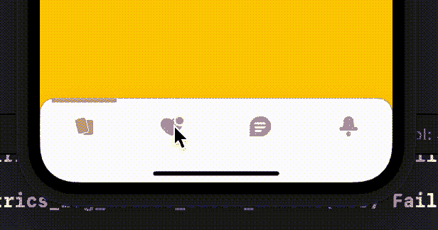
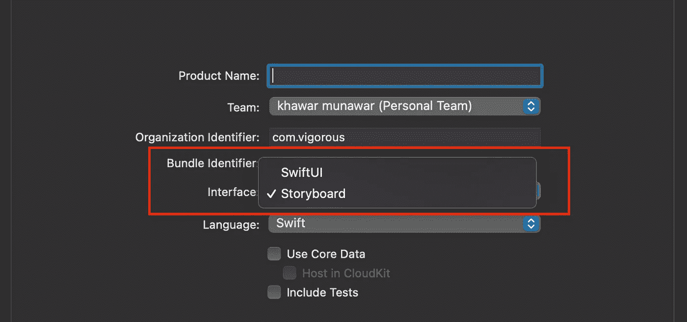
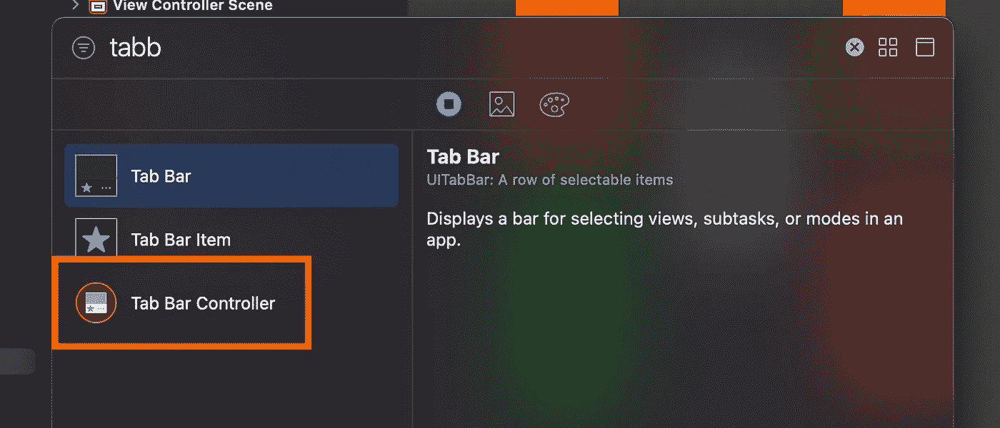
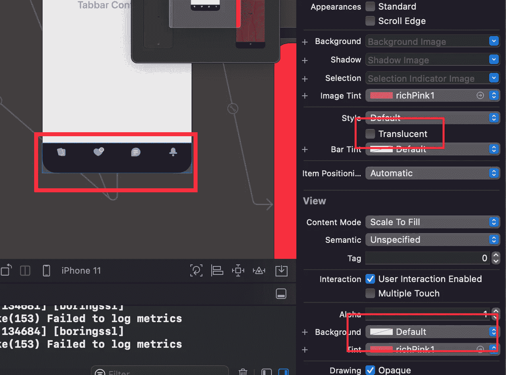
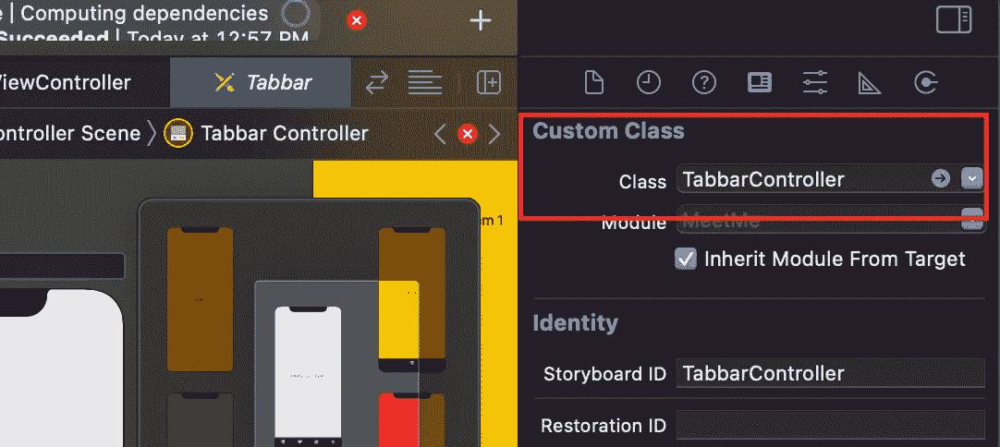
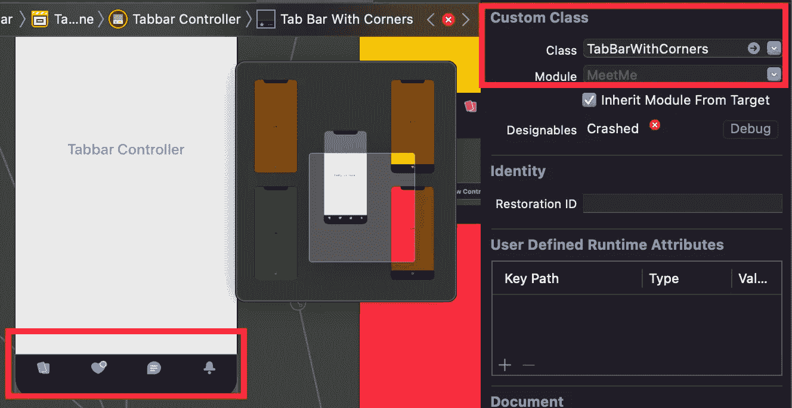

# 在 Swift IOS 中自定义 Tabbar

> 原文：<https://medium.com/geekculture/customize-tabbar-in-swift-ios-bf14a8e02d6?source=collection_archive---------3----------------------->

嗨，伙计们，在这个博客里，你们将学习如何**定制**T2IOS**原生** **TabBar** 。跟随博客…

## **第一步**

用**故事板**创建全新的 **XCode** 项目。

## 第二步

之后打开**故事板**并搜索**标签栏控制器。**

拖动**标签栏控制器**并将其放到**故事板**上。这将在**故事板**上创建你的 tabbar。

之后选择你的 tabbar，取消**半透明**选项，将**背景**改为**默认。**

## 第三步

现在，创建一个控制器类 **TabbarController。**

现在，将**Tabbar 控制器**连接到 **Tabbar** 上。

## 第四步

> 首先，我们将改变背景的标签栏圆角。

用于创建 **@IBDesignable** 类**tabbarwithcorners**并将其与 **UITabBar** 继承。在该文件中，我们正在创建**形状播放器**，并在被覆盖的 **draw(_ rect: CGRect)** 方法中绘制该**形状播放器**。

现在，选择 tabbar 并给类 **TabBarWithCornors** 。通过这样做，tabbar 将采用在 **TabBarWithCornors** 中创建的形状。运行代码，然后你可以看到 tabbar 圆角背景。

## 第五步

> 现在创建 **Tabbar** 项目的上线

现在首先在 **TabbarController** 中创建以下两个属性。

> varupper lenview:ui view！
> 
> **设**间距:CGFloat = 12

之后在 **TabbarController** 中写一个 **addTabbarIndocatorView** 。**添加 TabbarIndicatorView** 获取选中项目的**索引**并在该 tabbar 项目顶部绘制 lineView。

首先，该视图将通过使用以下代码片段在 viewDidLoad 中使用。

我们传递 isFirstTime true，因为除了第一次，我们每次都需要从超级视图中删除该视图。

之后，我们需要在点击任何一个 tabbar 条目时调用这个方法。为此，我们需要实现 **UITabBarControllerDelegate。**实现该委托并使用其以下方法，该方法将在每次单击项目时运行，然后调用 **addTabbarIndocatorView** 方法，该方法将在每次单击项目时从超级视图中移除前一个视图并重新绘制线条视图。

之后，您可以看到活动 tabbar 项目上方的行。

# TabbarController 类完整代码:

希望这个博客对你有所帮助。感谢你阅读这篇文章😍 😍 😍 😍 😍 😍 😍

## 订阅模式

 [## 米（meter 的缩写））阿巴斯正在创建 IOS 开发者| Patreon

### 立即成为 M.Abbas 的赞助人:获得世界上最大会员的独家内容和体验…

www.patreon.com](https://www.patreon.com/abbasgujjar)