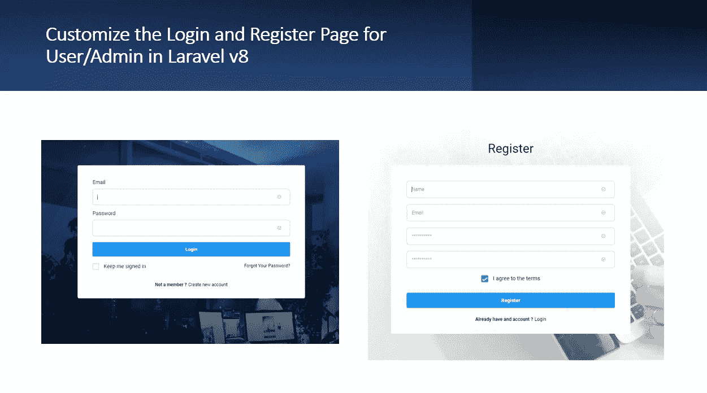

# 在 Laravel v8 中为用户/管理员定制登录和注册页面

> 原文：<https://medium.com/geekculture/customize-the-login-and-register-page-for-user-admin-in-laravel-v8-9e42127d0185?source=collection_archive---------3----------------------->

当开发一个 web 应用程序时，认证系统是必不可少的。在本教程中，我们将学习如何使用 Auth 命令定制 Laravel v8 中的登录和注册页面。

首先，从[这里](https://www.bootstrapdash.com/product/star-admin-free)下载管理模板。解压缩 zip 文件，我们将使用 src/index.html 作为我们的管理仪表板登录页面。虽然模板…