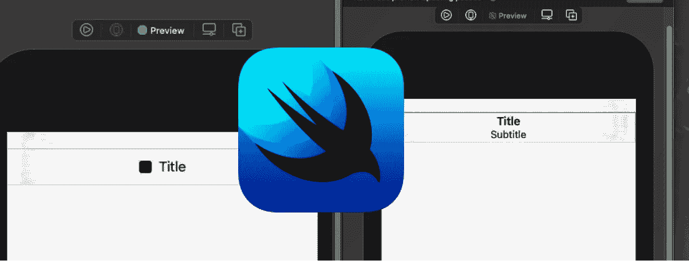
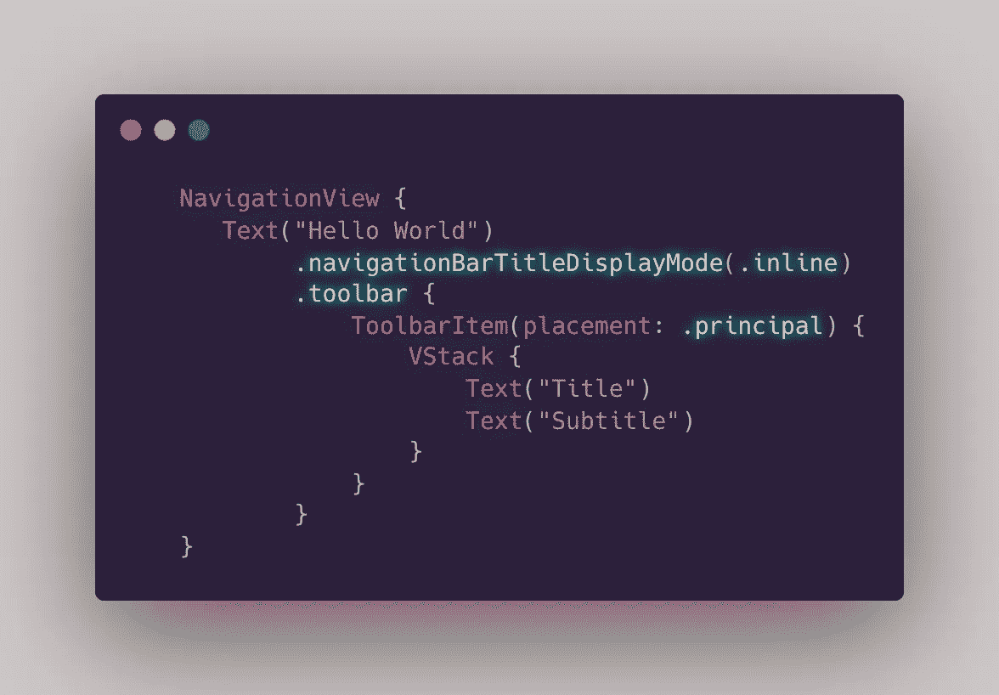
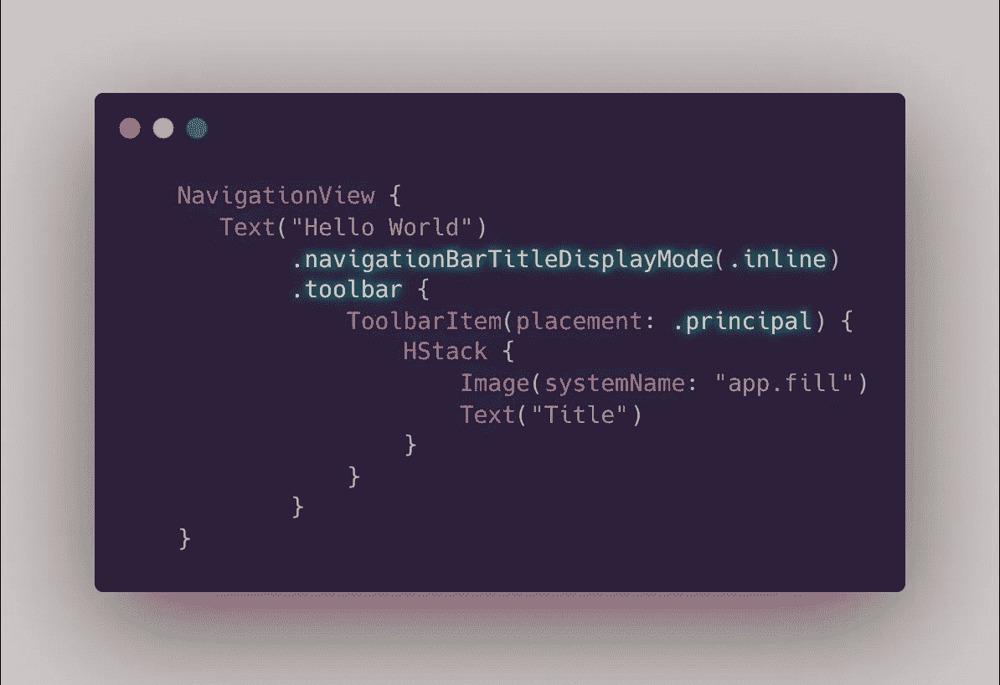
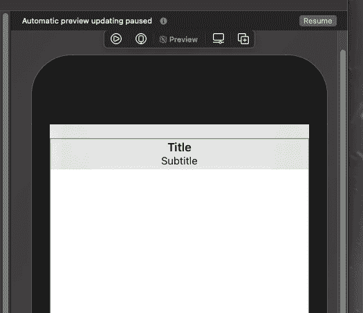
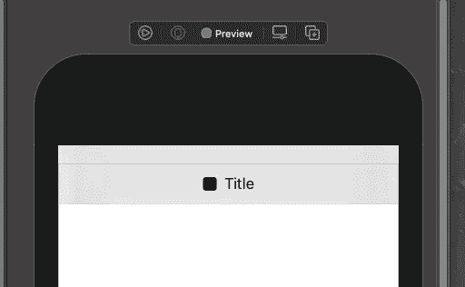

# 在 SwiftUI 中自定义导航栏

> 原文：<https://medium.com/geekculture/customize-your-navigationbar-in-swiftui-14ba094306ef?source=collection_archive---------3----------------------->

Story Image

大家好，今天我们将谈论导航栏视图定制。事不宜迟，我们开始吧。

# 我们开始吧

上面说的定制和 UIKit 中设置`navigationView.titleview`是一回事。要在 SwiftUI 中定制导航栏标题视图，我们只需将放置类型`[.principal](https://developer.apple.com/documentation/swiftui/toolbaritemplacement/principal)`的`[ToolbarItem](https://developer.apple.com/documentation/swiftui/toolbaritem)`设置为新的`.toolbar`修饰符。这些`.principal`放置设置简单来说，将渲染视图对齐到 NavigationView 的中心。让我们看看下面的例子。

Example1

在上面给出的例子中，我们创建了 NavigationView 并添加了`.toolbar`修饰符。设置位置后，您可以在**工具栏中放置任何您想要的东西。**

Example2

这不仅限于文本，你可以把图像，按钮，无论你喜欢什么。

Example1

Example2

今天我想谈谈小 SwiftUI 的特性。在新的文章中再见。注意安全，✌🏼