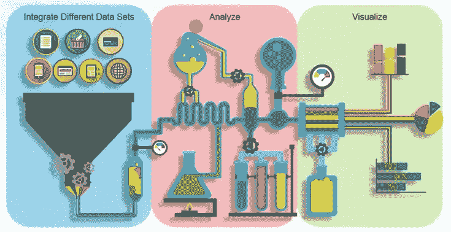
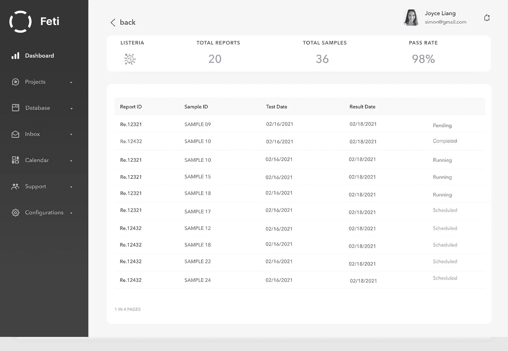
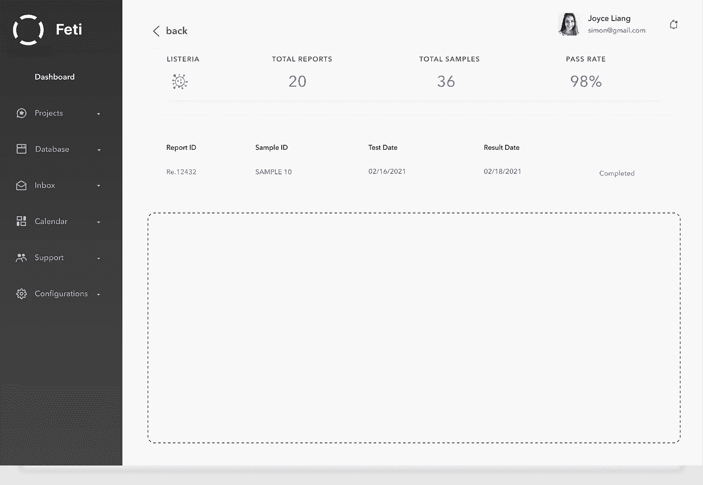
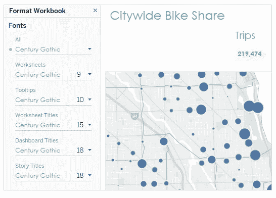
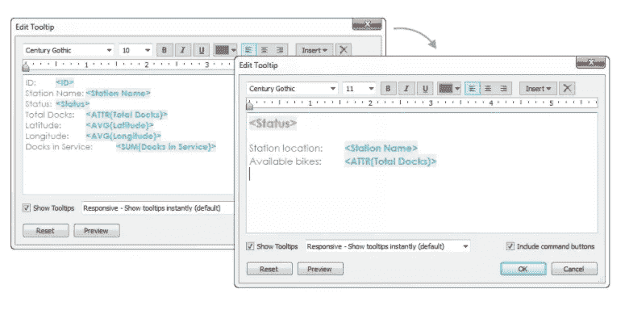
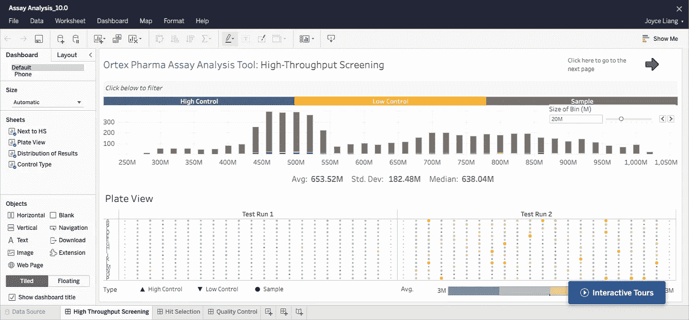
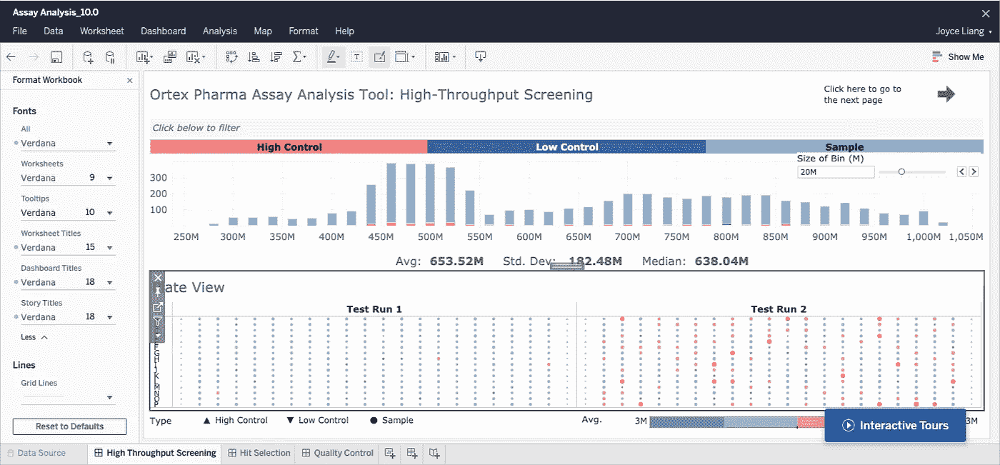
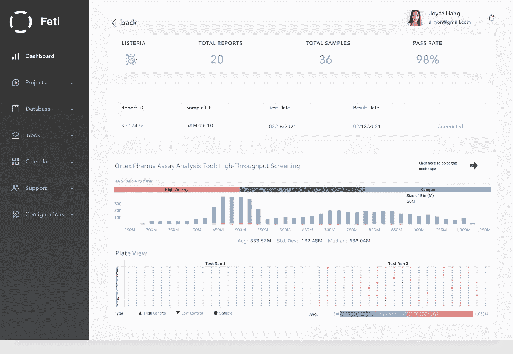
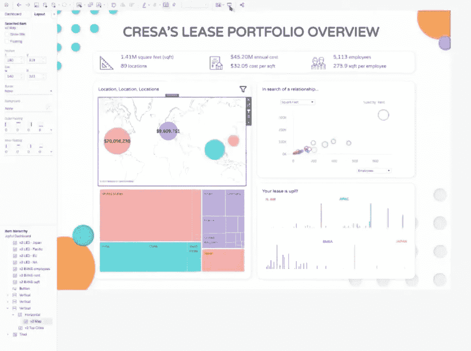

# 带 Tableau 的定制仪表板

> 原文：<https://medium.com/geekculture/customized-dashboard-with-tableau-56e1016a8e55?source=collection_archive---------10----------------------->

在我之前的文章中，我介绍了如何[创建数据可视化仪表板](/@runningsun.liang/design-a-data-visualization-dashboard-25f04b182dd5)。除了在创建仪表板时应用数据可视化，还有一些情况是数据分析工具(在本文中，我使用了 Tableau)已经通过数据可视化接口很好地完成了输出。这篇文章解释了如何使用 Tableau 的品牌重塑功能来更改格式设置，并使输出与组织的品牌保持一致。

# 关于 Tableau

[**Tableau**](https://www.tableau.com/) 是一家专注于商业智能的交互式数据可视化软件公司。它将原始数据转换成一种非常容易理解的格式。Tableau 于 2003 年在加州山景城成立，2019 年该公司被 Salesforce 以 157 亿美元收购。

Tableau 的特点:

*   惊人的数据可视化
*   优质客户支持
*   易于实施
*   数据源集成
*   移动支持和丰富的在线社区

在 Tableau 中，数据可视化包括 3 个步骤:

**整合不同的数据集:**数据集可以是一个文本文件，一个 excel 表格或者你可以连接到任何服务器或数据库，而不仅仅是一个，你可以将不同的数据集连接在一起。

**分析:**第二步，根据参数分析数据。

形象化:对你想如何呈现你所分析的东西进行形象化。

data visualization process — photo credits: Edureka

例如，在这个仪表板中，在使用点击报告“Re.12432”之后，它们应该被定向到详细信息，并且所有数据都由 Tableau 分析。

虚线框内是应该显示的报告输出。

为了使输出与组织的品牌保持一致，我使用了 Tableau 的品牌重塑功能，更改了字体，创建了自己的自定义调色板以及工具提示。

**改变字体**

1.  点击**格式** > **工作簿**。
2.  在**格式工作簿**窗格的**字体**下进行更改。

如果你想使用公司品牌特有的字体，你首先需要在运行 Tableau 的电脑上安装它。以下是[使用自定义字体](https://help.tableau.com/current/pro/desktop/en-us/formatting_create_custom_fonts.htm)的指南。

change the fonts

**改变标记颜色**

改变商标的颜色是向观众传达组织品牌的另一种方式。

1.  转到仪表板上的视图，并从视图的快捷菜单中单击**转到工作表**。
2.  在视图中，点击**标记**卡上的**颜色**。
3.  进行新的颜色选择。

**改变工具提示**

1.  转到视图的工作表，点击**工作表** > **工具提示**。
2.  确认工具提示包含您想要显示的详细信息。您可以更改字体、顺序、措辞、对齐方式和颜色。

customize the tooltip

以下是使用 Tableau 中的品牌重塑工具前后的输出:

before

after rebranding

现在输出在我们的仪表板上看起来很棒。

After rebranding the reports

除了重塑 Tableau 之外，实现定制的另一种方法是使用 Figma 设计仪表板并将其导入 Tableau。Robert 介绍了使用 Figma 重新设计 Tableau 仪表板的技巧和诀窍。

Tableau Dashboard after using Figma to redesign

## 打包的资源:

1.  "[仪表盘大全](https://www.amazon.com/Big-Book-Dashboards-Visualizing-Real-World/dp/1119282713/ref=sr_1_1?crid=354N69F87YDKR&dchild=1&keywords=big+book+of+dashboards&qid=1616771595&sprefix=the+big+dashboard%2Caps%2C173&sr=8-1) " —强烈推荐！
2.  "[重塑仪表板品牌](https://help.tableau.com/current/pro/desktop/en-us/formatting_rebrand.htm) " —来自 Tableau
3.  "[Tableau+Figma](https://www.youtube.com/watch?v=fwfpkM-wa5o&t=2848s)"—Robert 和 Nathan 在 Youtube 上发布的视频，讲述了使用 fig ma 提升 Tableau 仪表盘美感的技巧和诀窍。

感谢您的阅读！