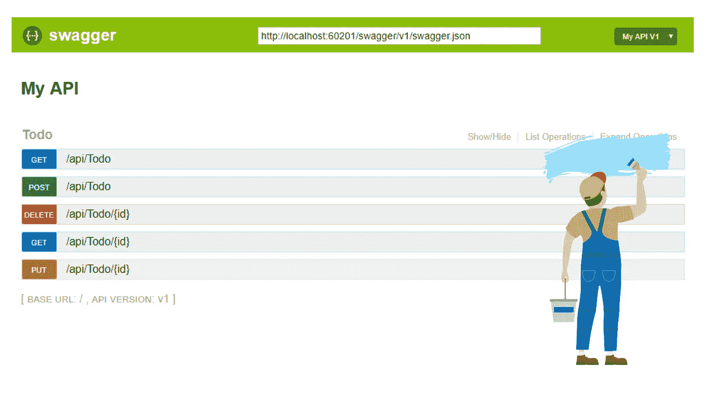
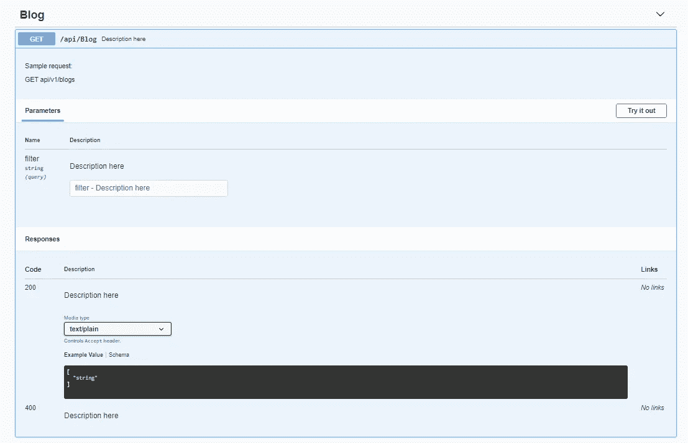
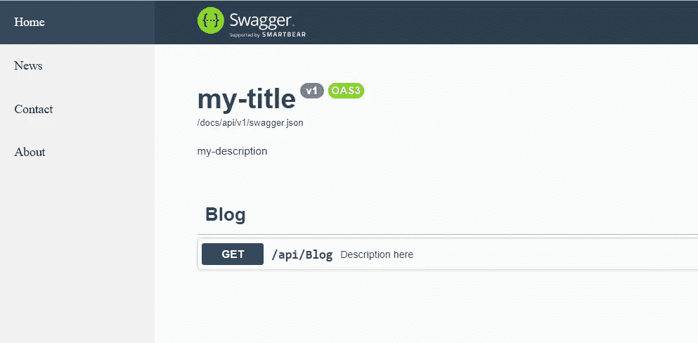

# 在 ASP.NET 核心 5 中定制 Swagger

> 原文：<https://medium.com/geekculture/customizing-swagger-in-asp-net-core-5-2c98d03cbe52?source=collection_archive---------4----------------------->

我们中的许多人使用 **Swagger** 和 **Swashbuckle** 来记录 C #中的 API。它们非常容易使用，以至于它们已经包含在 *webapi* 基础模板项目中。得益于此，我们可以减少记录服务所花费的时间。但是有时候默认配置是不够的。在这篇文章中，我将给出一些提示和例子，说明如何根据我们的喜好定制 swagger。

# 包括注释

在 Swagger 中丰富文档的最好方法是在源代码中使用注释。首先，在您的项目解决方案中将**generated documentation file**选项设置为 *true* 。

Enable generate documentation file

然后配置 Swager 以包含 XML 注释。

Include XML comments

剩下的就看你的了。您应该为您的所有端点编写一份完整的文档。我会给你看一个你应该在评论中包含什么的例子。

Comments example

结果将是这样的:

# 填写开放 API 信息

为您的开放 API 填写元数据

*   **标题**
*   **描述**:服务的简短描述。
*   **版本**:开放 API 文档的版本。是必需的。
*   **服务条款**:API 服务条款的 URL。必须采用 URL 的格式。
*   **联系人**:暴露 API 的联系方式。
*   **License** :公开的 API 的许可信息。

# 将 URL 转换为小写

默认情况下，路线以大写字母开头，对我来说可读性较差。比如 **api/Teams** 而不是 **api/teams** 。为了解决这个问题，我们可以编写一个简单的过滤器。

PathLowercaseDocumentFilter.cs

然后注册过滤器:

Registering the filter

# 更改文档路径

默认情况下，Swagger 文档位于路径 */swagger* 中。为此，我们只需更改 **RoutePrefix** 和 **RouteTemplate** 属性。

Changing route to /**docs/api**

# 风格招摇💅

我们可以覆盖默认的样式，注入我们自己的 CSS 文件。考虑到我们必须有**应用程序。UseStaticFiles()** 已启用。然后在 **wwwroot** 文件夹中创建一个 CSS 文件。

Add custom CSS

你可以在网上找到各种各样的招摇主题，从这里开始:

 [## GitHub-ost ranme/swagger-ui-themes:一个 CSS 主题集合，为你的 Swagger 文档增添趣味

### 招摇过市的医生很棒。为什么不让他们看起来更好！下载 swagger-ui-themes 项目并放置所需的…

github.com](https://github.com/ostranme/swagger-ui-themes/) 

# 添加静态侧栏

通过包含一个静态的导航条，让你的 API 更加个性化。在 **wwwroot** 中添加一个 HTML 文件，其中包含您的自定义栏的源代码。

wwwroot/custom-sidebar.html

Add styles to wwwroot/swagger-custom.css

通过设置 **HeadContent 将您的导航栏包含在 UI 配置中。**

Static custom sidebar

# 添加自定义 JS

添加 JavaScript 非常容易。您所要做的就是在 **wwwroot** 文件夹中创建一个 JS 文件，然后将其作为 SwaggerUI 配置的一部分。

您还可以包含外部库，如 jQuery。

# 就这样

通过这些简单的步骤，您可以根据自己的喜好定制 Swagger，并赋予它更好的外观。我希望这篇关于如何定制 ASP.NET Core 5 的文章对您有所帮助。非常感谢您的阅读。