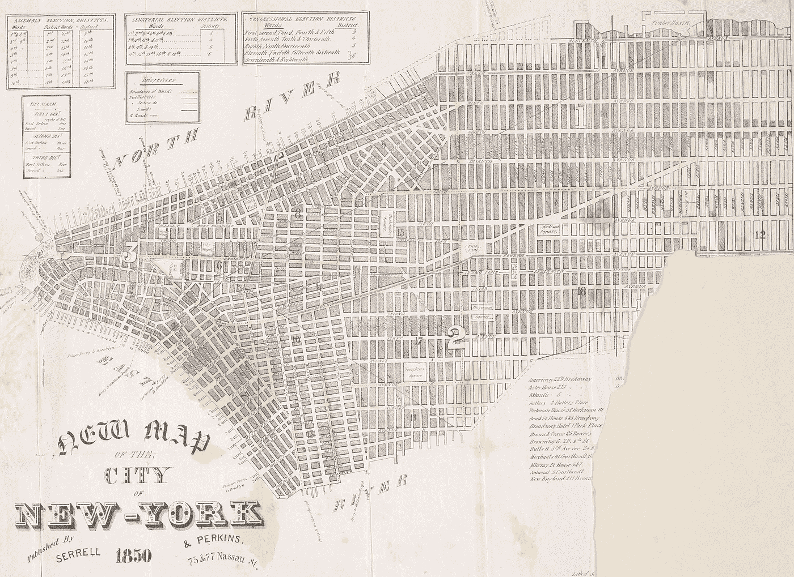
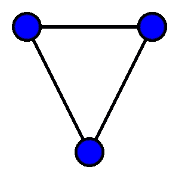
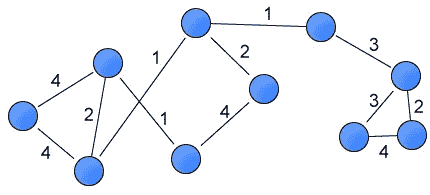
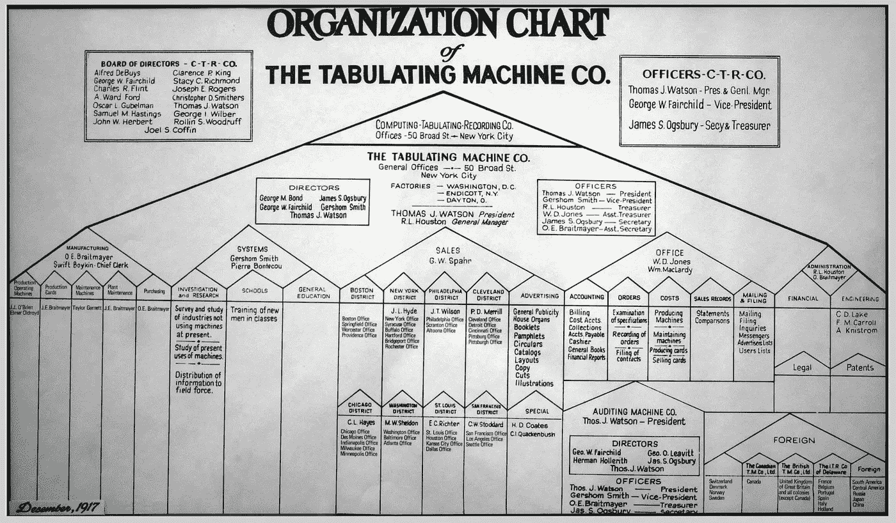
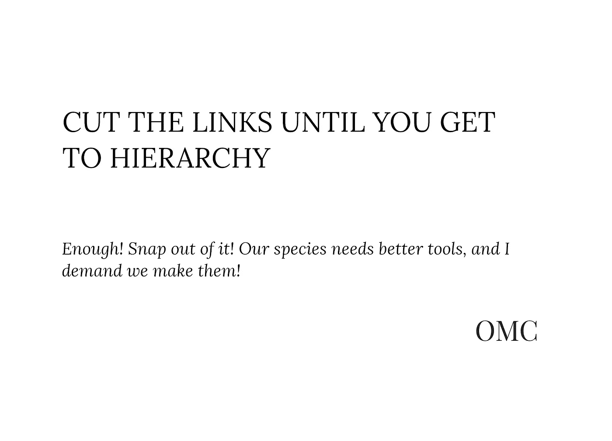

# 切断链接，直到你到达层次

> 原文：<https://medium.com/geekculture/cut-the-links-until-you-get-to-hierarchy-b7f8208877b?source=collection_archive---------62----------------------->

“如果按钮的形状不像思想，思想最终会像按钮一样。”——泰德·纳尔逊

我想和你分享一段著名的关于软件创作(以及一般的创作)的书:*神话中的人月，*作者 Fredrick Brooks。为什么？这个特别的部分是一个骄傲的例子，说明了我们作为一个物种的习惯，让我们的工具抑制和简化我们的思维，而不是花时间去构建【time 同构的工具——也就是说，足够敏感来代表人类的思想——或者甚至构建实际上扩展认知范围的工具。

从根本上说，我认为《人月神话》是一部优秀的作品，写得很好，完全配得上它的经典地位。布鲁克斯只是做了不同的假设，并有不同的阅读清单，这使得一本优秀的书，有时对我个人来说绝对是令人震惊的。

# 切断链接，直到你到达层次

这里有一段冒犯的话:

> *软件的真实性并不是固有地嵌入空间的。因此，它没有现成的几何表示，就像陆地有地图，硅芯片有图表，计算机有连接示意图一样。当我们试图绘制软件结构图时，我们发现它不是由一个，而是几个，一个叠加在另一个之上的一般有向图组成的。这几个图可以表示控制流、数据流、依赖模式、时序、名称空间关系。这些通常甚至不是平面的，更不用说层次了。事实上，建立对这种结构的概念控制的方法之一是强制链接切断，直到一个或多个图变得有层次。*

让我们从上下文开始，向不完全熟悉的人解释这段话:

**一:**这是布鲁克散文的一部分(后来作为*神话人*月*月*的一部分发表)，叫做《没有银弹》。在这篇文章中，他概述了他是如何认为，在文章发表后的 10 年间，在那个时候，不可能有任何一项创新能让软件创作者的速度提高一个数量级(10 倍)。

Brook 的推理是，到那个时候，开发的主要时间消耗不是“偶然的”复杂性，即取决于编码和实现的方法和技术的复杂性，而是“本质的”复杂性:程序的实际抽象结构，它的各部分以及它们如何一起工作。

第二:他指出，本质复杂性如此棘手的一个原因是，很难传达一个程序真实、完整的结构。“软件的现实并不是固有地嵌入空间的。因此，它没有现成的几何表示，不像陆地有地图，硅片有图表，计算机有连接示意图。”

这就是说，一个人可以在二维地图上*某种程度上*代表真实世界的城市街道，因为这样的地形在世界的二维表面上显现(考虑到偶尔的桥梁或隧道)。但是软件更难。

**三:**软件不是二维的，像纸的表面，是多维的；我们的软件图中的进程可以用任何方式连接。因此，正如 Brooks 指出的:“当我们试图绘制软件结构图时，我们发现它不是由一个，而是几个，一个叠加在另一个上的一般有向图组成的。这几个图可以表示控制流、数据流、依赖模式、时序、名称空间关系。这些通常都不是平面的，更不用说层级了。”

对于那些不熟悉术语的人来说，本文中的“[图](https://en.wikipedia.org/wiki/Graph_(discrete_mathematics))”是指由节点(例如，你的朋友群中的每个成员)和边(例如，它们之间的关系)组成的数学结构，很像“思维导图”*平面*图是那些边不交叉的图，这使得它们更容易阅读；层级图(如果我没看错的话)是那些(通俗地说)[类似于树](https://en.wikipedia.org/wiki/Tree_(graph_theory))的图，与著名的公司组织结构图没有什么不同。

*上图:一个非常简单的网络图，点代表“节点”(比如你朋友群里的人)，线代表“边”(他们之间的联系)。它是平面的，因为没有一条边交叉。*

*上图:一个非平面图，注意标有 1 的交叉边(顺便说一下，在这个图中，这些整数表示“权重”，即特定连接的强度)。*

*上图:公司组织结构图*

第四:因为任何东西都可以连接到任何东西，所以事情变得很难描绘和可视化。比如说，在曼哈顿中城，可以很有把握地假设第 9 大道和第 47 街的交叉口与其他四个交叉口相连:两个沿着第 9 大道，两个沿着第 47 街。但是，想象一下，如果这个十字路口可以合法地连接到镇上的任何其他十字路口，容易而且没有限制。如果这变得难以想象，那就是布鲁克斯的观点。

五:布鲁克斯漫不经心地总结道:“事实上，对这种结构建立概念控制的一种方法是强制链接切断，直到一个或多个图变得有层次。”

我说*不，不，不！*

# 不要！

为了结束这里的循环，Brooks 说，如果一个人试图将一个计算机程序或系统的概念结构可视化，他应该故意删除元素之间连接的可视化，直到它代表像公司组织结构图这样的层次结构。这是*,尽管*事实上每次我们切断一个链接，我们的图片就会丢失信息，变得不那么真实。

对他来说，这是一个可以接受的政策，这一事实似乎源于我们这个物种与等级和线性的奇怪关系:我们对非线性和非等级的恐惧，以及我们用头撞击将二维结构与三维和多维结构分开的无形天花板的习惯。

这些几乎是同一个问题:我们允许组织结构图，因为它是二维的(一个是级别，一个是部门)。具有讽刺意味的是，我认为大多数在声称拥有这种图表的公司工作过的人都知道这是虚构的:许多员工与不止一个经理有关系，并接受多个方向，员工总是服从法律上与他们平等的其他人，更不用说看起来更像友谊而不是命令结构的幕后关系了。

我在这里告诉你，多维度是被渴望的:最好的生活和我们的创造都有这种属性。只有在真正有用或必要的时候，才应该创建或强制实施层次结构，这比大多数人想象的要少。

一些例子:

# 等级制度

自从 70 年代的 Unix 以来(据我所知，此后普遍如此)，我们在计算机上组织媒体的方式是分层次的:文件夹中的文件，其他文件夹中的文件夹，所有这些都驻留在一个超级文件夹中；一个文件或文件夹可以同时存在于多个文件夹中，但是操作系统使它变得困难、直观和脆弱。

这是荒谬的，也是脱离现实的:为什么我必须把一个数字结构放在一个文件夹中，这个数字结构可以与任何数量的文件夹相关联，因此可以包含在任何数量的文件夹中？这就像声称巴赫要么是大键琴演奏家要么是作曲家，而不是两者兼而有之，或者说他不止是一种东西是奇怪或不寻常的。(是的，如果你想知道，我也拒绝整个文件/文件夹/“文件系统”的虚构，但这是另一天的讨论。)

# 线性

实体书很可爱，但它们最有意义的局限性之一是它们强制线性的程度:章节、段落、句子等等。必须一个接一个，不管每一个*实际上是不是从它前面的*开始。我经常发现自己在写一篇文章，其中给定的标题包含几个要点，重要性和顺序都相同，但我被迫从某个地方开始:这一节就是这样一个例子，没有理由将层次放在第一位，但*的东西*必须放在第一位。

与超文本相比，网络是一个居高临下的马戏团(如果像我这样的人有我们的方式，它将会是)，但是*至少*它给了我们任意跳转到其他材料的能力。例如，维基百科在这方面是非线性的:任何一篇文章都有几十、几百、甚至几千次到其他文章和网站的跳转，可以说从曼哈顿第 9 大道和第 47 街的交叉口到伦敦的霍洛韦路。

如果你真的将所有这些链接绘制成图，并把它们可视化，那么书本在看到不可计数的、紧密链接的"*有向图，一个接一个地叠加在一起时，会感到晕眩。“但它确实有效，而且这并不是什么反常、堕落或难以控制的事情:我们一直都在这么做，这是对人类信息系统实际结构的粗略暗示。*

如果你想了解更多这些想法和概念，请看 Ted Nelson 的作品，他的 Ted 演讲很好地证明了这一点:

[https://www.youtube.com/watch?v=PUTmmwbkN6Y](https://www.youtube.com/watch?v=PUTmmwbkN6Y)

# 我们需要更好的工具

事实上，我们的工具在他看来是缺乏的，我们受制于循环的康威定律:“任何设计系统(广义定义)的组织都会产生一种设计，其结构是该组织沟通结构的复制。”

我们建立层级组织，它建立限制性的、层级的、二维的软件(传统的文字处理器、电子表格、关系数据库),这些软件使我们进行层级思考，建立更多的层级组织，然后我们再做一遍。

布鲁克斯在他的一篇后续文章中提到了类似的东西，只是没有指名道姓，而且完全是中性的，这篇文章后来被添加到了这本书的附录中。他最重要的信息之一是，在可能的情况下，个人和公司应该购买现成的软件，而不是自己开发。他指出，当他第一次表达这一想法时，最大的反对意见是现成的工具不够灵活，无法符合公司的业务系统；但是，在完成之后的版本时，他注意到人们只是购买了软件并改变了他们的系统来匹配它。

我绝不会声称一家公司现有的系统总是比服务于这一功能的软件更好，我只是希望布鲁克斯能提出一点警告:如果让我们改变生活以适应软件很容易，那么独裁者可能会避开强权政府，而更喜欢经营一家技术公司；或者，一个技术公司的董事可能会意外地成为独裁者。

而我们似乎很无奈。这让我想把唱针从唱片上扯下来(让那令人满意的*尖叫*)并说“够了！振作起来！我们的物种需要更好的工具，我要求我们制造它们！”

的确，Brooks 多次讨论过这种方法:高级编程语言、特殊的开发团队结构等等。，但从未在*中实际存储和表示信息的手段*。或许感觉太琐碎了。他甚至花了几段时间谈论流程图的局限性，阅读跨几页打印的流程图的困难，但从未要求一个让用户创建、修改和共享任意连接的图形结构的系统。当然，这至少会有一点帮助。

因此，亲爱的读者，我们就像《银河系漫游指南》中*的*克里基特*星球上的人们一样，*他们甚至从来不问自己在宇宙中是否孤独，他们的天空在晚上被灰尘遮住，在白天被眩目的太阳遮住:“就好像他们有一个从地平线到地平线延伸 180 度的盲点。”我们对任何把我们置于这种强制等级和线性位置的工具的反应，通过破坏信息，应该以感叹词开始，然后是陈述和疑问: **No. *Non serviam。*为什么？**

