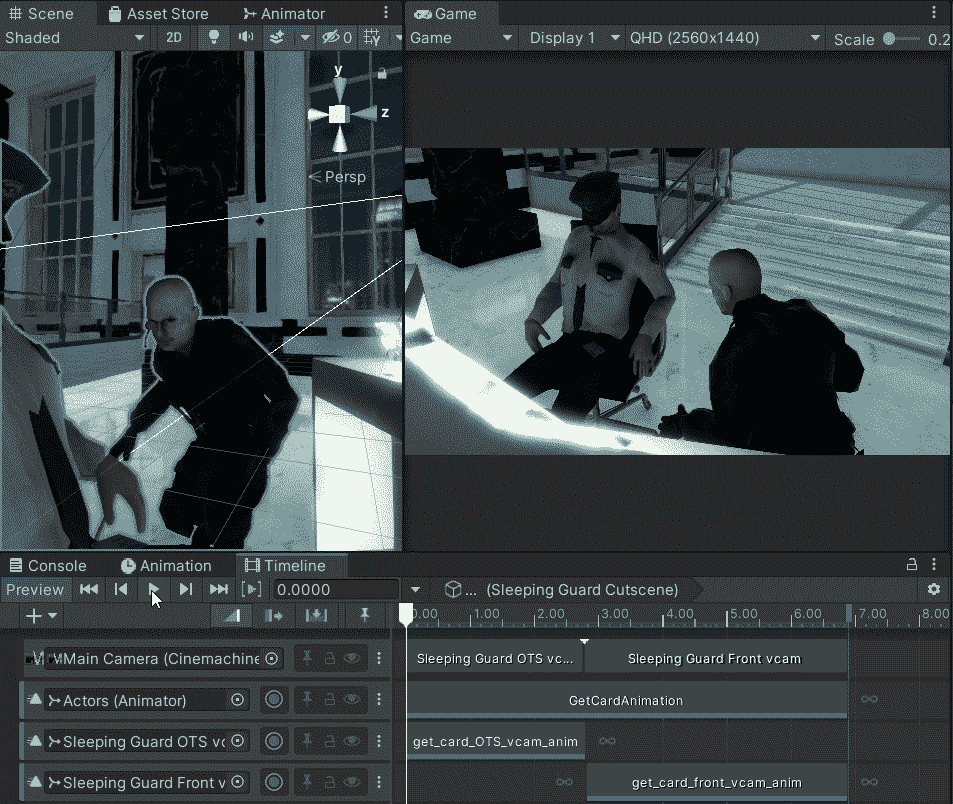

# 过场动画第 3 部分:动画摄像机

> 原文：<https://medium.com/geekculture/cutscenes-part-3-animate-cameras-745539cfb0?source=collection_archive---------41----------------------->

**目标**:使用动画创建一个全景摄像机运动

自从 2D 系列教程以来，我们非常擅长创建和修改简单的动画，对吗？

在之前的教程中，我更喜欢将**突变**剪切为两个 vcams 的混合。这是因为在每一个镜头中，我想**创造一个平移动作**，它们将被剪切分开，混合将不再适合。