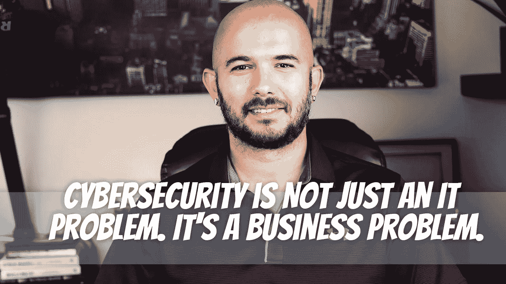

# 网络安全不仅仅是一个 IT 问题。这是一个商业问题。

> 原文：<https://medium.com/geekculture/cybersecurity-is-not-just-an-it-problem-its-a-business-problem-f07770010cb3?source=collection_archive---------6----------------------->

现在，我们似乎每天都能听到新的黑客攻击。但问题不仅仅是技术。这也是每个人都需要理解和解决的业务问题。它以这样或那样的方式影响着每一个行业。

我个人认为是因为这个词本身，网络安全。听起来很专业，涉及到技术，所以一定是…