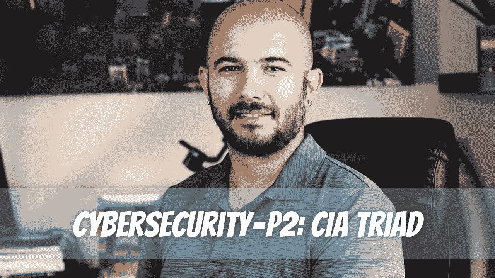

# 网络安全——P2:中央情报局三部曲

> 原文：<https://medium.com/geekculture/cybersecurity-p2-cia-triad-9e44b406321a?source=collection_archive---------14----------------------->

中情局三人组是一个重要的安全原则。它被称为“三条腿的凳子”，因为它确保了数据的机密性、完整性和可用性。数据必须始终受到保护，以防未经授权的访问。如果您的凳子的任何一条腿被破坏，那么您必须用另一条满足与第一条腿相同的安全标准的腿来替换它，然后您才能在这个新环境中继续有效地操作…