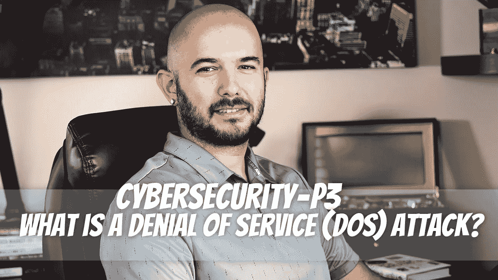

# 网络安全——P3:什么是拒绝服务(DoS)攻击？

> 原文：<https://medium.com/geekculture/cybersecurity-p3-what-is-a-denial-of-service-dos-attack-7667309531aa?source=collection_archive---------8----------------------->

拒绝服务(DoS)攻击是指攻击者试图通过向网站发送大量流量，使网站无法响应，从而使用户无法访问该网站。这个想法是通过对服务器或网络进行网络攻击来扰乱服务器或网络的正常运行。这种网络攻击来自一个来源，比如攻击者的计算机。