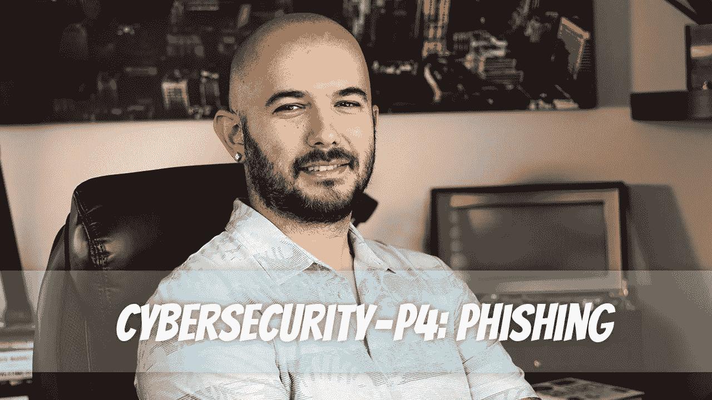

# 网络安全— P4:网络钓鱼

> 原文：<https://medium.com/geekculture/cybersecurity-p4-phishing-70f59d49c43e?source=collection_archive---------11----------------------->

如果您使用电子邮件，您很可能听说过网络钓鱼攻击。虽然听起来就像钓鱼，但并不轻松。如果你被钓鱼，你会有糟糕的一天。如果你抓到一条鱼，你会笑的。

为什么称之为网络钓鱼？这个想法是黑客向目标用户发送一封带诱饵的电子邮件，并希望目标上钩。就像钓鱼的诱饵应该像…