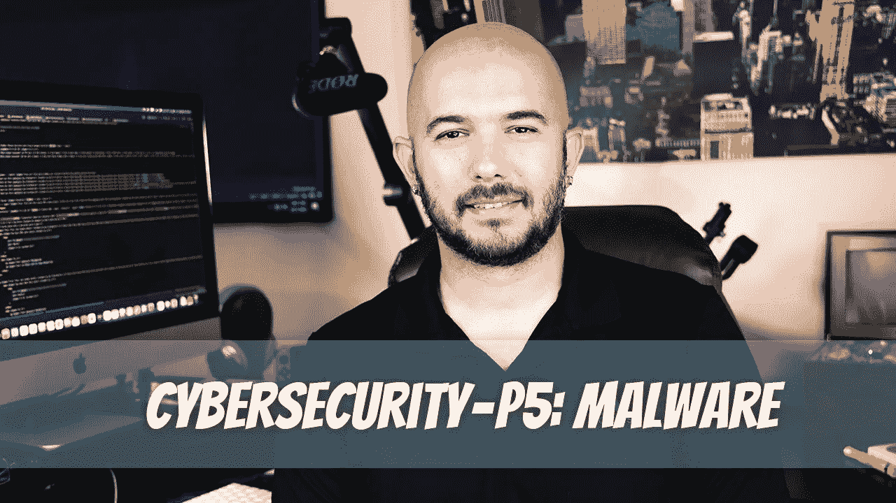

# 网络安全— P5:恶意软件

> 原文：<https://medium.com/geekculture/cybersecurity-p5-malware-22dd3cb5face?source=collection_archive---------8----------------------->

恶意软件是一种恶意软件，它可以感染你的计算机并渗透你的所有数据。它经常被用来窃取个人信息或传播其他类型的恶意软件。保护自己免受恶意软件攻击的最佳方式是更新安全补丁，并始终在设备上使用防病毒软件。

据估计，与恶意软件相关的网络犯罪的总成本为 6 万亿美元。是的…