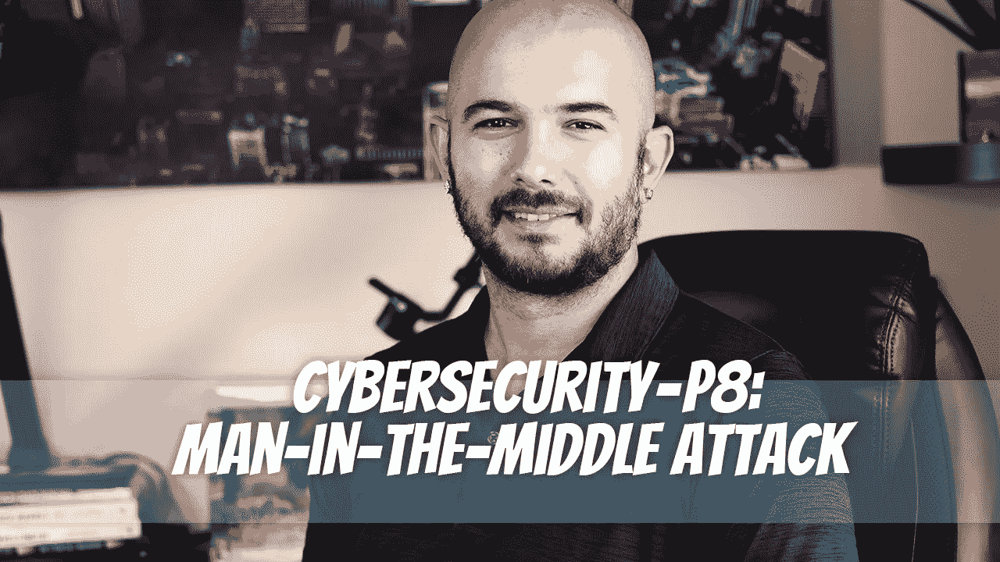

# 网络安全— P8:中间人攻击

> 原文：<https://medium.com/geekculture/cybersecurity-p8-man-in-the-middle-attack-3644c21b9ed8?source=collection_archive---------20----------------------->

中间人攻击是这类攻击的恰当术语。网络流量通过攻击者的机器进行路由，黑客可以看到经过的未加密数据。

# 中间人攻击是如何工作的？

中间人攻击的工作原理是让攻击者在两个设备之间注入他们的机器…