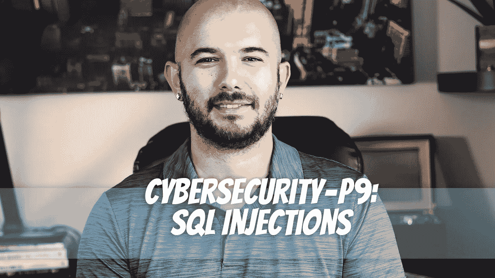

# 网络安全— P9: SQL 注入

> 原文：<https://medium.com/geekculture/cybersecurity-p9-sql-injections-471de647e8d7?source=collection_archive---------12----------------------->

当攻击者注入一段 SQL 脚本以操纵在数据库驱动的 web 应用上运行的 SQL 脚本，试图访问/修改/删除数据库内的某些内容时，就会发生 SQL(结构化查询语言)注入攻击。它甚至可以执行某些管理脚本。

SQL 注入袭击是最常见的袭击之一。公司受到冲击…