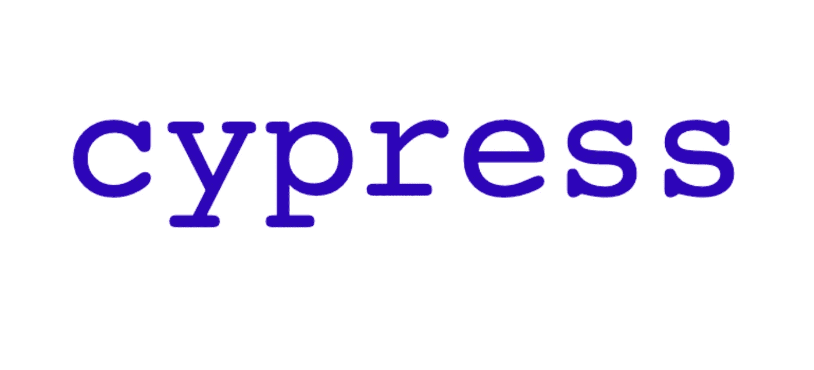

# Cypress 端到端测试

> 原文：<https://medium.com/geekculture/cypress-end-to-end-testing-798c5f101807?source=collection_archive---------6----------------------->

Image by [FloMagia](https://pixabay.com/photos/cypress-javascript-programming-test-7599230/)

# 介绍

Cypress.io 是一个跨平台的开源端到端测试运行程序，可以自动化在浏览器中运行的任何东西。

与其他 e2e 测试工具相比，Cypress 的实现不需要解决方案或驱动程序。它的目标是使测试编写更快、更轻松(使用 Mocha、Chai)和更可靠(测试的可见性、屏幕截图错误等等)。