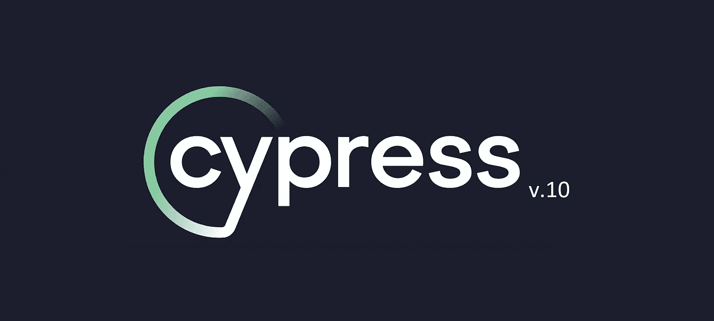
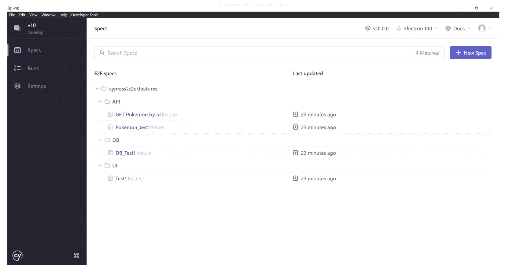
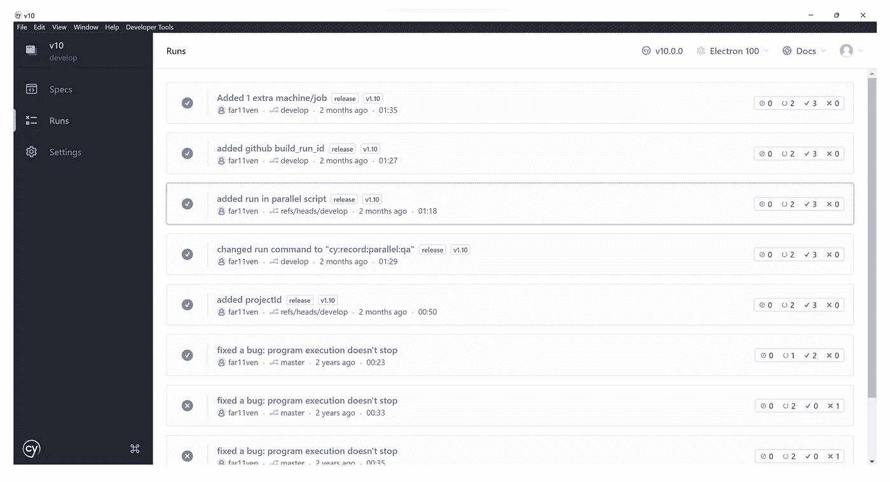
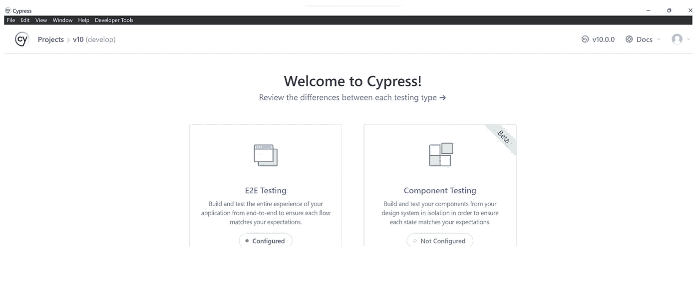
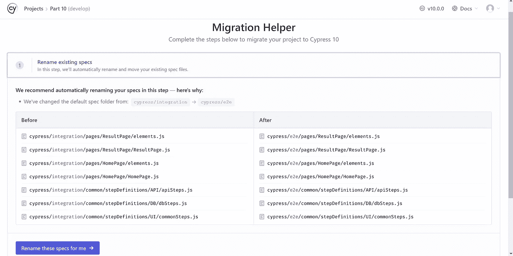
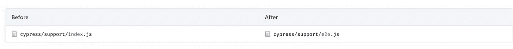
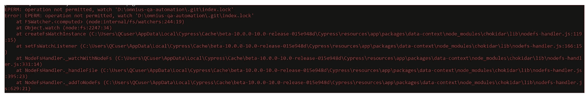
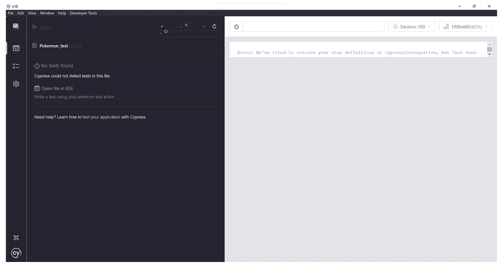

# Cypress v10 —有什么新功能？

> 原文：<https://medium.com/geekculture/cypress-v10-whats-new-3752676ac927?source=collection_archive---------8----------------------->



你好，笨蛋们！！

鉴于我最近加入了 [Cypress.io](https://www.cypress.io/) 的[大使计划](https://www.cypress.io/ambassadors/)；它有一些额外的好处，其中之一是在公开发布之前先睹为快，我得到了 Cypress v.10-beta 的第一手资料，下面是我对 v10 版本的看法。

# Cypress v10 提供的新增/删除功能列表:

*   组件测试现在是 Cypress v10 测试版的一部分
*   对配置文件的更改
*   让我们在 E2E 测试和组件测试之间选择/分离
*   柏树工作室实验支持已被删除
*   刷新的测试运行程序(Cypress 应用程序)用户界面



Cypress app Home Screen

*   有了新的增强，您可以从 Cypress 仪表板上看到您的测试运行历史(您必须登录)



Your Test runs from Cypress Dashboard

*   在**赛普拉斯公开赛**期间,“运行所有规格”和“运行过滤规格”的能力被移除。
*   在 cypress run 和 cypress open 中添加了新的 were 和——组件 CLI 标志，允许用户运行或启动 cypress 进行特定的测试类型。如果在运行 **cypress run** 时没有提供测试类型特定的 CLI 标志，cypress 将默认运行端到端测试。

# 升级到 Cypress v10

您必须首先安装最新的 cypress 依赖项到 v10.x.x，并基于您的框架运行 npm install 或 yarn install。

然后使用 ***【柏树打开】*** 命令打开柏树



一旦您选择了 E2E 测试，它将引导您到一个迁移助手屏幕，这将帮助您通过点击几个按钮来迁移您的测试:

1)您需要将您的测试从“集成”文件夹移动到“e2e”文件夹

> 您必须重命名您现有的测试，(这实际上更像是一个目录变更):在 v10 中，默认的 spec 文件夹已经从:cypress/integration-> cypress/e2e

因此，您新更新的测试应该如下所示:



Before and after renaming your tests

2)现有的支持文件也已更改:

> 因此，基本上，由于测试在 E2E 和组件测试之间有明显的区别，所以您现有的**cypress/support/index . js**被更改为 **cypress/support/e2e.js** 或**cypress/support/componenet . js**



Before and after renaming your support file

3)迁移您的配置文件:

*   不再支持使用 cypress.json 配置文件。用一个 **cypress.config.js，cypress.config.ts，cypress.config.cjs** 或 **cypress.config.mjs** 文件替换这个配置文件。这种变化提供了更好的配置灵活性和可扩展性。
*   **测试文件**，**忽略测试文件**选项被移除。该选项分别被新的 **specPattern** 、 **excludeSpecPattern** 选项取代 [specPattern](https://github.com/cypress-io/cypress-documentation/blob/10.0-changelog/content/_changelogs/guides/references/configuration) 选项是一个新的测试类型特定配置选项，必须在 [e2e](https://github.com/cypress-io/cypress-documentation/blob/10.0-changelog/guides/references/configuration#e2e) 和/或[组件](https://github.com/cypress-io/cypress-documentation/blob/10.0-changelog/guides/references/configuration#component)配置中定义。

# 使用 Cypress v10 可能会遇到的问题

以下是我在测试版中遇到的问题列表:

1.  在 headless 和 open 测试运行期间，我让 Cypress 应用程序崩溃了多次；(根据互联网上的信息，您可以使用 **npm 缓存清理-强制**命令来避免，但对我无效)**[https://github.com/cypress-io/cypress/issues/22002](https://github.com/cypress-io/cypress/issues/22002)
    **编辑**:应在 10.0.1 版中修复**

****

**app crashing error**

**2.对于那些将 cypress 与 cucumber 一起使用的人来说，他们将面临 Cypress 无法识别测试的问题，因为在迁移之后,“集成”文件夹被替换为“e2e”,**Cypress-cucumber-preprocessor**仍然为 step-defs 搜索“集成”文件夹。**

****

**cypress-cucumber-preprocessor**

> **解决方法是保留您的。cypress 目录下的 cypress/e2e 文件夹中的特性文件和 cypress/integration 文件夹下的所有测试定义，直到 cypress-cumber-preprocessor 支持 v10**

**3.Cypress 在第一次启动时可能会抛出一个类似下面的与 **plugins/index.js** 文件相关的错误。**

****

**pluginsFile error on Cypress v10 first launch**

> **要继续，您需要注释掉您的插件文件内容，然后根据您的测试类型使用 **setupNodeEvents()** 或 **devServer()** 选项来引用任何插件文件**

```
...
e2e: {
    // We've imported your old cypress plugins here.
    // You may want to clean this up later by importing these.
    setupNodeEvents(on, config) {
      return require('./cypress/plugins/index.js')(on, config)
    },
    specPattern: 'cypress/e2e/**/*.{feature,features}',
    excludeSpecPattern: ['**/stepDefinitions/*', '*.js', '*.md'],
  },
```

**在 **cypress.config.js** 中引用你的插件文件。**

# **结束语:**

**总而言之，Cypress v10 是对 Cypress.io 的一个很有前途的更新，对于那些正在为他们的应用寻找新的 e2e/组件测试工具的人来说，这将是一个很大的进步。**

****链接:****

**Cypress v10 变更日志:**

**[](https://docs.cypress.io/guides/references/changelog#10-0-0) [## 变更日志| Cypress 文档

### 发布于 2022 年 6 月 1 日摘要:组件测试现在是测试版！我们还从头开始重新设计了 Cypress 应用程序…

docs.cypress.io](https://docs.cypress.io/guides/references/changelog#10-0-0) 

官方声明:

[](https://www.cypress.io/blog/2022/06/01/cypress-10-release/) [## 宣布柏树 10 与组件测试测试版！

### 朋友们，你们好！今天，我们要分享一个激动人心的消息。上面的标题可能已经泄露了，但在…

www.cypress.io](https://www.cypress.io/blog/2022/06/01/cypress-10-release/) 

*最初发布于*[https://kushalbhalaik . XYZ](https://kushalbhalaik.xyz/blog/cypress-v10-whats-new/)**