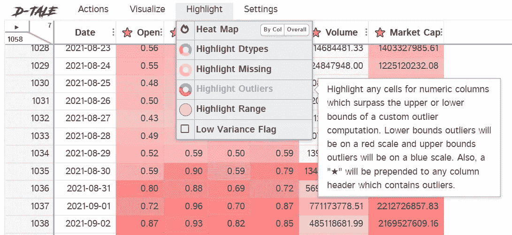

# Python 中的 D-Tale、简单和交互式 EDA

> 原文：<https://medium.com/geekculture/d-tale-easy-interactive-eda-in-python-61de18ae8679?source=collection_archive---------10----------------------->

一个伟大的软件包，不仅适用于初学者或有经验的分析师。这是另一个很棒的软件包，从可视化 Pandas 数据框结构到在你的数据集中绘制图表，导出，过滤等等。

如果你想看的话，我已经写了几篇关于 EDA 和数据可视化的早期文章。