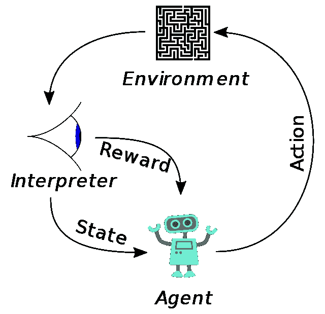

# 什么是强化学习？

> 原文：<https://medium.com/geekculture/d635641d4056?source=collection_archive---------60----------------------->

## 理解机器学习第三范式的简单方法

Source: [Wikimedia Commons](https://commons.wikimedia.org/wiki/File:Reinforcement_learning_diagram.svg)

强化学习(RL)是一种机器学习，它使代理通过尝试自己的动作，使用试错法在环境中发现或学习。在大多数有趣和具有挑战性的案例中，行动可能会影响以后。