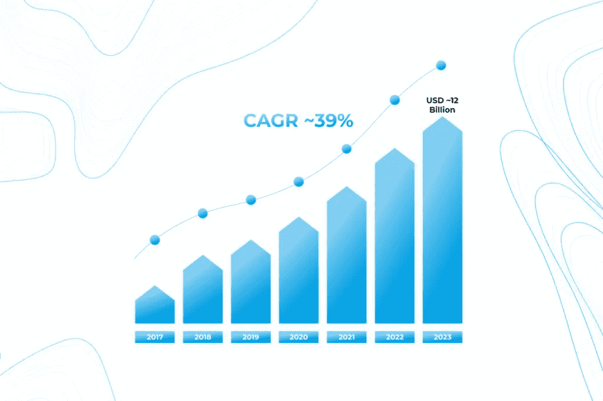
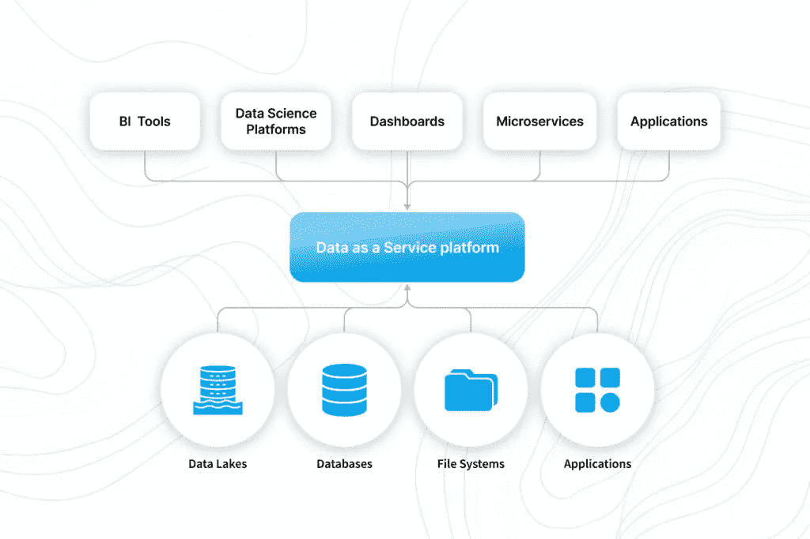
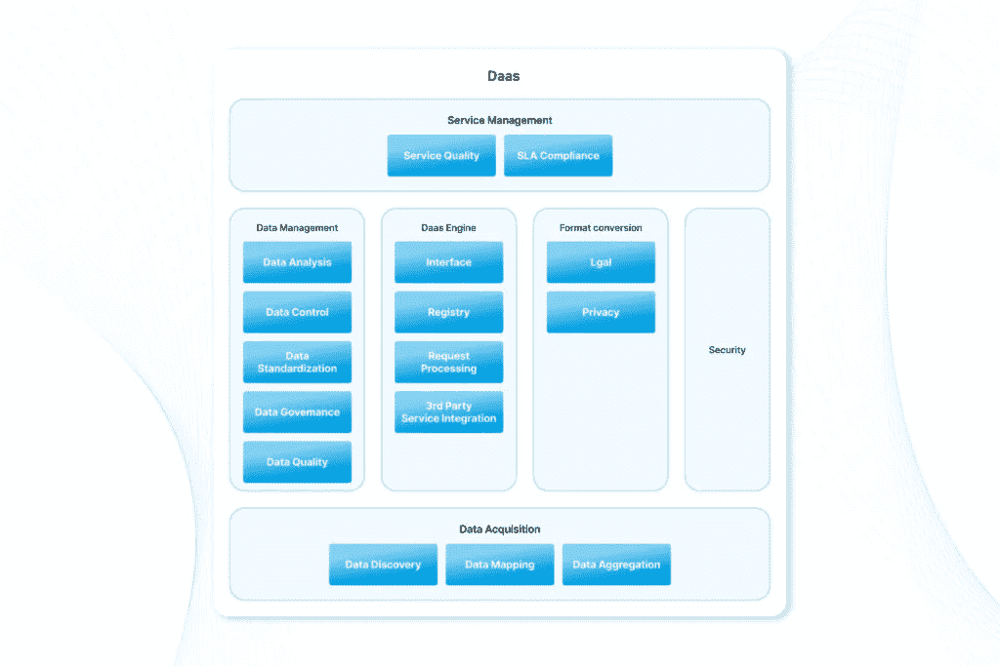
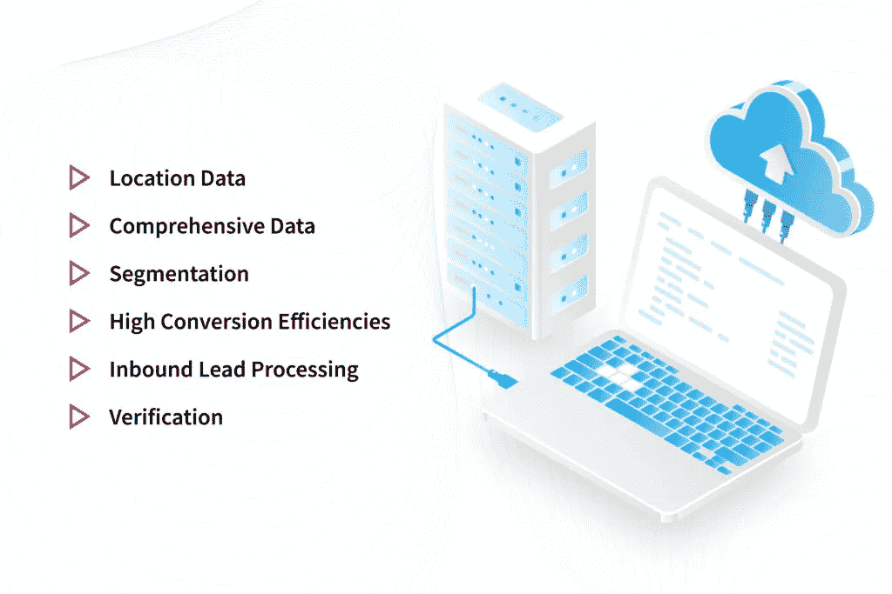

# DaaS 服务:让复杂的事情变得简单[最佳范例] —尼克斯联合公司

> 原文：<https://medium.com/geekculture/daas-services-making-complex-things-simple-best-examples-nix-united-55f71454916a?source=collection_archive---------17----------------------->

如今，企业对数据的依赖比过去更加广泛。此外，获取、存储和应用数据的方法也在快速变化。突破性技术的出现是新形式信息使用的最大催化剂。新的连接方法，包括移动设备和物联网传感器，扩展了可用的信息类型，并刺激了数据市场的持续发展。

对数据日益增长的需求引发了被称为数据即服务(DaaS)公司的数据处理公司的出现和积极发展。

他们做什么，数据即服务概念如何解决现代组织的数据相关挑战？

简而言之，数据处理公司提供快速、高质量的数据，能够满足最苛刻客户的需求。这些数据如何帮助优化运营，它有哪些好处或隐患，主要是什么是 DaaS？本文深入探讨了这一概念，并基于现场经验和实际案例研究找到了更多答案。

这一技术概念类似于软件即服务(SaaS)，即无需安装程序即可在线通过云访问软件。每个“即服务”组织都依赖云来运营业务资源。虽然 SaaS 术语已经成为流行语，但数据即服务还没有如此广泛。原因之一是数据存储和分析以及云技术的快速发展。

数据即服务可以包括所有类型的数据:

这种数据管理策略通过将数据保存在一个统一的位置，消除了对基础架构的依赖。这种方法简化了在不同地区拥有多个内部单位、与客户共享数据或采用数据货币化策略的企业的运营。

DaaS 市场正在飞速发展。专家预测其规模将在 2023 年接近 120 亿美元。

# 数据即服务的关键属性

对于用户来说，数据即服务的确切含义是什么？传统数据组织和 DaaS 之间的主要区别是什么？

# DaaS 应该授权

为了简化企业的实施流程，DaaS 解决方案应该完美地集成到现有的工作流程中，而不是要求客户改变他们的流程。它需要大量的客户知识、顺利的集成机会和提供即时商业价值的数据。对于专业公司来说，专注于无故障集成和解决特定的客户问题至关重要。

# DaaS 应该提高利润率

一个典型的数据公司的生产成本是巨大的，特别是如果一个公司的经营规模很小。然而，毛利润往往会随着业务增长而提高。企业主应该评估他们获取、创建和处理数据的支出结构如何随着客户群的增长而变化。如果几十个新客户让你的毛利润大大高于小规模经营，规模经济就实现了。一个不断上升的底线是发展一个广泛和有弹性的利基组织的关键。

# DaaS 应该是机器可读的

数据质量和准确性刺激由机器学习和人工智能实现的创新。同时，数据错误会造成灾难。通过使 DaaS 机器可读，公司打开了一系列的机会，以确保信息的正确性。众多工具，包括 Crowdflower 和 Mighty AI，旨在微调您的解决方案，标记您的信息，并为算法使用做准备。

当数据确保以下两点时，它会提供最大的价值:

*   速度——短时间内改变的能力
*   认识到正在发生的变化的价值

当数据传输率很高时，公司的数据具有显著的潜在价值。房地产或股票市场的市场数据是快速价值增长的例证。

随着对人工智能产品需求的不断增长，DaaS 也将发展壮大。但是采用这种技术的公司的成功将取决于数据质量、速度和利润。

# 数据即服务是如何工作的？

平台是组织内部使用的内部技术。这种端到端解决方案的重要作用是增强各种数据源和工具之间的互连，如报告、微服务、商业智能和应用程序。该平台为最终用户提供了一个通过 ODBC 或 REST 使用 SQL 访问数据的机会。

组织还可以使用外部 DaaS 服务来获取数据。绝大多数情况下，公司通过简单的 API 交付这样的服务。几个杰出的公司数据提供商的例子将在文章中进一步讨论。

# 数据即服务的优势

成功实施后，该解决方案可以使整个企业及其客户受益。以下是迄今为止最显著的优势。

# 货币化数据

获得足够的数据不再是问题。当今公司面临的主要挑战是组织和操作信息。尽管许多企业主采用了数据货币化计划，但很少有人能够充分利用他们的信息。数据即服务可以成为实现这一目标的途径。

# 减少开支

DaaS 解决方案可以帮助组织最大限度地减少在不当决策上花费的时间和金钱。通过什么方式？

*   利用各种数据源
*   揭示有价值的见解
*   确保数据驱动的决策

此外，通过采用预测分析，您可以在以下方面获得宝贵的帮助:

*   发现客户行为模式
*   提供更好的服务
*   增强个性化用户体验
*   赢得客户忠诚度

# 向创新敞开大门

当数据成为企业的核心时，增长会很快。为什么？因为数据驱动的战略降低了风险，促进了创新。当所有必要的团队和部门获得及时和准确的数据时，他们可以产生成功的想法，并在实施时带来显著的效果。新的成功举措将接踵而至，并刺激进一步增长。

# 促进决策制定

在 DaaS 的帮助下，信息变成了至关重要的商业资产。该技术支持更具战略性的决策和成功的数据管理。这些解决方案融合了内部和外部数据源，如客户、合作伙伴和开放数据源，以允许获得业务的全面视图。公司还能如何利用这项服务来加强决策？

*   通过使用服务于特殊业务任务的端到端 API 为分析提供信息
*   通过自助式目录简化用户数据访问

# 强化数据驱动的文化

对现代企业来说，组织数据并为每个团队提供他们需要的信息是一个相当大的挑战。随着数据源范围的不断扩大，DaaS 提供了综合信息，强化了数据驱动的文化，并简化了数据在工作流程中的使用。此外，该技术通过可用于广泛应用的可重用数据集，帮助组织处理复杂数据。

# 最小化风险

个人偏见和不完整的信息会妨碍决策并使组织面临风险。当公司与数据即服务提供商合作时，他们会处理所有数据以做出成功的选择。他们还可以采用数据虚拟化等技术，通过可重用的服务来访问、集成、更改和传输数据，从而提高查询性能并保持数据安全性。因此，该服务降低了与视图冲突和数据质量不足相关的风险。

# 主要挑战

作为云解决方案，DaaS 技术带来了诸如信息安全和隐私等主要问题，并要求集成解决方案具有高度灵活性以实现扩展功能。让我们更详细地讨论一下主要的挑战。

在提供对所需业务环境中的数据的无障碍访问的同时，该服务可能会使关键信息受到未经授权的使用。如今数据泄露越来越普遍，企业应该采取适当的网络安全措施。数据安全方法是选择 DaaS 供应商时要考虑的关键参数之一。可靠的合作伙伴会采取全面的安全措施来消除财务和声誉方面的损失风险。

通过 DaaS 访问的业务数据可能包含机密信息。在专业环境中，隐私问题具有重要意义，因为共享的数据通常与业务流程的关键方面相关。用户应确保数据提供者采取必要措施保证私人信息的保密性。

# 干净的数据集

您的数据服务供应商可能有自己的数据集，需要与您的数据集相结合。但是，您公司和供应商的数据准备规则可能不匹配，从而导致脏数据。因此，您的供应商应该认识到与您的数据集干净地集成的需要。

# 数据管理

来自各种来源的海量数据很难管理。只有验证 DaaS 环境中的数据完整性，以保证其与任何其他信息的一致性，才能实现最高级别的数据治理。验证可能很复杂，但它是确保您的公司符合数据质量要求的重要组成部分。

# 有限的能力

当公司实施数据即服务平台时，它只能使用与该特定平台兼容的工具进行操作。这限制了它开发自己的数据处理和分析解决方案的工具选择。因此，您选择的平台应该在工具选择方面提供最大的灵活性。

# 数据即服务架构

一旦我们确定了解决方案的基本机会和威胁，让我们考虑如何构建平台。

数据即服务体系结构可以被视为一个通用模板，包括来自不同学科的主要概念和模式，以促进新环境的实现。

该架构主要包括以下组件:

*   数据采集——在系统和数据源之间形成一个连接层。
*   数据管理-确定数据策略，确保一致的数据操作方式。
*   数据即服务引擎——根据数据策略和法规满足数据请求的服务中心。
*   数据法规-提供对既定法律的遵从。
*   安全-确保信息资产免受网络攻击。
*   服务管理——保证手头的服务满足用户的期望和要求，以提高业务价值并最大限度地提高服务效率。

# DaaS 背后的主要工具

支持数据即服务的技术可以分为几类:

# 数据集成

此类别包括能够从各种来源选择、提取、准备、转换和传输信息到统一来源的工具。例如:

*   **Talend 数据整合软件**。该工具旨在连接、访问和转换任何信息，无论是否在云中。
*   **信息动力中心**。该软件使公司能够积累、访问和处理来自各种来源的数据。
*   **数据虚拟化**。一个方便快捷的数据访问、集中化和治理的平台。

# 数据库管理系统

这是一个完整的软件系统，用于识别、创建、更新和操作数据库。

*   **微软 SQL Server** 。允许保存和获取其他应用程序使用的数据。
*   **IBM Db2** 。基于人工智能的混合解决方案，有助于管理内部和云中的结构化或非结构化数据。它具有灵活性和可扩展性，可以满足任何企业的需求。

# 自助数据准备

此类工具帮助企业实现信息民主化。他们利用分析功能来检查复杂数据，实现可扩展性，并管理最终分析结果。

*   **Pentaho 7.0** 。该解决方案提供了将大数据和数据准备相结合的 BI 和数据集成产品。
*   **Datawatch 托管分析平台**。自助式数据操作和可视化数据检查的企业产品。它包括各种数据集操作的能力。

# 数据即服务公司示例

什么是领先的 DaaS 公司，他们专门从事什么？作为服务示例，看看几个显著的数据。

提供数据积累、数据共享、数据湖和数据交换机会的先驱 DaaS 公司之一。它帮助企业处理结构化和半结构化信息，并从中挖掘出有价值的见解。

作为一个高性能数据库，该平台提供了对多模型数据的突破性分析，无论是否在云中。它使公司能够利用当代架构开发数据解决方案，并获得可行的实时洞察。

# 甲骨文 DaaS 公司

一个利用 Oracle 拥有的 Datalogix 和 BlueKai 的营销智能解决方案。它包括两个分支:

*   **甲骨文 DaaS 营销公司**为营销人员提供多渠道数据
*   **面向社会的甲骨文 DaaS**提供社会和企业信息

作为突破性技术的前沿，这些组织和其他组织有助于使复杂的数据相关流程变得更加顺畅和简单。

数据即服务允许企业增强其内部流程并获得上市成功。在哪些方面？有许多成功案例研究的例子。让我们考虑几个重要的用例。

# 位置数据

利用物理地址信息的组织可以使用 DaaS 获得精确的位置数据。第三方信息可以与内部客户记录相结合，以涵盖所有类型的地址，包括仓库、分支机构、小型店面和附属建筑。

# 综合数据

定义新的消费者细分变得更容易，尤其是如果你的产品是针对特定的市场。专门的工具可以帮助将公司的详细信息和联系数据与内部消费者信息联系起来。可以利用这些全面的数据来揭示新的客户类别。

# 分割

对目标受众进行更深入的细分是另一个生动的案例研究。对企业来说，更多地了解客户并优先考虑客户是至关重要的。默认行业细分的数量，如技术或制造，可能太大了。然而，使用正确的工具，组织可以选择一些理想的帐户，并将它们的相关关键字包含在公司语义列表中。因此，公司将在新的或类似的行业类别中扩大其潜在客户的基础。

# 高转换效率

本案例研究表明，组织可以通过网站提升销售线索转化率。提供实时丰富的工具将筛选线索，以提供最相关的业务数据，从而改善分析并推动转化。

# 入库销售线索处理

入库销售线索处理也变得更加高效。数据即服务解决方案可自动清理、增强您的网站流量信息，并将其链接到特定的 CRM 领域。所有部门都可以方便地获得所需的信息，同时销售代表可以获得值得信赖的、符合营销标准的销售线索。

确认

如果未经核实，新客户或合作伙伴可能会给公司带来一定的风险。DaaS 提供了将非结构化商业信息转化为结构化智能的先进机会。这些指标不仅包括公司的行业部门及其在技术堆栈中的进展，还包括公司的技术能力评级和财务历史。因此，企业有权检查其潜在合作伙伴的可靠性。

# 启动数据即服务

有了上面提到的所有令人印象深刻的好处，开始使用 DaaS 可能看起来很复杂。不过这也不足为奇，因为对于许多人来说，这个解决方案仍然是新的，还没有被充分探索。然而，这项任务是可以完成的，并且对于获得轰动的商业结果是不可或缺的。

数据即服务使您从大量的设置和准备工作中解脱出来。它易于部署，同时大量专业供应商随时准备为您提供技术支持。因此，您不必雇用额外的人员。

下面是开始实现讨论中的服务类型的基本步骤:

*   选择合适的供应商。考虑以下因素:
*   费用
*   可量测性
*   可靠性
*   灵活性
*   易于与现有例程集成
*   注册并激活您的平台。
*   把你的信息转移到 DaaS 数据库。请记住，数据迁移可能需要一些时间，具体取决于数据量和网络连接速度。
*   让自己沉浸在 DaaS 平台提供的新机遇中。

# 底线

拥抱前沿技术对于公司在快速发展的商业环境中前进至关重要。数据即服务有助于简化内部运营、提升客户体验、优化目标受众细分、推动转化和推动创新。定义您的目标，概述您应对挑战的策略，并选择合适的供应商，以使您的转型之路顺利成功。

*原载于 2022 年 7 月 27 日*[*【https://nix-united.com】*](https://nix-united.com/blog/data-as-a-service-making-complicated-things-simple/)*。*