# 每日进度-实现剑弧特效。

> 原文：<https://medium.com/geekculture/daily-progress-implementing-sword-arc-fx-f47d8b1398a2?source=collection_archive---------65----------------------->

我们想给我们的挥剑增加一点天赋，我们得到了一个非常酷的弧形特效，叫做剑 _ 三 _ 粒子。我们先把它切成 512×512 的方块。

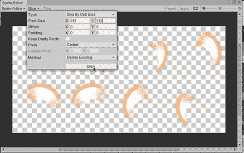

我们首先将第一帧移动到玩家对象中，并将其重命名为 Sword_Arc

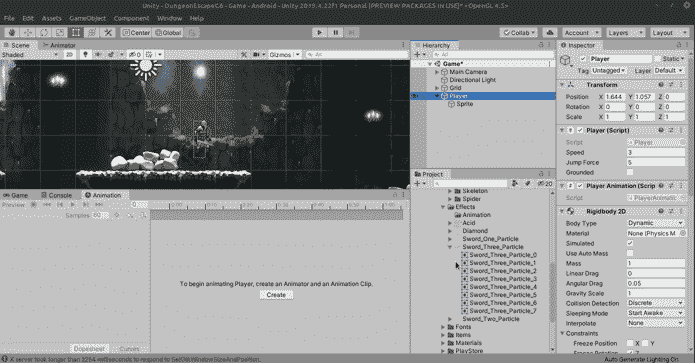

记得设置精灵层顺序为 50，和播放器一样。

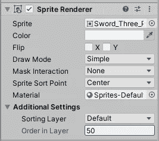

像以前一样，创建一个新的动画，我们将它保存在 Sprite/Effects/Animation 下，命名为 Sword_Arc_anim。拖动所有帧，设置样本为 30，并点击播放。Unity 需要几秒钟来整理东西，但是很快我们就有了一个好看的动画弧线！

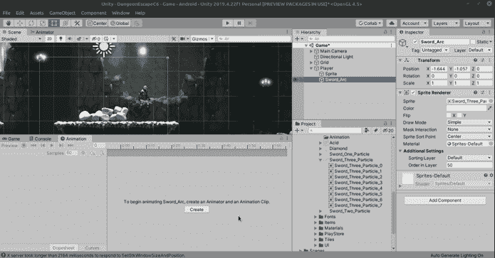

为了让它看起来真的很酷，我们可以把它倾斜一个弧度，所以把旋转角度改为(66，48，-80)。也可以调整到你认为合适的位置。

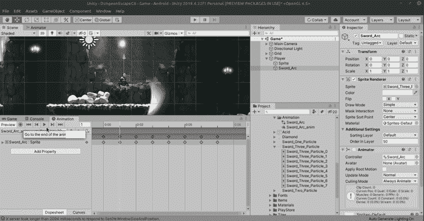

它移动得有点太快了，让我们从第 2 帧开始移动所有帧，并将它们移动到大约 5 秒。

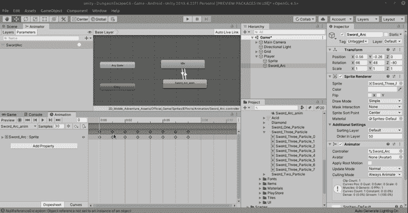

好吧！我们有一个很棒的秋千！现在让我们在编码之前在动画制作中设置它，首先让我们关闭循环时间，因为我们只希望这个动画播放一次。

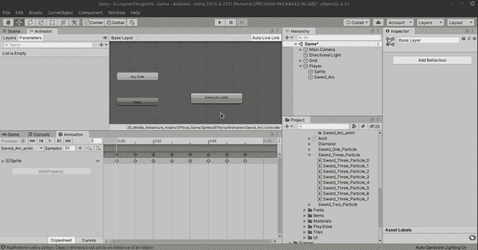

接下来，我们将创建一个空状态，这将是我们的空闲状态，我们将转换到 arc 并返回。去剑弧将没有退出时间和 0 过渡，但剑弧到闲置将有一个退出时间和大约 0.35 过渡时间。

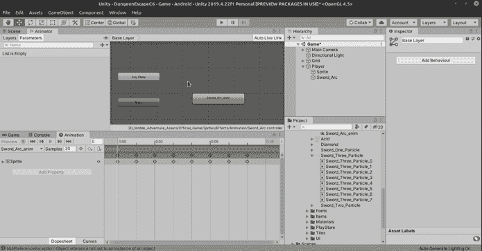

所以让我们扣动扳机。

看起来不错，现在编程:首先我们创建一个持有人，并分配它。

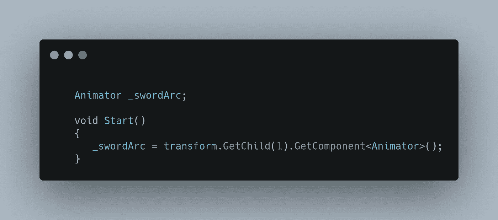

我们通常不能使用 GetComponentInChildren 来获取动画师，因为它会抓取第一个玩家。我们想得到第二个孩子，使用数组规则，将是 1。一旦我们有了第一个孩子(孩子 0 是玩家精灵)，我们将从中获得动画组件。

接下来我们只需设置触发器，简单！

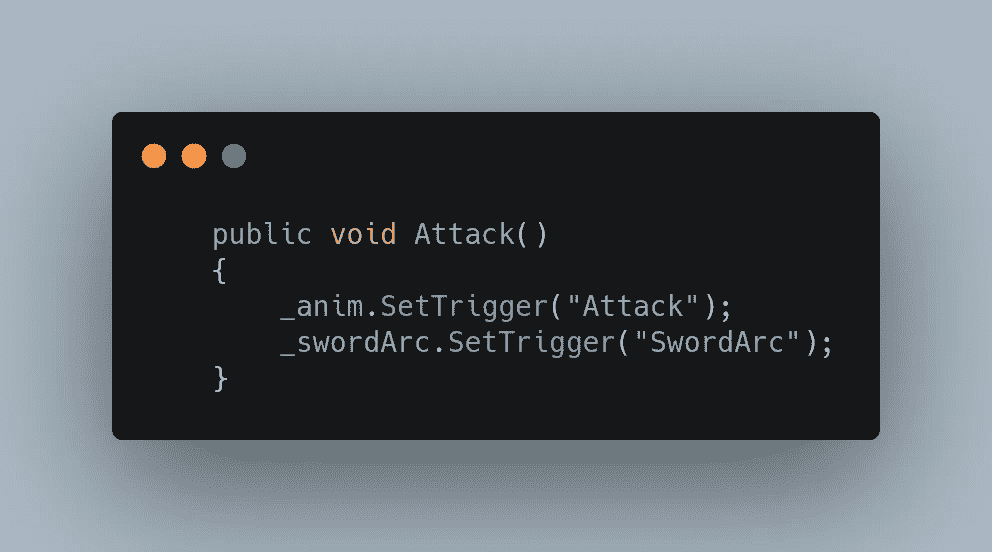

让我们运行游戏并点击鼠标按钮:

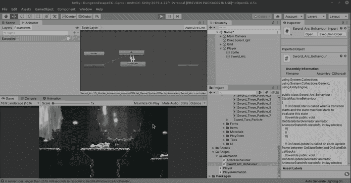

正如我所怀疑的，动画运行了两次。这是昨天的同一个问题，所以我们将以同样的方式解决它。我们将为剑弧创建一个行为，我将其命名为剑弧 _ 行为。然后在 OnStateExit 上，我们对 SwordArc 使用 ResetTrigger，一切都将完美运行。

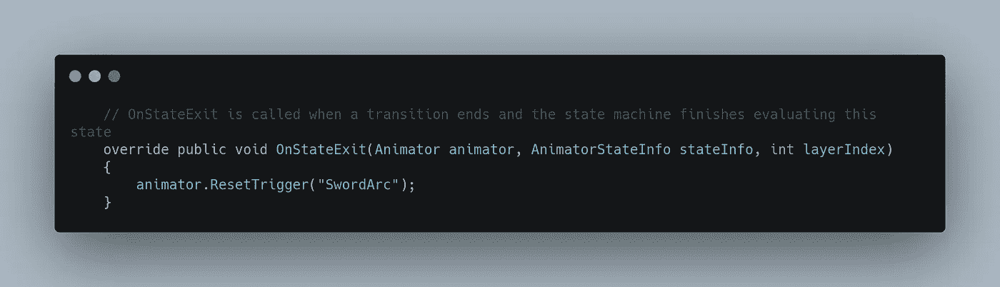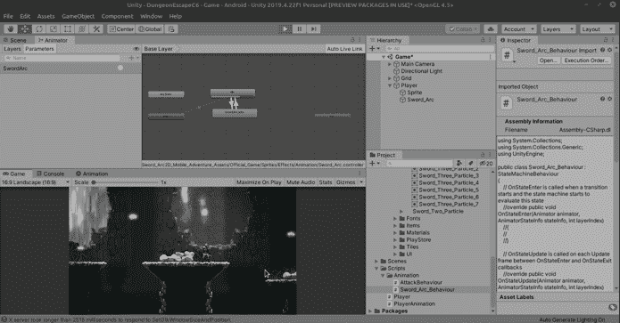

太好了！动画现在只播放一次！不过玩家挥剑似乎有点太慢了，所以我们要修正动画:

首先，我们将进入球员攻击动画，并删除所有的关键帧。

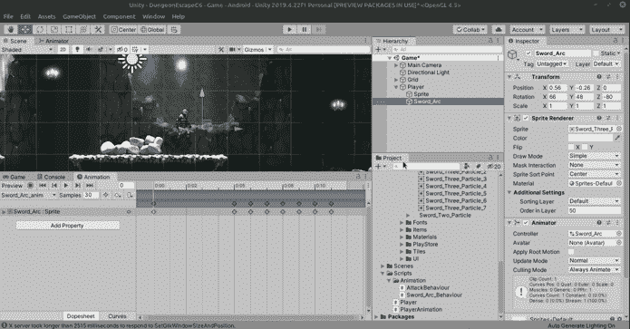

在原始 Reg_Swing 动画下，我们抓取第 6–23 帧，忽略第 9 帧，并将它们拖到时间轴中。

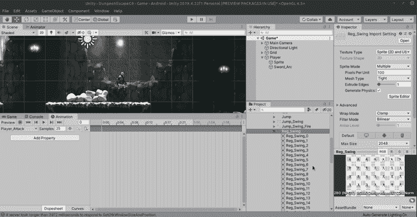

这导致了:

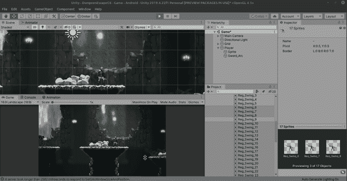

更快的挥杆！所有东西放在一起看起来都很棒！不过，可以对弧线进行一些最终调整。以下是数字:

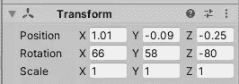

位置:1.01，-0.09，-0.25
旋转:66，58，-80

还有一个问题是，弧线的第一帧一直在玩家的身上，并且跟随着玩家。我们可以通过向上移动该帧，插入一个新的帧，然后单击 record 按钮，关闭新的第一帧上的 sprite 渲染器，并在下一帧上打开它，从而轻松地解决这个问题。完成后，再次点按“录制”按钮。

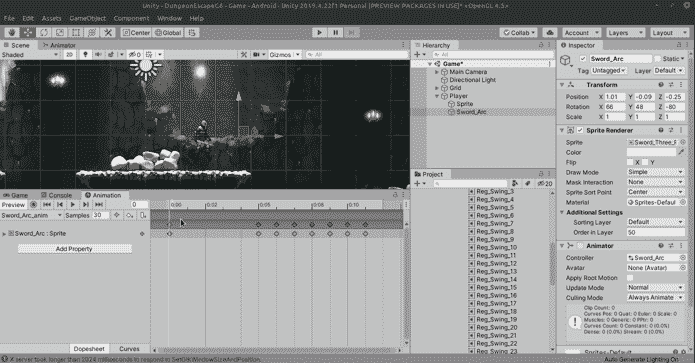

下一个问题是当玩家翻转两边时，通常，我们也需要编程翻转剑弧。我将做一些稍有不同的事情，以后可能会改变，但现在我认为这将通过翻转玩家转换而不是使用。只显示精灵的 flipX 函数。这实际上将翻转整个玩家对象，包括弧线:

这是新的挂图功能:

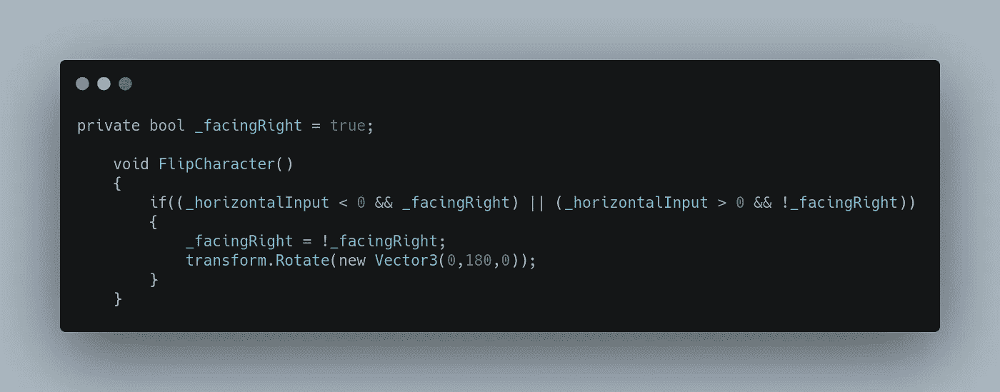

我们首先创建一个名为 _facingRight 的 boolean，它可能会在以后派上用场，但然后我们检查我们的 horizontalInput，如果它小于 0(向左移动，但我们面向右，或者如果我们向右移动并面向左，那么我们的 current _facingRight boolean 将成为它的对立面，我们将对象沿 y 轴旋转 180 度，本质上翻转玩家及其所有子对象，包括弧线以及任何未来的种子点，就像有一个发射子弹的十字弓或手枪一样。你再也不用担心因为面对的方向而改变产卵点了！

看看这个:

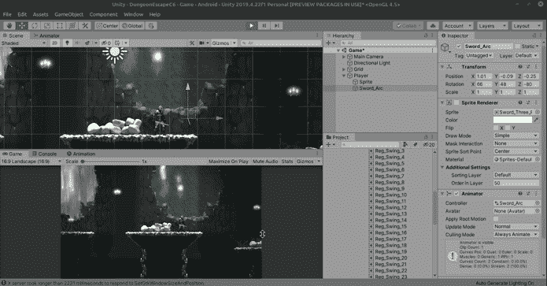

完美的工作，我们不需要一次编程两个对象！我要感谢 Nik Hwang 的这个方法，去[看看他的 Youtube 频道！](https://www.youtube.com/channel/UC5sPLOWXyDsvvSZs9Dd0dlg)