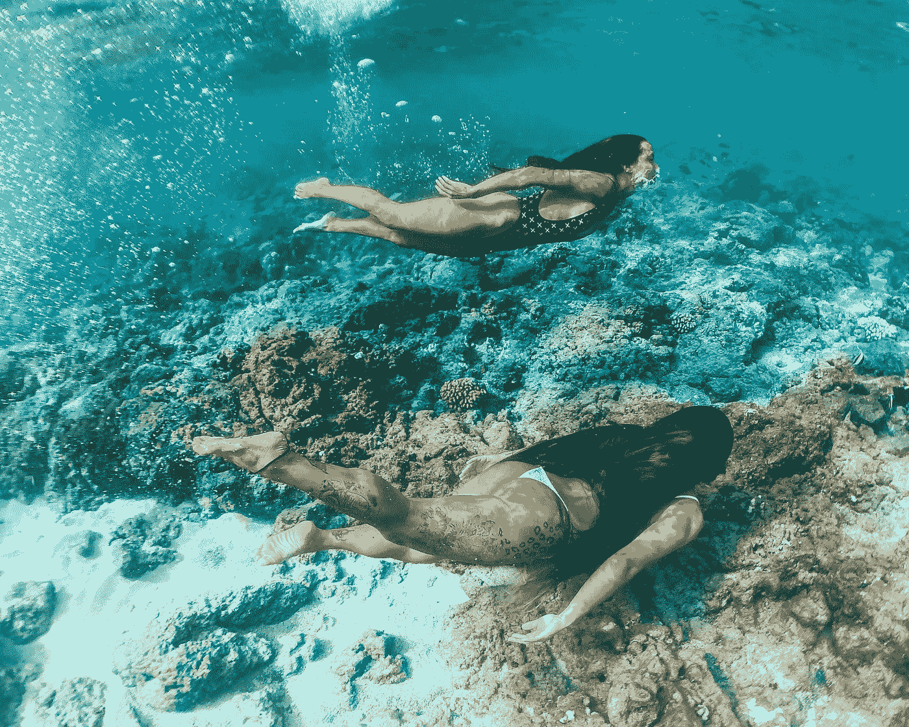

# 奶牛装上 VR 头戴设备？是时候停下来思考了

> 原文：<https://medium.com/geekculture/dairy-cows-fitted-with-vr-headsets-time-to-stop-and-think-db38d30cc2b3?source=collection_archive---------13----------------------->

虚拟现实是为了进入“更好”的世界而设计的，但它会是一条单行道吗？

Photo by [Jess Loiterton](https://www.pexels.com/@jess-vide?utm_content=attributionCopyText&utm_medium=referral&utm_source=pexels) from [Pexels](https://www.pexels.com/photo/women-wearing-swimsuit-swimming-under-water-near-the-reef-5008895/?utm_content=attributionCopyText&utm_medium=referral&utm_source=pexels)

给农场动物戴上虚拟现实(VR)耳机的想法[在 2019 年](https://www.thesun.co.uk/news/10436073/russian-cows-fitted-with-vr-goggles-so-they-see-green-grass-all-year-long/)成为新闻。当时，俄罗斯政府宣布他们正在研究一个项目，通过给奶牛安装 VR 头戴设备来增加牛奶产量。