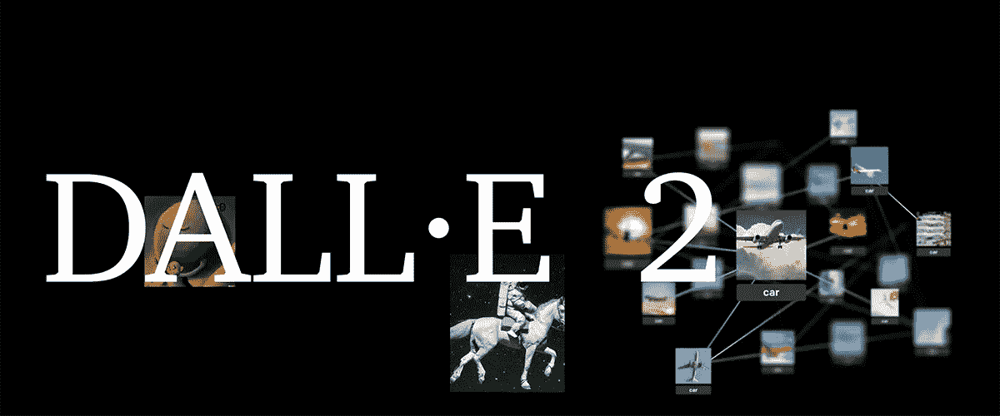
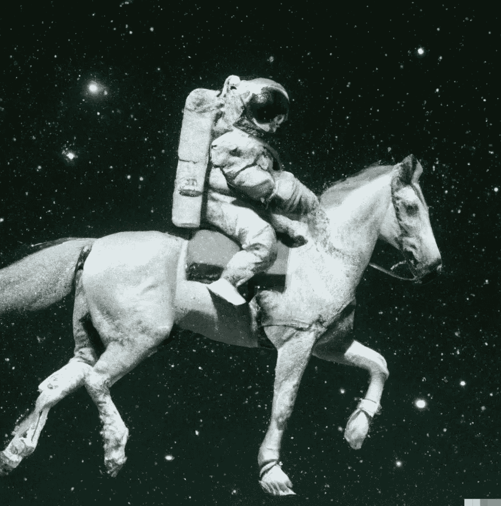
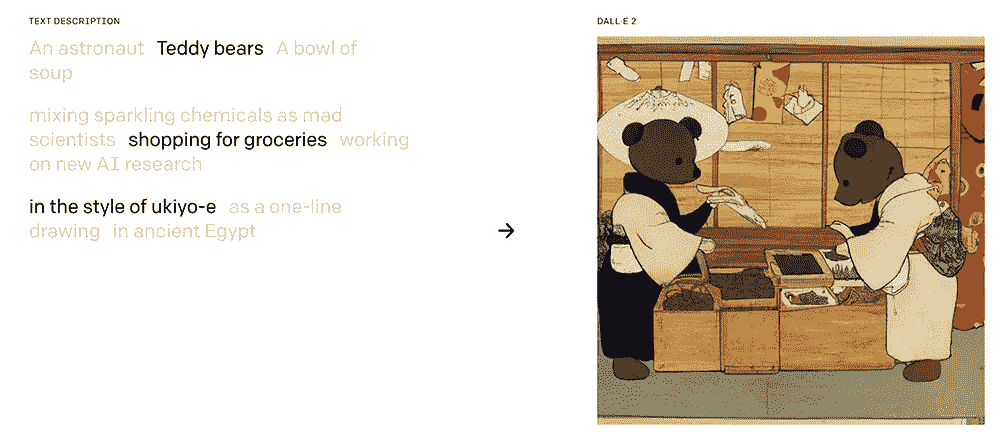
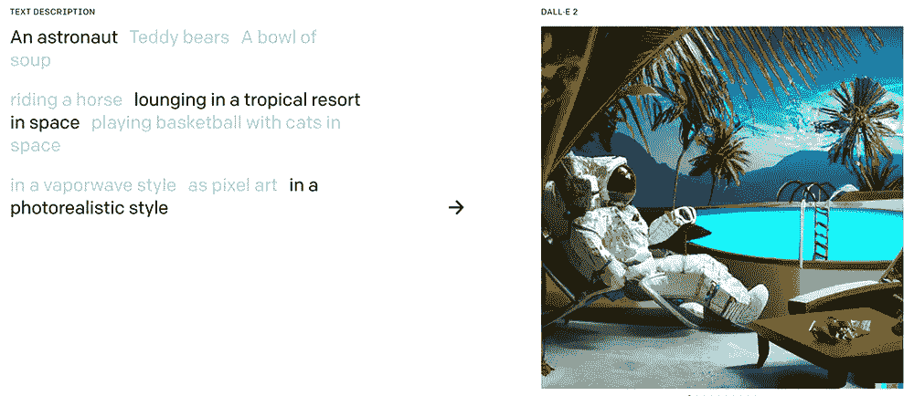
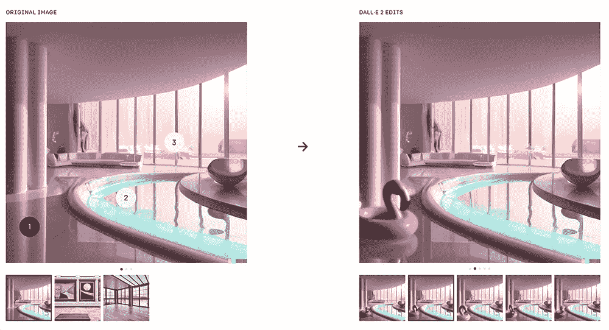
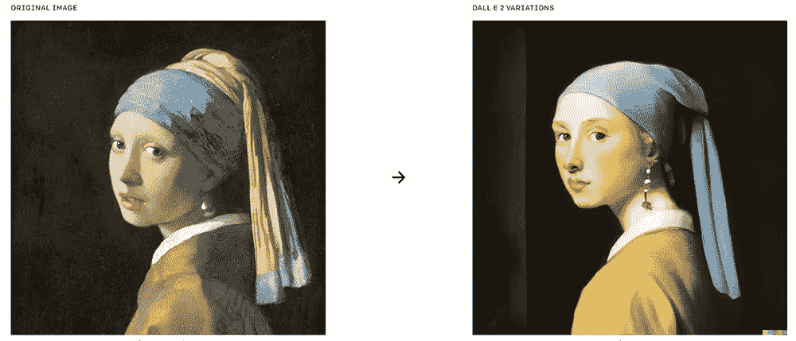
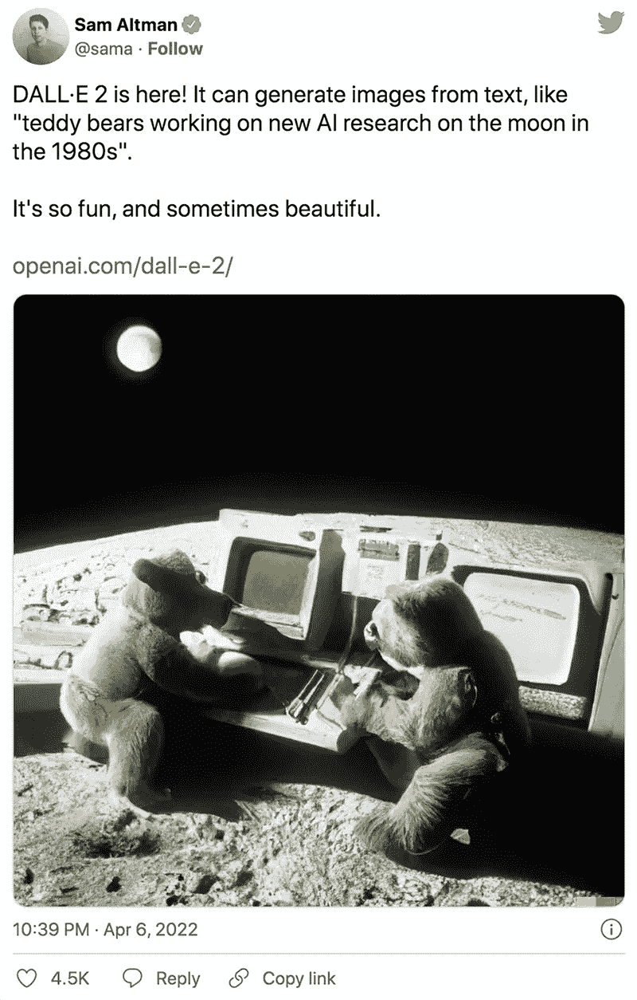
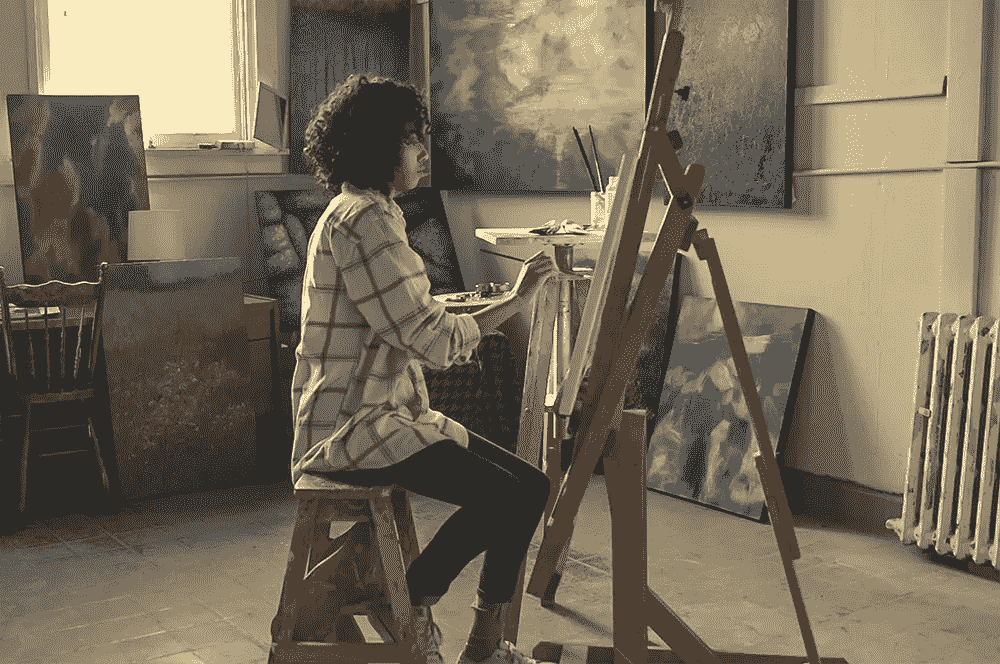

# DALL-E 2 AI 图像生成为创意者打开了更多可能性

> 原文：<https://medium.com/geekculture/dall-e-2-ai-image-generation-opens-more-possibilities-for-creatives-ac722c1d2345?source=collection_archive---------7----------------------->

**DALL-E 2** 是一个 ***机器学习* (ML)** 框架语言模型从 [**打开 AI**](https://openai.com/dall-e-2/) 。它可以使用 [**剪辑**](https://openai.com/blog/clip/) **(对比语言-图像预训练)** 算法生成逼真的图像。这是对原始 DALL-E 的改进，具有更快的图像生成速度、更低的延迟和更高的分辨率。CLIP 是一个 ***神经网络* (NN)** 实现 ***计算机视觉*** 与 ***自然语言处理* (NLP)** 。这就利用了[**【GPT-3】**](https://becominghuman.ai/gpt-3-and-code-generation-ai-enabled-instant-software-development-270795077cbd)**(创成式预训练变压器)**的“零射击”能力。

DALL-E 2 于 2021 年 1 月作为 **DALL E** 首次推出，是最新版本。对软件功能进行了改进(这是用户会感兴趣的)。DALL E 使用了一个*神经网络*，它被训练成基于 GPT3 **从图片的文本描述中识别图片。**

该系统为用户提供的是从自然语言生成图像的便利。使用 NLP，用户可以简单地说出或键入他们想要创建的内容，软件将实时生成图像。例如，你可以这样说:

***【宇航员在外太空骑马】***

***AI generated art from human speech using DALL-E 2 (Source OpenAi)***

DALL-E 2 可以创建令人惊叹的照片级逼真图像，就像将您的想象变成现实。宇航员在外太空骑马的例子只是众多例子中的一个。你只需要对 DALL-E 2 说你想创建什么，剩下的就交给它了。

你可以用照片编辑软件(如 Photoshop)制作出类似的效果，但这需要时间来培养技巧。一般人甚至不能使用这个软件，除非他们花足够的时间学习。对于 DALL-E 2 来说，这不再是必要的，因为它使用的软件可以实时生成图像。它只需要使用自然语言，就像与普通人交谈一样。这就是 NLP 和 AI 在工作中的奇妙之处。

## 探索 DALL-E 2

从 DALL-E 2 的开放 AI [网站](https://openai.com/dall-e-2/)，访问者可以了解更多关于如何使用 DALL-E 2 的信息(如果你想要更多关于 DALL-E 2 如何工作的技术和工程解释，请访问他们的[博客](https://openai.com/blog/))。这有助于用户了解软件中最重要的东西，即特性。

目前(文章发布时)还没有全功能的零售应用，只有演示。结果也受到分辨率(1024 x 1024)的限制，而质量并不总是最好的。还有一个[等待名单](https://labs.openai.com/waitlist)给那些想要尝试即将到来的版本的人。

在他们的网站上，有一个演示展示了 DALL-E 2 如何从文本描述中生成图像。您可以尝试不同的选项，但它们是针对本演示设置的(非用户定义)。您不能键入自己的文本，但是您可以选择想要使用的文本块并提供不同的组合。

**Figure 1\. You can combine text to produce your image. In this case it is “Teddy bears”, “shopping for groceries” and “in the style of ukiyo-e” (Japanese art style).**

之前我们有一个宇航员骑马的例子，现在你可以用宇航员生成不同的图像。

**Figure 2\. This is what we get when we combine “An astronaut”, “lounging in a tropical resort in space” and “in a photorealistic style”.**

还有一个互动演示，让游客决定一个物体(如火烈鸟)的位置。

**Figure 3\. You can choose where you want to place a pink flamingo in an image scene. DALL-E 2 then generates the image with different styles.**

DALL-E 2 还展示了它从现有图像中创造变化的迷人方式，包括艺术家的作品。

**Figure 4\. The painting of Jan Vermeer’s “*Girl with a Pearl Earring*,” (circa 1665) can be rendered into different variations by DALL-E 2.**

DALL-E 2 有一种方法可以通过称为 ***扩散*** 的过程，将文本或语音中的关系和模式结合起来。简而言之，它根据大量训练数据集从语音中合成单词或词汇的关系。例如，软件将接受训练，根据作为训练数据集一部分的汽车图像的标签，或者软件的“记忆”，来知道“汽车”是什么。它也知道基于颜色的描述。如果你要求一个“红色汽车”的渲染，DALL-E 2 将生成一辆红色汽车的像素。

## 可能性是无限的

DALL-E 2 使用被称为算法的计算机技术从输入中创建图像，以产生结果作为输出。它将用户的描述作为输入，然后将其传递给后端系统，该系统在数百万张图像的数据集上进行训练，以产生所需的输出。你有大量的数据，软件可以用来生成任何可能的图像。由于数据量会随着时间的推移而不断增长，因此您可以产生的可能性是无限的。

在这一点上，DALL-E 2 非常擅长它的任务，它可以取代艺术家或图形设计师来创作艺术作品。制作人可以要求 DALL-E 2 根据他们想看的内容制作一个令人惊叹的专辑封面。小企业主可以制作自己的横幅来宣传他们的产品。这也可以被学生用来为他们的学校项目提供视觉辅助。这就带走了人的创造性，因为我们把这项任务交给了计算机。是这样吗？

## 创意过时了吗？

这引出了一个问题。这些类型的图像生成人工智能软件会使*创意*过时吗？这是双向的。可以让需要想法帮助的普通用户受益。然而，这并不意味着创意会完全过时。

创意人员可能会担心，使用 DALL-E 2 的应用程序可能会在未来取代他们。也许它会在智能手机应用程序中变得更加常见，并成为需要图形和艺术内容，但没有创意人员的公司或个人的 **SaaS(软件即服务)**解决方案。艺术家、图形设计师和摄影师等创意人员仍将需要增强内容。即使一家公司使用 DALL-E 2，创造性的思维过程仍然需要人类的投入。人工智能并不总是完美的，所以当结果不清楚时，仍然需要人类。

**If we can express our thoughts into pictures, it would be like DALL-E 2 (Source Twitter)**

另一种情况是，当 DALL-E 2 变得更受欢迎时，它将导致市场上创意人员之间的更多竞争。虽然这将意味着一些创意人员可能会遭受损失(主要是那些经验不足的人)，但它可以让更有经验的创意人员受益，为内容开发最佳创意。这实际上旨在带来更多的创造力，从而为市场提供最好的内容。在这种情况下，那些经验最少的创意人员将投入时间进行培训，以便能够学习如何使用 DALL-E 2 应用程序。

DALL-E 2 实际上可以补充创意人员的工作，作为一种帮助他们发挥创造力的新工具。即使是经验丰富的图形设计师也会耗尽新鲜的想法，或者经历“创意阻塞”。像 DALL-E 2 这样的工具可以帮助他们根据从渲染中获得的想法来创建新的内容。人工智能不一定要被负面看待，但在这种情况下，它作为一种有益的工具，对创意者来说是积极的。这就像 Photoshop 或 Lightroom 如何帮助修图人员完成工作一样。

## 对艺术家和摄影师的威胁

虽然普通人可能会对 DALL-E 2 的创作感到惊讶，但专业艺术家可能不会太激动。这不仅仅是因为它可能威胁到他们的生计，而是让我们承认，计算机不会像人类一样花费时间和精力来创造艺术。这听起来不公平，但这是事实。艺术的价值不仅基于内容，还基于创作它所花费的时间和努力。

**Will AI replace artists in the future? (Photo Credit:** [**Burst**](https://www.pexels.com/photo/woman-sitting-on-brown-stool-374054/)**)**

对一些人来说，人工智能产生的艺术价值可能是无价的，因为它们可以被视为稀有和不可替代的。甚至有生成艺术作为[**【NFT】**](/hd-pro/nft-an-introduction-to-the-blockchain-for-photographers-and-creatives-69512d51b0ed)的想法，这些都在**【区块链】**数据库上得到验证。一旦你有这么多由 DALL-E 2 制作的艺术作品，并被证实是 NFT 的作品，它就会充斥市场，没有买家。真正的艺术品仍然因其价值受到收藏家的珍视。它们是由真正的艺术家制作的，被认为更加真实。

对于摄影师来说，DALL-E 2 系统可能不会取代他们在现实生活中想要捕捉的东西。虽然你可以用人工智能生成你能想到的最好的数字艺术，但照片却完全不同。对于更真实的捕捉，摄影师仍然会更喜欢使用他们的相机来拍照。如果摄影师想生成一张巴哈马泳装模特的照片，用 AI 看起来是那么简单。这都是假的，许多摄影师更喜欢在真实的巴哈马和模特实地拍摄，而不是让电脑在虚拟的巴哈马生成一个假模特。

然而，人工智能生成成像可能会对摄影师构成威胁。这是在*股票摄影*。有些摄影师的生计依赖于从库存照片中获得报酬。用户可以从 DALL-E 2 上获取他们的图片，而不是从图片服务中获取。DALL-E 2 图像可能更便宜，因为它们不需要版税或使用许可，因为它可以从已知图像中创建本来应该是原始的渲染。即使是这样，也不意味着库存照片将被完全取代。仍然有更多高质量和分辨率的原始库存照片，而 DALL-E 2 仍然是实验性的。

## 摘要

DALL-E 2 可以在创意上开启无限可能，但并不是一个完美的系统。结果并不总是人们所期望的，但它仍然能够产生一些东西。很多时候结果看起来很好，但其他时候却令人怀疑。将考虑质量和分辨率。DALL-E 和 DALL-E 2 在这方面仍有一些改进的空间。是否有趣取决于用户。当更多的用户找到了使用 DALL-E 2 的目的，那么它就可以成为一个可行的商业产品，开启比以前更多的可能性。

也许像 DALL-E 2 这样的软件的目的不是取代人类创造艺术。相反，它将成为每个人创造力的灵感来源。创意人员可以使用 DALL-E 2 来发挥他们的想法，甚至创造出更好的作品，如果不是最好的艺术作品的话。这就是人工智能如何帮助增强创意，而不是取代创意人员。从 DALL-E 2 产生的艺术可以成为新思想的来源。人类的思维可以从那里得到东西。