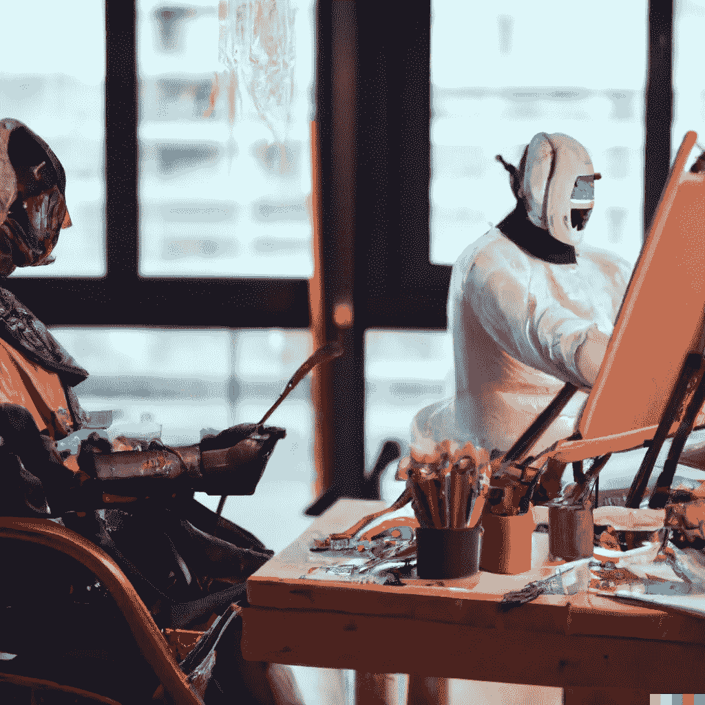

# DALL E vs. Midjourney:人工智能图像生成器如何以非常不同的方式看待人类概念

> 原文：<https://medium.com/geekculture/dall-e-vs-midjourney-how-ai-image-generators-see-human-concepts-much-differently-e5f1b3e14667?source=collection_archive---------5----------------------->

## 两个流行平台结果的对比

Feature image produced using DALL·E. All other images produced with DALL·E and Midjourney.

如果你已经读过我的作品(如果你读过，谢谢！)，你会知道我最近和来自 OpenAI 的 [DALL E 一起面对面地投入了人工智能成像的世界。从那以后，我还发现了另一个雄心勃勃的人](/@jeffhaywardwriting/my-first-impressions-of-dall-e-from-openai-b991513e7ce8)[中途](https://www.midjourney.com/home/)